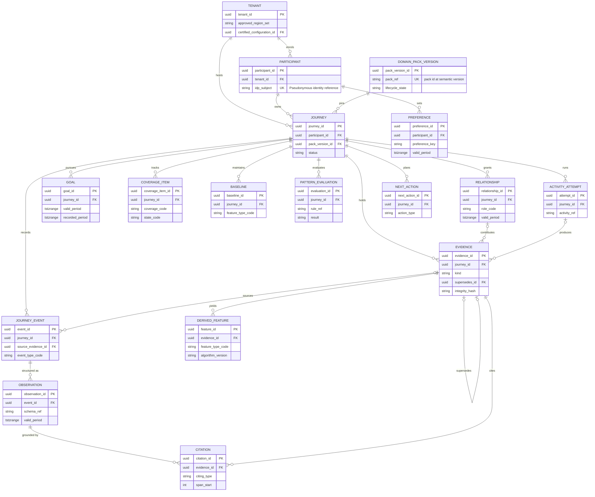
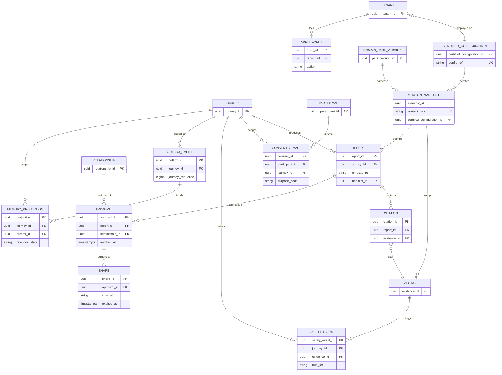

# Data Model: Cairn — Longitudinal Guidance and Evidence Platform

> **Template Origin**: Official | **ArcKit Version**: 6.16.4 | **Command**: `/arckit:data-model`

## Document Control

| Field | Value |
|-------|-------|
| **Document ID** | ARC-001-DATA-v1.0 |
| **Document Type** | Data Model |
| **Project** | Cairn — Longitudinal Guidance and Evidence Platform (Project 001) |
| **Classification** | OFFICIAL |
| **Status** | DRAFT |
| **Version** | 1.0 |
| **Created Date** | 2026-09-28 |
| **Last Modified** | 2026-09-28 |
| **Review Cycle** | Monthly |
| **Next Review Date** | 2026-10-28 |
| **Owner** | Chris McKelt (Architecture Owner) |
| **Reviewed By** | [PENDING] |
| **Approved By** | [PENDING] |
| **Distribution** | Project Team, Architecture Team, Privacy, Clinical Safety |

## Revision History

| Version | Date | Author | Changes | Approved By | Approval Date |
|---------|------|--------|---------|-------------|---------------|
| 1.0 | 2026-09-28 | ArcKit AI | Initial creation from `/arckit:data-model` command | PENDING | PENDING |

---

## Executive Summary

### Overview

This is the logical data model for the Cairn core platform: the canonical record that every other store (long-term memory, search indexes, analytics, exports) is derived from. It implements the data requirements DR-001 to DR-015 in `ARC-001-REQ-v1.1`, the principles in `ARC-000-PRIN-v1.0`, and the ownership in the RACI of `ARC-001-STKE-v1.1`.

The model is intentionally generic [CSD-C1]. It contains no clinical or mentoring vocabulary: domain meaning (event types, observation schemas, coverage topics, consent purposes) arrives as pack-defined codes and schemas, and external standards such as FHIR are produced by adapters, never stored as the canonical shape [CSD-C3]. Every entity is scoped to one tenant data plane, and everything about a participant's experience is also scoped to one journey, so a person's health and mentoring journeys can never be joined.

Four design decisions shape the model:

1. **Append-only evidence with crypto-shredding.** Evidence is never updated in place. Its content is encrypted with a per-journey key, so deletion destroys the key and leaves a content-free tombstone. This keeps the tamper-evident hash chain intact and makes backup copies unreadable at once.
2. **Bi-temporal state** for things that change over time (goals, relationships, preferences, coverage and observations): each version records when it was true for the participant (valid time) and when Cairn recorded it (record time), as DR-014 requires.
3. **Claim-check events.** The outbox carries identifiers and metadata, not content. Projections such as memory fetch content from the canonical store at processing time, after a consent check, so the event stream never becomes a second copy of participant content.
4. **Citations as data.** Every statement shown to a person resolves through a Citation record to an evidence span (P3).

### Model Statistics

- **Total Entities**: 27 entities defined (E-001 through E-027)
- **Total Attributes**: 286 attributes across all entities (excluding the standard audit columns described in the Entity Catalog)
- **Total Relationships**: 40 relationships mapped (one is drawn in both diagrams), plus 4 many-to-many links held as reference arrays
- **Data Classification** (using the DR-004 tiers):
  - 🟢 Public: 0 entities
  - 🟡 Internal: 3 entities
  - 🟠 Confidential: 7 entities (6 contain PII)
  - 🔴 Restricted: 17 entities (participant content; the pack sets Restricted-Personal or Restricted-Health; safety events are always Restricted-Health)

### Compliance Summary

- **Privacy Status**: NEEDS_DPIA. The primary regime is the Australian Privacy Act 1988 and the APPs, not GDPR; a privacy impact assessment (the Australian equivalent of a DPIA) is required before the pilot.
- **PII Entities**: 23 entities contain personal information (including pseudonymous records that are reasonably identifiable)
- **Data Protection Impact Assessment (DPIA)**: REQUIRED (health information, biometric-derived features, long-duration profiling risk)
- **Data Retention**: 7 years for consent, approval and audit records (proposed, as proof of lawful handling); participant content follows pack retention and participant deletion (DR-006)
- **Cross-Border Transfers**: NO by default. All stores and inference stay in the tenant's approved regions (Australia by default) [CSD-C4]

### Key Data Governance Stakeholders

- **Data Owner (Business)**: Haim Ozchakir, Executive Sponsor (S-11) — accountable overall; the product owner (S-18, not yet named) owns journey data day to day. Participants own their journey content under P4.
- **Data Steward**: Privacy officer (S-8, not yet named) — consent, retention, subject rights; clinical safety lead (S-7, not yet named) for safety events and regulated-pack content
- **Data Custodian (Technical)**: Platform operator and SRE (S-9) for each data plane; engineering (S-12) owns the schema
- **Data Protection Officer**: Privacy officer (S-8)

---

## Visual Entity-Relationship Diagram (ERD)

The model is shown in two diagrams to stay readable. Diagram 1 covers identity, journeys, evidence and planning. Diagram 2 covers outputs, consent, safety, provenance and projections; it repeats a few entities from diagram 1 (with key attributes only) where relationships cross.

**Diagram 1: Identity, journeys, evidence and planning**

**Diagram 2: Outputs, consent, safety, provenance and projections**

---

## Entity Catalog

**Modelling conventions** (apply to every entity; not repeated in each attribute table):

- **Audit columns**: every table also has `created_at` (TIMESTAMPTZ, UTC) and `created_by` (actor reference). Append-only tables have no `updated_at`.
- **Identifiers**: UUID v7 (time-ordered), shown in APIs with type prefixes (for example `ev_`, `evt_`, `jrn_`).
- **Scope keys**: `tenant_id` and, for participant content, `journey_id` are mandatory and drive row-level security and partitioning (DR-007).
- **Bi-temporal entities** (E-003, E-004, E-006, E-007, E-010) carry `valid_period` (when it was true for the participant) and `recorded_period` (when Cairn held that version). A change inserts a new version and closes the old version's `recorded_period`; nothing else is updated (DR-014).
- **Encrypted content**: columns marked 🔒 are encrypted in the application with a per-journey data key held in the tenant's key service. Destroying the key is how content is erased (crypto-shredding).
- **Codes**: columns ending `_code` or `_ref` hold pack-defined codes or registered version references, validated against the journey's pinned pack version. The core defines no domain values (P1).
- **Participant owns content**: for every Restricted entity the participant is the data subject and, under P4, decides disclosure. Business owners listed below are accountable within Cairn for the entity's management.

---

### Entity E-001: Tenant

**Description**: A customer or operating boundary (health service, employer, programme sponsor) with its own data plane configuration.

**Source Requirements**:

- DR-004: Data classification
- FR-001: Tenant and deployment configuration (approved regions, certified configuration, minimum cohort size)

**Business Context**: Anchors residency, certified configuration and programme settings for everything in the data plane.

**Data Ownership**:

- **Business Owner**: S-13 Commercial lead (contract terms), accountable S-11 Haim Ozchakir
- **Technical Owner**: S-12 Engineering
- **Data Steward**: S-8 Privacy officer

**Data Classification**: CONFIDENTIAL

**Volume Estimates**:

- **Initial Volume**: 1 record at go-live; **Peak Volume**: about 30 by Year 3 (one per data plane)
- **Average Record Size**: under 5 KB

**Data Retention**:

- **Total Retention**: contract term + 7 years (proposed)
- **Deletion Policy**: hard delete after the data plane is decommissioned and retention ends

#### Attributes

| Attribute | Type | Required | PII | Description | Validation Rules | Default | Source Req |
|-----------|------|----------|-----|-------------|------------------|---------|------------|
| tenant_id | UUID | Yes | No | Unique identifier | UUID v7 | Generated | FR-001 |
| tenant_name | VARCHAR(200) | Yes | No | Organisation name | 1–200 chars | None | FR-001 |
| approved_region_set | TEXT[] | Yes | No | Approved cloud regions | Values from cloud policy allow-list | Australian region set | NFR-C-004 |
| certified_configuration_id | UUID | Yes | No | Certified configuration in use | FK to E-024 | None | FR-047 |
| min_cohort_size | INTEGER | Yes | No | Minimum aggregate cohort | At or above the core minimum | Core minimum | DR-008 |
| enabled_pack_versions | UUID[] | Yes | No | Pack versions tenants may start journeys on | Each FK to E-023 in Pilot or Certified state | Empty | FR-005 |
| config_version | INTEGER | Yes | No | Configuration version | Increments on change | 1 | FR-001 |
| status | ENUM | Yes | No | Tenant lifecycle | ['onboarding', 'active', 'suspended', 'closed'] | 'onboarding' | FR-001 |

**Attribute Notes**:

- **PII Attributes**: None (administrator identities live in the identity provider)
- **Encrypted Attributes**: None beyond storage encryption

#### Relationships

**Outgoing Relationships**:

- deployed_on: E-001 → E-024 (many-to-one). FK `certified_configuration_id`; Cascade Delete: NO

**Incoming Relationships**:

- E-002, E-005, E-027 reference `tenant_id`

#### Indexes

- **Primary Key**: `pk_tenant` on `tenant_id`
- **Foreign Keys**: `fk_tenant_certified_configuration` on `certified_configuration_id` (On Delete: RESTRICT)
- **Unique Constraints**: `uk_tenant_name` on `tenant_name`

#### Privacy & Compliance

- **Contains PII**: NO
- **Data Breach Impact**: LOW
- **Cross-Border Transfers**: None; held in the control plane and the tenant's data plane
- **Audit Logging**: Change logging required (NFR-C-002); 7 years

---

### Entity E-002: Participant

**Description**: A person undertaking one or more journeys within one tenant. Identity is held by the identity provider; Cairn keeps a pseudonymous reference and minimal contact details.

**Source Requirements**:

- DR-004, DR-007: classification and scoping
- FR-002: Participant onboarding and preferences

**Business Context**: Owns journeys, grants consent and approves every disclosure.

**Data Ownership**:

- **Business Owner**: S-18 Product owner (accountable S-11); the participant controls disclosure (P4)
- **Technical Owner**: S-12 Engineering
- **Data Steward**: S-8 Privacy officer

**Data Classification**: CONFIDENTIAL (Restricted-Health where the existence of the record reveals a health programme)

**Volume Estimates**:

- **Initial Volume**: up to 500 (pilot); **Peak Volume**: about 50,000 by Year 3
- **Average Record Size**: under 2 KB

**Data Retention**:

- **Total Retention**: while any journey, consent record or legal hold exists
- **Deletion Policy**: hard delete of contact details; pseudonymous ID kept only while referenced by retained audit or consent records

#### Attributes

| Attribute | Type | Required | PII | Description | Validation Rules | Default | Source Req |
|-----------|------|----------|-----|-------------|------------------|---------|------------|
| participant_id | UUID | Yes | Yes | Pseudonymous identifier | UUID v7 | Generated | DR-007 |
| tenant_id | UUID | Yes | No | Owning tenant | FK to E-001 | None | DR-007 |
| idp_subject | VARCHAR(255) | Yes | Yes | Identity provider subject | Unique per tenant | None | NFR-SEC-001 |
| display_name 🔒 | VARCHAR(100) | No | Yes | Name the participant chooses to be called | 1–100 chars | NULL | FR-002 |
| contact_email 🔒 | VARCHAR(254) | No | Yes | For content-free notifications | RFC 5322 | NULL | INT-009 |
| contact_phone 🔒 | VARCHAR(20) | No | Yes | For content-free notifications | E.164 | NULL | INT-009 |
| age_confirmed_adult | BOOLEAN | Yes | No | Confirms 18 or over (no date of birth stored) | Must be true in v1 | false | A-1 |
| locale | VARCHAR(10) | Yes | No | Language and region | BCP 47 | 'en-AU' | NFR-U-003 |
| time_zone | VARCHAR(64) | Yes | No | Participant time zone | IANA zone name | Tenant default | DR-010 |
| status | ENUM | Yes | No | Lifecycle | ['invited', 'active', 'paused', 'withdrawn', 'deleted'] | 'invited' | FR-002 |

**Attribute Notes**:

- **PII Attributes**: participant_id, idp_subject, display_name, contact_email, contact_phone
- **Encrypted Attributes**: display_name, contact_email, contact_phone
- **Minimisation**: no date of birth, address or government identifier is stored

#### Relationships

**Outgoing Relationships**:

- enrolled_in: E-002 → E-001 (many-to-one). FK `tenant_id`; Cascade Delete: NO

**Incoming Relationships**:

- E-003, E-005, E-020 reference `participant_id`

#### Indexes

- **Primary Key**: `pk_participant` on `participant_id`
- **Foreign Keys**: `fk_participant_tenant` on `tenant_id` (On Delete: RESTRICT)
- **Unique Constraints**: `uk_participant_idp_subject` on `(tenant_id, idp_subject)`

#### Privacy & Compliance

- **Contains PII**: YES
- **Legal Basis for Processing**: Consent at enrolment (APP 3); contact details used only for the notification purpose (APP 6)
- **Data Subject Rights**: access and export (FR-035), correction (FR-018), deletion (FR-044, DR-006), withdrawal at any time
- **Data Breach Impact**: HIGH for health tenants (membership reveals a condition)
- **Cross-Border Transfers**: None; notification providers assessed under APP 8 (INT-009)
- **DPIA**: REQUIRED
- **Audit Logging**: Access and change logging required; 7 years

---

### Entity E-003: Preference

**Description**: A participant's explicit preference (input mode, language level, interaction length, cadence, quiet periods, personal ask limit), versioned over time.

**Source Requirements**:

- DR-014: Bi-temporal canonical state
- FR-002: Participant onboarding and preferences

**Business Context**: Explicit preferences always override memory-derived context (FR-002).

**Data Ownership**:

- **Business Owner**: S-18 Product owner
- **Technical Owner**: S-12 Engineering
- **Data Steward**: S-8 Privacy officer

**Data Classification**: CONFIDENTIAL (accessibility preferences may imply health information; treat as Restricted in health tenants)

**Volume Estimates**:

- **Initial Volume**: about 10 per participant; **Peak Volume**: about 1 million versions by Year 3
- **Average Record Size**: under 1 KB

**Data Retention**:

- **Total Retention**: while the participant is active; history deleted with the participant
- **Deletion Policy**: hard delete

#### Attributes

| Attribute | Type | Required | PII | Description | Validation Rules | Default | Source Req |
|-----------|------|----------|-----|-------------|------------------|---------|------------|
| preference_id | UUID | Yes | No | Version identifier | UUID v7 | Generated | DR-014 |
| participant_id | UUID | Yes | Yes | Owner | FK to E-002 | None | FR-002 |
| journey_id | UUID | No | No | Set for journey-specific preferences (for example ask limit) | FK to E-005 | NULL | FR-023 |
| preference_key | VARCHAR(64) | Yes | No | Preference name | Core-defined key list | None | FR-002 |
| preference_value | JSONB | Yes | Yes | Value | Schema per key; ask limit no higher than pack budget | None | FR-002 |
| valid_period | TSTZRANGE | Yes | No | When the preference applies | Non-empty range | [now, ∞) | DR-014 |
| recorded_period | TSTZRANGE | Yes | No | When Cairn held this version | Closed on supersession | [now, ∞) | DR-014 |

**Attribute Notes**:

- **PII Attributes**: participant_id, preference_value
- **Derived Attributes**: none; memory-derived context is never stored here

#### Relationships

- set_by: E-003 → E-002 (many-to-one); Cascade Delete: YES
- scoped_to: E-003 → E-005 (many-to-one, optional); Cascade Delete: YES

#### Indexes

- **Primary Key**: `pk_preference` on `preference_id`
- **Foreign Keys**: `fk_preference_participant`, `fk_preference_journey`
- **Unique Constraints**: exclusion constraint preventing overlapping `valid_period` for the same `(participant_id, journey_id, preference_key)` among current versions
- **Performance Indexes**: `idx_preference_current` on `(participant_id, preference_key)` where `upper(recorded_period)` is infinite

#### Privacy & Compliance

- **Contains PII**: YES
- **Legal Basis for Processing**: Consent (service delivery)
- **Data Subject Rights**: view, change and delete in the app
- **Data Breach Impact**: MEDIUM
- **Audit Logging**: Change logging (history is the table itself)

---

### Entity E-004: Relationship

**Description**: A contributor or reviewer linked to a journey by the participant, with role, scope, rights and validity period. Read rights are stored as explicit participant approvals.

**Source Requirements**:

- DR-014: Bi-temporal canonical state
- FR-003: Relationships, contributors and reviewers; FR-004: Cross-journey isolation

**Business Context**: Controls who can contribute, and who may receive approved briefs.

**Data Ownership**:

- **Business Owner**: S-18 Product owner; the participant grants and revokes
- **Technical Owner**: S-12 Engineering
- **Data Steward**: S-8 Privacy officer

**Data Classification**: RESTRICTED (tier from pack: a carer or neurologist relationship reveals a health condition)

**Volume Estimates**:

- **Initial Volume**: about 3 per journey; **Peak Volume**: about 200,000 versions by Year 3
- **Average Record Size**: under 2 KB

**Data Retention**:

- **Total Retention**: journey lifetime + DR-006; invitee contact details deleted 30 days after the relationship ends (proposed)
- **Deletion Policy**: hard delete of contact details; relationship ID kept while referenced by approvals

#### Attributes

| Attribute | Type | Required | PII | Description | Validation Rules | Default | Source Req |
|-----------|------|----------|-----|-------------|------------------|---------|------------|
| relationship_id | UUID | Yes | No | Version identifier | UUID v7 | Generated | FR-003 |
| tenant_id | UUID | Yes | No | Tenant scope | FK to E-001 | None | DR-007 |
| journey_id | UUID | Yes | No | Journey scope | FK to E-005 | None | FR-004 |
| role_code | VARCHAR(64) | Yes | No | Pack-defined role (for example carer, mentor, clinician) | In pack role list | None | FR-003 |
| relationship_kind | ENUM | Yes | No | Contributor or reviewer | ['contributor', 'reviewer'] | None | FR-003 |
| invitee_idp_subject | VARCHAR(255) | No | Yes | Invitee identity once registered | Unique per journey | NULL | NFR-SEC-001 |
| invitee_contact 🔒 | VARCHAR(254) | No | Yes | Invitation email or phone | RFC 5322 or E.164 | NULL | FR-003 |
| scope | JSONB | Yes | No | Sections or topics in scope | Pack schema | None | FR-003 |
| rights | TEXT[] | Yes | No | Granted rights | Subset of ['contribute', 'receive_brief'] | None | FR-003 |
| valid_period | TSTZRANGE | Yes | No | When the relationship is active (expiry) | Non-empty | None | DR-014 |
| recorded_period | TSTZRANGE | Yes | No | Version history | Closed on change | [now, ∞) | DR-014 |
| revoked_at | TIMESTAMPTZ | No | No | Revocation time | Immutable once set | NULL | FR-003 |

**Attribute Notes**:

- **PII Attributes**: invitee_idp_subject, invitee_contact (third-party personal information)
- **Encrypted Attributes**: invitee_contact

#### Relationships

- granted_in: E-004 → E-005 (many-to-one); Cascade Delete: NO (versions retained for audit)
- Incoming: E-008 (contributions), E-018 (approvals)

#### Indexes

- **Primary Key**: `pk_relationship` on `relationship_id`
- **Foreign Keys**: `fk_relationship_journey`
- **Performance Indexes**: `idx_relationship_active` on `(journey_id, relationship_kind)` for current versions; `idx_relationship_invitee` on `invitee_idp_subject`

#### Privacy & Compliance

- **Contains PII**: YES (invitees are third parties)
- **Legal Basis for Processing**: Participant's consent for the relationship; invitees are notified at invitation (APP 5) and consent to their own contributions
- **Data Subject Rights**: participants revoke; invitees can decline, withdraw and request their own data
- **Data Breach Impact**: HIGH (reveals health context and personal networks)
- **Audit Logging**: Access and change logging required

---

### Entity E-005: Journey

**Description**: A long-duration instance for one participant, bound to one immutable pack version.

**Source Requirements**:

- DR-007: Journey-scoped partitioning
- FR-005: Journey bound to one pack version; FR-006: Explicit journey migration

**Business Context**: The unit of isolation for all participant content, consent and memory.

**Data Ownership**:

- **Business Owner**: S-18 Product owner; the participant owns the journey
- **Technical Owner**: S-12 Engineering
- **Data Steward**: S-8 Privacy officer

**Data Classification**: RESTRICTED (a Parkinson's journey's existence is health information)

**Volume Estimates**:

- **Initial Volume**: up to 500 (pilot); **Peak Volume**: about 50,000 active by Year 3
- **Average Record Size**: under 2 KB

**Data Retention**:

- **Active Period**: journey lifetime; **Total Retention**: closure + pack-declared period (proposed default 12 months) unless statutory retention applies (DR-006)
- **Deletion Policy**: crypto-shred the journey key; delete all journey-scoped rows; keep a tombstone

#### Attributes

| Attribute | Type | Required | PII | Description | Validation Rules | Default | Source Req |
|-----------|------|----------|-----|-------------|------------------|---------|------------|
| journey_id | UUID | Yes | No | Unique identifier and partition key | UUID v7 | Generated | DR-007 |
| tenant_id | UUID | Yes | No | Tenant scope | FK to E-001 | None | DR-007 |
| participant_id | UUID | Yes | Yes | Owner | FK to E-002 | None | FR-005 |
| pack_version_id | UUID | Yes | No | Pinned pack version | FK to E-023; Pilot or Certified | None | FR-005 |
| data_key_ref | VARCHAR(255) | Yes | No | Reference to the per-journey data key | Key exists in tenant key service | Generated | DR-006 |
| status | ENUM | Yes | No | Lifecycle | ['active', 'paused', 'closed', 'deleted'] | 'active' | FR-023 |
| started_at | TIMESTAMPTZ | Yes | No | Start | Not in future | NOW() | FR-005 |
| closed_at | TIMESTAMPTZ | No | No | Closure | After started_at | NULL | DR-006 |
| legal_hold | BOOLEAN | Yes | No | Statutory retention hold | Set only by privacy officer workflow | false | DR-006 |
| migration_history | JSONB | Yes | No | Previous pack versions and migration approvals | Append-only array | [] | FR-006 |

**Attribute Notes**:

- **PII Attributes**: participant_id (and the journey's existence in health packs)
- **Derived Attributes**: none

#### Relationships

- owned_by: E-005 → E-002 (many-to-one); pinned_to: E-005 → E-023 (many-to-one); Cascade Delete: NO (deletion is a controlled workflow)
- Incoming: every journey-scoped entity (E-004, E-006 to E-021, E-025, E-026)

#### Indexes

- **Primary Key**: `pk_journey` on `journey_id`
- **Foreign Keys**: `fk_journey_participant`, `fk_journey_pack_version` (On Delete: RESTRICT)
- **Performance Indexes**: `idx_journey_participant` on `(tenant_id, participant_id)`; `idx_journey_pack` on `pack_version_id` (migration impact queries)

#### Privacy & Compliance

- **Contains PII**: YES
- **Legal Basis for Processing**: Consent to the pack's purposes at enrolment (APP 3 for health information)
- **Data Subject Rights**: export (FR-035), deletion (FR-044), pause and withdrawal
- **Data Breach Impact**: HIGH
- **DPIA**: REQUIRED
- **Audit Logging**: Access and change logging required

---

### Entity E-006: Goal

**Description**: A participant-selected or pack-defined outcome, versioned with valid time so goal changes are preserved (for example "gain leadership experience" replaced by "lead an architecture team").

**Source Requirements**:

- DR-014: Bi-temporal canonical state
- FR-019: Coverage tracking; FR-049: Mentorship pack

**Business Context**: Drives progress and stall rules and appears in briefs.

**Data Ownership**:

- **Business Owner**: S-18 Product owner; content owned by the participant
- **Technical Owner**: S-12 Engineering
- **Data Steward**: S-8 Privacy officer

**Data Classification**: RESTRICTED

**Volume Estimates**:

- **Initial Volume**: about 3 per journey; **Peak Volume**: about 500,000 versions by Year 3
- **Average Record Size**: under 2 KB

**Data Retention**:

- **Total Retention**: journey retention (DR-006)
- **Deletion Policy**: crypto-shred with the journey, or supersede-and-shred on participant deletion

#### Attributes

| Attribute | Type | Required | PII | Description | Validation Rules | Default | Source Req |
|-----------|------|----------|-----|-------------|------------------|---------|------------|
| goal_id | UUID | Yes | No | Version identifier | UUID v7 | Generated | DR-014 |
| goal_key | UUID | Yes | No | Stable identity across versions | Same for all versions of one goal | Generated | DR-014 |
| tenant_id | UUID | Yes | No | Tenant scope | FK | None | DR-007 |
| journey_id | UUID | Yes | No | Journey scope | FK to E-005 | None | DR-007 |
| goal_code | VARCHAR(64) | No | No | Pack-defined goal type | In pack list | NULL | FR-049 |
| statement 🔒 | TEXT | Yes | Yes | Goal in the participant's words | 1–1,000 chars | None | FR-049 |
| status | ENUM | Yes | No | State | ['active', 'achieved', 'paused', 'abandoned'] | 'active' | FR-020 |
| valid_period | TSTZRANGE | Yes | No | When the goal applied | Non-empty | [now, ∞) | DR-014 |
| recorded_period | TSTZRANGE | Yes | No | When Cairn held this version | Closed on supersession | [now, ∞) | DR-014 |
| source_evidence_id | UUID | No | No | Evidence where the goal was set or changed | FK to E-008 | NULL | DR-002 |

**Attribute Notes**:

- **PII Attributes**: statement
- **Encrypted Attributes**: statement

#### Relationships

- pursued_in: E-006 → E-005 (many-to-one); sourced_from: E-006 → E-008 (many-to-one, optional)

#### Indexes

- **Primary Key**: `pk_goal` on `goal_id`
- **Unique Constraints**: exclusion constraint on `(goal_key, valid_period)` among current versions
- **Performance Indexes**: `idx_goal_current` on `(journey_id, status)`; GiST index on `valid_period` for as-at queries

#### Privacy & Compliance

- **Contains PII**: YES
- **Legal Basis for Processing**: Consent (pack purpose)
- **Data Subject Rights**: view history, correct (new version), delete
- **Data Breach Impact**: MEDIUM (HIGH in employer-sponsored programmes)
- **Audit Logging**: Change logging via versions

---

### Entity E-007: CoverageItem

**Description**: The state of one pack-defined coverage topic in a journey, with state history, distinguishing not asked, not reported, reported, needs detail and complete.

**Source Requirements**:

- DR-014: Bi-temporal canonical state
- FR-019: Coverage tracking

**Business Context**: Lets briefs separate "not observed", "not reported" and "not asked"; drives coverage-gap rules.

**Data Ownership**:

- **Business Owner**: S-6 Pack authors (state model); S-18 Product owner
- **Technical Owner**: S-12 Engineering
- **Data Steward**: S-8 Privacy officer

**Data Classification**: RESTRICTED

**Volume Estimates**:

- **Initial Volume**: 20–60 topics per journey; **Peak Volume**: about 10 million versions by Year 3
- **Average Record Size**: under 0.5 KB

**Data Retention**:

- **Total Retention**: journey retention (DR-006)
- **Deletion Policy**: deleted with the journey

#### Attributes

| Attribute | Type | Required | PII | Description | Validation Rules | Default | Source Req |
|-----------|------|----------|-----|-------------|------------------|---------|------------|
| coverage_item_id | UUID | Yes | No | Version identifier | UUID v7 | Generated | FR-019 |
| tenant_id | UUID | Yes | No | Tenant scope | FK | None | DR-007 |
| journey_id | UUID | Yes | No | Journey scope | FK to E-005 | None | DR-007 |
| coverage_code | VARCHAR(64) | Yes | No | Pack-defined topic | In pack coverage model | None | FR-019 |
| state_code | VARCHAR(32) | Yes | No | Pack-defined state | In pack state list | 'not_asked' | FR-019 |
| evaluation_id | UUID | Yes | No | Rule evaluation that set the state | FK to E-014 | None | FR-020 |
| valid_period | TSTZRANGE | Yes | No | When the state applied | Non-empty | [now, ∞) | DR-014 |
| recorded_period | TSTZRANGE | Yes | No | Version history | Closed on supersession | [now, ∞) | DR-014 |

**Attribute Notes**:

- **PII Attributes**: none directly; the combination of topic and state is health information in health packs
- **Derived Attributes**: state_code is set only by rule evaluations (E-014)

#### Relationships

- tracked_in: E-007 → E-005 (many-to-one); set_by: E-007 → E-014 (many-to-one)

#### Indexes

- **Primary Key**: `pk_coverage_item` on `coverage_item_id`
- **Unique Constraints**: exclusion constraint on `(journey_id, coverage_code, valid_period)` among current versions
- **Performance Indexes**: `idx_coverage_current` on `(journey_id, coverage_code)`

#### Privacy & Compliance

- **Contains PII**: YES (in context)
- **Legal Basis for Processing**: Consent (pack purpose)
- **Data Breach Impact**: MEDIUM
- **Audit Logging**: Change logging via versions

---

### Entity E-008: Evidence

**Description**: An immutable item of evidence: an utterance, capture, document, contribution or external record.

**Source Requirements**:

- DR-002: Evidence immutability and integrity; DR-011: Raw media handling
- FR-017: Append-only evidence with provenance; FR-012: Transcript confirmation

**Business Context**: Everything shown to a person must cite evidence (P3); the only place participant content lives canonically.

**Data Ownership**:

- **Business Owner**: S-18 Product owner; content owned by the participant or contributor
- **Technical Owner**: S-12 Engineering
- **Data Steward**: S-8 Privacy officer (S-7 for regulated packs)

**Data Classification**: RESTRICTED

**Volume Estimates**:

- **Initial Volume**: about 50,000 in the pilot year; **Growth Rate**: up to 2,000 per journey per year
- **Peak Volume**: about 100 million by Year 3 (proposed)
- **Average Record Size**: 2 KB (text); media stored as objects, mostly left on devices

**Data Retention**:

- **Total Retention**: journey retention (DR-006); participant deletion within 30 days
- **Deletion Policy**: crypto-shredding: content and key destroyed, tombstone with hash kept to preserve the chain

#### Attributes

| Attribute | Type | Required | PII | Description | Validation Rules | Default | Source Req |
|-----------|------|----------|-----|-------------|------------------|---------|------------|
| evidence_id | UUID | Yes | No | Unique identifier | UUID v7 | Generated | FR-017 |
| tenant_id | UUID | Yes | No | Tenant scope | FK | None | DR-007 |
| journey_id | UUID | Yes | No | Journey scope and partition key | FK to E-005 | None | DR-007 |
| kind | ENUM | Yes | No | Evidence type | ['utterance', 'capture', 'document', 'contribution', 'external_record'] | None | FR-017 |
| content 🔒 | TEXT | No | Yes | Text content (utterance, transcript, extracted text) | Null for media-only items or after shredding | NULL | FR-017 |
| object_ref | VARCHAR(512) | No | No | Pointer to consented media object | Object exists; consent purpose covers upload | NULL | DR-011 |
| span_index | JSONB | No | No | Citable span offsets | Offsets within content | NULL | FR-017 |
| input_mode | ENUM | Yes | No | How it was captured | ['typed', 'voice_on_device', 'voice_server', 'upload', 'integration'] | None | FR-011 |
| confirmed_at | TIMESTAMPTZ | No | No | Participant confirmation | Null until confirmed; typed text confirmed on send | NULL | FR-012 |
| occurred_from | TIMESTAMPTZ | Yes | No | Start of when it happened | Not after occurred_to | recorded_at | DR-010 |
| occurred_to | TIMESTAMPTZ | Yes | No | End of when it happened | Not before occurred_from | recorded_at | DR-010 |
| occurred_precision | ENUM | Yes | No | Precision of the stated time | ['exact', 'day', 'week', 'month', 'approximate'] | 'exact' | DR-010 |
| recorded_at | TIMESTAMPTZ | Yes | No | When Cairn received it | Server time | NOW() | DR-010 |
| author_type | ENUM | Yes | No | Producer | ['participant', 'contributor', 'system', 'external'] | None | FR-017 |
| author_id | UUID | Yes | Yes | Producing actor (participant or relationship) | FK to E-002 or E-004 | None | FR-017 |
| activity_attempt_id | UUID | No | No | Activity that produced it | FK to E-015 | NULL | FR-013 |
| supersedes_id | UUID | No | No | Item this corrects | FK to E-008, same journey | NULL | DR-002 |
| consent_purposes | UUID[] | Yes | No | Consent grants allowing use | Each FK to an active E-020 | None | DR-005 |
| classification | ENUM | Yes | No | Data tier | ['restricted_personal', 'restricted_health'] | Pack tier | DR-004 |
| manifest_id | UUID | Yes | No | Version manifest | FK to E-022 | None | DR-003 |
| integrity_hash | CHAR(64) | Yes | No | Hash-chain value over metadata and a salted content digest | Verified daily | Computed | DR-002 |
| shredded_at | TIMESTAMPTZ | No | No | When content was erased | Set once | NULL | DR-006 |

**Attribute Notes**:

- **PII Attributes**: content, author_id (content often also names third parties)
- **Encrypted Attributes**: content (per-journey key); media objects use per-object keys
- **Audit Attributes**: recorded_at, confirmed_at, shredded_at

#### Relationships

- held_in: E-008 → E-005 (many-to-one); supersedes: E-008 → E-008 (optional)
- contributed_by: E-008 → E-004 (optional); produced_by: E-008 → E-015 (optional); stamped_by: E-008 → E-022
- Incoming: E-009, E-011, E-012, E-021 reference `evidence_id`; E-026 references it in `source_refs`

#### Indexes

- **Primary Key**: `pk_evidence` on `evidence_id`
- **Foreign Keys**: `fk_evidence_journey`, `fk_evidence_supersedes`, `fk_evidence_manifest` (On Delete: RESTRICT)
- **Performance Indexes**: `idx_evidence_timeline` on `(journey_id, occurred_from DESC)`; `idx_evidence_unconfirmed` on `(journey_id)` where `confirmed_at IS NULL`
- **Partitioning**: hash partitioned by `journey_id`
- **Full-Text Indexes**: none in the canonical store (content is encrypted); search is a rebuildable projection

#### Privacy & Compliance

- **Contains PII**: YES (sensitive health information in health packs)
- **Legal Basis for Processing**: Consent for sensitive information (APP 3.3); use limited to consented purposes (APP 6)
- **Data Subject Rights**: access and export, correction by supersession, deletion by crypto-shredding
- **Data Breach Impact**: HIGH
- **DPIA**: REQUIRED
- **Audit Logging**: Access logging on every read; change logging implicit (append-only); 7 years

---

### Entity E-009: JourneyEvent

**Description**: Something that happened or was reported, typed by the pack (for example a statement, a completed activity, a goal change).

**Source Requirements**:

- DR-003: Version manifest on every material output
- FR-016: Schema-constrained extraction; FR-050: Canonical event stream

**Business Context**: The unit the pattern engine evaluates and the outbox publishes.

**Data Ownership**:

- **Business Owner**: S-18 Product owner
- **Technical Owner**: S-12 Engineering
- **Data Steward**: S-8 Privacy officer

**Data Classification**: RESTRICTED

**Volume Estimates**:

- **Initial Volume**: about 60,000 in the pilot year; **Peak Volume**: about 120 million by Year 3
- **Average Record Size**: 1 KB

**Data Retention**:

- **Total Retention**: journey retention (DR-006)
- **Deletion Policy**: payload shredded with the journey key; row deleted with the journey

#### Attributes

| Attribute | Type | Required | PII | Description | Validation Rules | Default | Source Req |
|-----------|------|----------|-----|-------------|------------------|---------|------------|
| event_id | UUID | Yes | No | Unique identifier | UUID v7 | Generated | FR-016 |
| tenant_id | UUID | Yes | No | Tenant scope | FK | None | DR-007 |
| journey_id | UUID | Yes | No | Journey scope | FK to E-005 | None | DR-007 |
| event_type_code | VARCHAR(64) | Yes | No | Pack-defined event type | In pack schema | None | FR-016 |
| source_evidence_id | UUID | No | No | Evidence it came from | FK to E-008 | NULL | FR-016 |
| payload 🔒 | JSONB | Yes | Yes | Structured event data | Validated against pack schema | None | FR-016 |
| occurred_from | TIMESTAMPTZ | Yes | No | When it happened (start) | As E-008 | None | DR-010 |
| occurred_to | TIMESTAMPTZ | Yes | No | When it happened (end) | As E-008 | None | DR-010 |
| manifest_id | UUID | Yes | No | Version manifest | FK to E-022 | None | DR-003 |

**Attribute Notes**:

- **PII Attributes**: payload
- **Encrypted Attributes**: payload

#### Relationships

- recorded_in: E-009 → E-005; sourced_from: E-009 → E-008 (optional)
- Incoming: E-010 (observations)

#### Indexes

- **Primary Key**: `pk_journey_event` on `event_id`
- **Performance Indexes**: `idx_event_timeline` on `(journey_id, event_type_code, occurred_from)` for temporal rules

#### Privacy & Compliance

- **Contains PII**: YES
- **Legal Basis for Processing**: Consent (pack purpose)
- **Data Breach Impact**: HIGH
- **Audit Logging**: Access logging required

---

### Entity E-010: Observation

**Description**: A structured, schema-validated extraction from confirmed evidence (for example a reported experience with its context), versioned with valid time. It is a proposal until the participant confirms it directly or through brief approval.

**Source Requirements**:

- DR-014: Bi-temporal canonical state
- FR-016: Schema-constrained extraction

**Business Context**: The main input to pattern rules and brief sections; never a model's interpretation (P2, P3).

**Data Ownership**:

- **Business Owner**: S-6 Pack authors (schemas); S-7 Clinical safety lead for regulated packs
- **Technical Owner**: S-12 Engineering
- **Data Steward**: S-8 Privacy officer

**Data Classification**: RESTRICTED

**Volume Estimates**:

- **Initial Volume**: about 40,000 in the pilot year; **Peak Volume**: about 80 million versions by Year 3
- **Average Record Size**: 1 KB

**Data Retention**:

- **Total Retention**: journey retention (DR-006)
- **Deletion Policy**: shredded with the journey key; superseded when source evidence is deleted

#### Attributes

| Attribute | Type | Required | PII | Description | Validation Rules | Default | Source Req |
|-----------|------|----------|-----|-------------|------------------|---------|------------|
| observation_id | UUID | Yes | No | Version identifier | UUID v7 | Generated | FR-016 |
| observation_key | UUID | Yes | No | Stable identity across versions | Same for all versions | Generated | DR-014 |
| tenant_id | UUID | Yes | No | Tenant scope | FK | None | DR-007 |
| journey_id | UUID | Yes | No | Journey scope | FK to E-005 | None | DR-007 |
| event_id | UUID | Yes | No | Event it structures | FK to E-009 | None | FR-016 |
| schema_ref | VARCHAR(128) | Yes | No | Pack extraction schema and version | Registered in pack | None | FR-016 |
| values 🔒 | JSONB | Yes | Yes | Extracted structured values | Valid against schema_ref; codes from pack vocabulary | None | FR-016 |
| status | ENUM | Yes | No | Confirmation state | ['proposed', 'confirmed', 'rejected', 'superseded'] | 'proposed' | FR-016 |
| extraction_confidence | NUMERIC(4,3) | No | No | Model confidence, internal only | 0–1; never displayed (P5) | NULL | FR-016 |
| valid_period | TSTZRANGE | Yes | No | When it was true for the participant | Non-empty | From source evidence | DR-014 |
| recorded_period | TSTZRANGE | Yes | No | Version history | Closed on supersession | [now, ∞) | DR-014 |
| manifest_id | UUID | Yes | No | Extractor, prompt and model versions | FK to E-022 | None | DR-003 |

**Attribute Notes**:

- **PII Attributes**: values
- **Encrypted Attributes**: values
- **Derived Attributes**: values are model proposals validated deterministically; at least one E-011 citation is mandatory

#### Relationships

- structures: E-010 → E-009 (many-to-one); grounded_by: E-010 → E-011 (one-to-many, at least one)

#### Indexes

- **Primary Key**: `pk_observation` on `observation_id`
- **Performance Indexes**: `idx_observation_current` on `(journey_id, schema_ref, status)`; GiST on `valid_period`
- **Check Constraints**: an observation cannot become `confirmed` without a citation

#### Privacy & Compliance

- **Contains PII**: YES (sensitive health information in health packs)
- **Legal Basis for Processing**: Consent (APP 3.3)
- **Data Subject Rights**: view, reject, correct (new version), delete
- **Data Breach Impact**: HIGH
- **Audit Logging**: Access logging required

---

### Entity E-011: Citation

**Description**: A link from a statement (an observation, a brief statement, a companion message or a memory-derived reference) to an exact evidence span.

**Source Requirements**:

- DR-002: Evidence integrity; DR-003: Version manifests
- FR-030: Deterministic brief assembly; FR-025: Companion phrasing; FR-031: Quote shortening

**Business Context**: Makes P3 enforceable: rendering fails closed if a statement has no resolvable citation.

**Data Ownership**:

- **Business Owner**: S-18 Product owner
- **Technical Owner**: S-12 Engineering
- **Data Steward**: S-7 Clinical safety lead (faithfulness)

**Data Classification**: RESTRICTED

**Volume Estimates**:

- **Initial Volume**: about 100,000 in the pilot year; **Peak Volume**: about 250 million by Year 3
- **Average Record Size**: 0.3 KB

**Data Retention**:

- **Total Retention**: as long as the citing record
- **Deletion Policy**: deleted with the citing record; a citation to a shredded span renders as "source removed by participant"

#### Attributes

| Attribute | Type | Required | PII | Description | Validation Rules | Default | Source Req |
|-----------|------|----------|-----|-------------|------------------|---------|------------|
| citation_id | UUID | Yes | No | Unique identifier | UUID v7 | Generated | FR-030 |
| tenant_id | UUID | Yes | No | Tenant scope | FK | None | DR-007 |
| journey_id | UUID | Yes | No | Journey scope (must match evidence) | FK to E-005 | None | DR-007 |
| citing_type | ENUM | Yes | No | What cites | ['observation', 'report_statement', 'companion_message', 'memory_reference'] | None | FR-030 |
| citing_id | UUID | Yes | No | Citing record | Resolves within the same journey | None | FR-030 |
| report_id | UUID | No | No | Report containing the statement | FK to E-017 | NULL | FR-030 |
| evidence_id | UUID | Yes | No | Cited evidence | FK to E-008 | None | FR-017 |
| span_start | INTEGER | Yes | No | Span start offset | Within evidence span_index | None | FR-030 |
| span_end | INTEGER | Yes | No | Span end offset | Greater than span_start | None | FR-030 |
| rendering | ENUM | Yes | No | How the span is shown | ['verbatim', 'shortened', 'adapted'] | 'verbatim' | FR-031 |
| rendered_text 🔒 | TEXT | No | Yes | Shortened or adapted text | Shortened text must be a subsequence of the span | NULL | FR-031 |

**Attribute Notes**:

- **PII Attributes**: rendered_text
- **Validation**: a cross-journey citation is impossible (journey_id must equal the evidence's journey_id)

#### Relationships

- cites: E-011 → E-008 (many-to-one); contained_in: E-011 → E-017 (many-to-one, optional); grounds: E-011 → E-010 (via citing_id)

#### Indexes

- **Primary Key**: `pk_citation` on `citation_id`
- **Performance Indexes**: `idx_citation_citing` on `(citing_type, citing_id)`; `idx_citation_evidence` on `evidence_id` (deletion impact)

#### Privacy & Compliance

- **Contains PII**: YES
- **Legal Basis for Processing**: Consent (pack purpose)
- **Data Breach Impact**: MEDIUM
- **Audit Logging**: Change logging required

---

### Entity E-012: DerivedFeature

**Description**: An algorithm output computed from evidence, usually on the device (for example a speech-rate or movement feature), with version and quality metadata. It is never silently promoted to a human-facing conclusion [CSD-C6].

**Source Requirements**:

- DR-011: Raw media handling
- FR-014: On-device media features; FR-021: Algorithm plug-ins

**Business Context**: Input to baseline and change rules; display is gated by the pack's regulatory profile (P5).

**Data Ownership**:

- **Business Owner**: S-7 Clinical safety lead (regulated packs); S-6 Pack authors
- **Technical Owner**: S-12 Engineering
- **Data Steward**: S-8 Privacy officer

**Data Classification**: RESTRICTED (Restricted-Health in health packs; features may be biometric)

**Volume Estimates**:

- **Initial Volume**: about 20,000 in the pilot year; **Peak Volume**: about 20 million by Year 3
- **Average Record Size**: 0.5 KB

**Data Retention**:

- **Total Retention**: journey retention (DR-006)
- **Deletion Policy**: deleted with source evidence or journey

#### Attributes

| Attribute | Type | Required | PII | Description | Validation Rules | Default | Source Req |
|-----------|------|----------|-----|-------------|------------------|---------|------------|
| feature_id | UUID | Yes | No | Unique identifier | UUID v7 | Generated | FR-021 |
| tenant_id | UUID | Yes | No | Tenant scope | FK | None | DR-007 |
| journey_id | UUID | Yes | No | Journey scope | FK to E-005 | None | DR-007 |
| evidence_id | UUID | Yes | No | Source capture | FK to E-008 | None | FR-014 |
| feature_type_code | VARCHAR(64) | Yes | No | Pack-defined feature | In pack list | None | FR-021 |
| value 🔒 | NUMERIC | Yes | Yes | Feature value | Pack-defined range | None | FR-021 |
| unit | VARCHAR(32) | Yes | No | Unit | Pack-defined | None | FR-021 |
| algorithm_version | VARCHAR(64) | Yes | No | Algorithm and version | Registered algorithm | None | FR-021 |
| computed_on | ENUM | Yes | No | Where computed | ['device', 'server'] | 'device' | FR-014 |
| quality | JSONB | Yes | No | Quality metadata | Pack schema; below threshold excluded from rules | None | FR-021 |
| displayable | BOOLEAN | Yes | No | Regulatory profile allows display | Set from pack profile only | false | FR-021 |

**Attribute Notes**:

- **PII Attributes**: value (biometric-derived in some packs)
- **Encrypted Attributes**: value

#### Relationships

- yielded_by: E-012 → E-008 (many-to-one); used_by: E-013 baselines and E-014 evaluations

#### Indexes

- **Primary Key**: `pk_derived_feature` on `feature_id`
- **Performance Indexes**: `idx_feature_series` on `(journey_id, feature_type_code, created_at)`

#### Privacy & Compliance

- **Contains PII**: YES (sensitive; possibly biometric information under the Privacy Act)
- **Legal Basis for Processing**: Explicit consent for the capture purpose (APP 3.3)
- **Data Breach Impact**: HIGH
- **DPIA**: REQUIRED (biometric-derived data)
- **Audit Logging**: Access logging required

---

### Entity E-013: Baseline

**Description**: A participant-specific reference state or distribution for a feature or measure, used by change-from-baseline rules.

**Source Requirements**:

- DR-014: Bi-temporal canonical state
- FR-020: Pattern engine; FR-021: Algorithm plug-ins

**Business Context**: Internal only; display gated by the regulatory profile (P5).

**Data Ownership**:

- **Business Owner**: S-7 Clinical safety lead (regulated packs); S-6 Pack authors
- **Technical Owner**: S-12 Engineering
- **Data Steward**: S-8 Privacy officer

**Data Classification**: RESTRICTED

**Volume Estimates**:

- **Initial Volume**: 5–20 per journey; **Peak Volume**: about 1 million by Year 3
- **Average Record Size**: 2 KB

**Data Retention**:

- **Total Retention**: journey retention (DR-006)
- **Deletion Policy**: deleted with the journey; recalculated when source features are deleted

#### Attributes

| Attribute | Type | Required | PII | Description | Validation Rules | Default | Source Req |
|-----------|------|----------|-----|-------------|------------------|---------|------------|
| baseline_id | UUID | Yes | No | Version identifier | UUID v7 | Generated | FR-020 |
| tenant_id | UUID | Yes | No | Tenant scope | FK | None | DR-007 |
| journey_id | UUID | Yes | No | Journey scope | FK to E-005 | None | DR-007 |
| feature_type_code | VARCHAR(64) | Yes | No | Feature or measure | In pack list | None | FR-021 |
| parameters 🔒 | JSONB | Yes | Yes | Baseline statistics | Algorithm schema | None | FR-021 |
| input_feature_ids | UUID[] | Yes | No | Features used | Each FK to E-012 | None | DR-003 |
| algorithm_version | VARCHAR(64) | Yes | No | Baseline algorithm | Registered | None | FR-021 |
| valid_period | TSTZRANGE | Yes | No | Period the baseline represents | Non-empty | None | DR-014 |
| recorded_period | TSTZRANGE | Yes | No | Version history | Closed on supersession | [now, ∞) | DR-014 |

**Attribute Notes**:

- **PII Attributes**: parameters
- **Encrypted Attributes**: parameters

#### Relationships

- maintained_in: E-013 → E-005 (many-to-one); built_from: E-013 → E-012 (many-to-many via input_feature_ids)

#### Indexes

- **Primary Key**: `pk_baseline` on `baseline_id`
- **Performance Indexes**: `idx_baseline_current` on `(journey_id, feature_type_code)`

#### Privacy & Compliance

- **Contains PII**: YES
- **Legal Basis for Processing**: Consent (pack purpose)
- **Data Breach Impact**: HIGH
- **Audit Logging**: Change logging via versions

---

### Entity E-014: PatternEvaluation

**Description**: The execution record of a pack rule: exact inputs, rule version, result and proposed action candidates.

**Source Requirements**:

- DR-003: Version manifests
- FR-020: Deterministic pattern engine

**Business Context**: Makes detection explainable and replayable (P2); shown to participants as "asked because…" (FR-018).

**Data Ownership**:

- **Business Owner**: S-6 Pack authors (rules); S-10 Architecture owner (replay guarantees)
- **Technical Owner**: S-12 Engineering
- **Data Steward**: S-7 Clinical safety lead (regulated packs)

**Data Classification**: RESTRICTED

**Volume Estimates**:

- **Initial Volume**: about 200,000 in the pilot year; **Peak Volume**: about 400 million by Year 3 (proposed; consider summarising "not triggered" results)
- **Average Record Size**: 0.5 KB

**Data Retention**:

- **Total Retention**: triggered results for journey retention; non-triggered results 90 days (proposed)
- **Deletion Policy**: deleted with the journey

#### Attributes

| Attribute | Type | Required | PII | Description | Validation Rules | Default | Source Req |
|-----------|------|----------|-----|-------------|------------------|---------|------------|
| evaluation_id | UUID | Yes | No | Unique identifier | UUID v7 | Generated | FR-020 |
| tenant_id | UUID | Yes | No | Tenant scope | FK | None | DR-007 |
| journey_id | UUID | Yes | No | Journey scope | FK to E-005 | None | DR-007 |
| rule_ref | VARCHAR(128) | Yes | No | Rule ID and version | Registered in pinned pack | None | FR-020 |
| input_refs | UUID[] | Yes | No | Exact inputs (events, observations, features, coverage) | All in the same journey | None | FR-020 |
| result | ENUM | Yes | No | Outcome | ['triggered', 'not_triggered', 'error'] | None | FR-020 |
| action_candidates | JSONB | No | No | Proposed next-action candidates | Actions in pack allowed set | NULL | FR-022 |
| evaluated_at | TIMESTAMPTZ | Yes | No | Evaluation time | Server time | NOW() | FR-020 |
| manifest_id | UUID | Yes | No | Versions | FK to E-022 | None | DR-003 |

**Attribute Notes**:

- **PII Attributes**: none directly; results are health information in context
- **Derived Attributes**: result and action_candidates are deterministic functions of inputs and versions

#### Relationships

- evaluated_in: E-014 → E-005; inputs: many-to-many with E-009, E-010, E-012, E-007 via input_refs

#### Indexes

- **Primary Key**: `pk_pattern_evaluation` on `evaluation_id`
- **Performance Indexes**: `idx_evaluation_triggered` on `(journey_id, evaluated_at)` where `result = 'triggered'`
- **Partitioning**: range partitioned by month

#### Privacy & Compliance

- **Contains PII**: YES (in context)
- **Legal Basis for Processing**: Consent (pack purpose); relevant to automated-decision transparency (NFR-C-001)
- **Data Breach Impact**: MEDIUM
- **Audit Logging**: Change logging (append-only)

---

### Entity E-015: ActivityAttempt

**Description**: A participant's attempt at a pack-defined guided activity, with status and result metadata.

**Source Requirements**:

- DR-003: Version manifests
- FR-013: Guided activities runner

**Business Context**: Links activities to the evidence they produce and feeds completion rules.

**Data Ownership**:

- **Business Owner**: S-6 Pack authors
- **Technical Owner**: S-12 Engineering
- **Data Steward**: S-8 Privacy officer

**Data Classification**: RESTRICTED

**Volume Estimates**:

- **Initial Volume**: about 15,000 in the pilot year; **Peak Volume**: about 15 million by Year 3
- **Average Record Size**: 0.5 KB

**Data Retention**:

- **Total Retention**: journey retention (DR-006)
- **Deletion Policy**: deleted with the journey

#### Attributes

| Attribute | Type | Required | PII | Description | Validation Rules | Default | Source Req |
|-----------|------|----------|-----|-------------|------------------|---------|------------|
| attempt_id | UUID | Yes | No | Unique identifier | UUID v7 | Generated | FR-013 |
| tenant_id | UUID | Yes | No | Tenant scope | FK | None | DR-007 |
| journey_id | UUID | Yes | No | Journey scope | FK to E-005 | None | DR-007 |
| activity_ref | VARCHAR(128) | Yes | No | Pack activity ID and version | Registered in pinned pack | None | FR-013 |
| status | ENUM | Yes | No | State | ['started', 'completed', 'skipped', 'abandoned'] | 'started' | FR-013 |
| started_at | TIMESTAMPTZ | Yes | No | Start | Server time | NOW() | FR-013 |
| completed_at | TIMESTAMPTZ | No | No | Completion | After started_at | NULL | FR-013 |
| next_action_id | UUID | No | No | Ask that prompted it | FK to E-016 | NULL | FR-022 |
| manifest_id | UUID | Yes | No | Versions | FK to E-022 | None | DR-003 |

**Attribute Notes**:

- **PII Attributes**: none directly (responses are stored as E-008 evidence)
- **Validation**: scores or grades cannot be stored unless the regulatory profile allows (FR-013)

#### Relationships

- run_in: E-015 → E-005; produces: E-015 → E-008 (one-to-many); prompted_by: E-015 → E-016 (optional)

#### Indexes

- **Primary Key**: `pk_activity_attempt` on `attempt_id`
- **Performance Indexes**: `idx_attempt_journey` on `(journey_id, activity_ref, status)`

#### Privacy & Compliance

- **Contains PII**: YES (in context)
- **Legal Basis for Processing**: Consent (pack purpose)
- **Data Breach Impact**: LOW
- **Audit Logging**: Change logging required

---

### Entity E-016: NextAction

**Description**: A planner decision: the candidates considered, filters applied, the chosen action (or none) and its delivery status.

**Source Requirements**:

- DR-003: Version manifests
- FR-022: Deterministic planner; FR-023: Burden budget

**Business Context**: Proves replayable planning (P2) and burden-budget compliance (P6).

**Data Ownership**:

- **Business Owner**: S-18 Product owner; S-6 Pack authors (planner policy)
- **Technical Owner**: S-12 Engineering
- **Data Steward**: S-8 Privacy officer

**Data Classification**: RESTRICTED

**Volume Estimates**:

- **Initial Volume**: about 50,000 in the pilot year; **Peak Volume**: about 60 million by Year 3
- **Average Record Size**: 1 KB

**Data Retention**:

- **Total Retention**: journey retention (DR-006)
- **Deletion Policy**: deleted with the journey

#### Attributes

| Attribute | Type | Required | PII | Description | Validation Rules | Default | Source Req |
|-----------|------|----------|-----|-------------|------------------|---------|------------|
| next_action_id | UUID | Yes | No | Unique identifier | UUID v7 | Generated | FR-022 |
| tenant_id | UUID | Yes | No | Tenant scope | FK | None | DR-007 |
| journey_id | UUID | Yes | No | Journey scope | FK to E-005 | None | DR-007 |
| candidates | JSONB | Yes | No | Candidates with source evaluation IDs | Each evaluation in the same journey | None | FR-022 |
| filters_applied | JSONB | Yes | No | Cooldown, budget, safety and permission outcomes | Core schema | None | FR-022 |
| action_type | VARCHAR(64) | Yes | No | Chosen action or 'none' | In pack allowed set, or 'none' | None | FR-022 |
| action_ref | VARCHAR(128) | No | No | Ask or activity reference | Registered in pinned pack | NULL | FR-022 |
| budget_consumed | INTEGER | Yes | No | Burden units used | 0 or more | 0 | FR-023 |
| scheduled_for | TIMESTAMPTZ | No | No | Delivery time | Outside quiet periods | NULL | FR-023 |
| delivery_status | ENUM | Yes | No | Delivery | ['planned', 'delivered', 'deferred', 'dropped', 'answered'] | 'planned' | FR-023 |
| manifest_id | UUID | Yes | No | Planner and pack versions | FK to E-022 | None | DR-003 |

**Attribute Notes**:

- **PII Attributes**: none directly; the chosen ask is health information in context
- **Derived Attributes**: all fields except delivery_status are deterministic from inputs and versions

#### Relationships

- planned_in: E-016 → E-005; based_on: E-016 → E-014 (many-to-many via candidates)

#### Indexes

- **Primary Key**: `pk_next_action` on `next_action_id`
- **Performance Indexes**: `idx_next_action_due` on `(delivery_status, scheduled_for)`; `idx_next_action_budget` on `(journey_id, created_at)`

#### Privacy & Compliance

- **Contains PII**: YES (in context)
- **Legal Basis for Processing**: Consent (pack purpose)
- **Data Breach Impact**: LOW
- **Audit Logging**: Change logging required

---

### Entity E-017: Report

**Description**: A brief, participant summary or evidence pack assembled deterministically for one audience from a pack template.

**Source Requirements**:

- DR-003: Version manifests
- FR-030: Deterministic brief assembly; FR-033: Evidence packs; FR-034: Structured exports

**Business Context**: The product's main output; every statement resolves through E-011 citations.

**Data Ownership**:

- **Business Owner**: S-18 Product owner; S-6 Pack authors (templates)
- **Technical Owner**: S-12 Engineering
- **Data Steward**: S-7 Clinical safety lead (faithfulness in regulated packs)

**Data Classification**: RESTRICTED

**Volume Estimates**:

- **Initial Volume**: about 2,000 in the pilot year; **Peak Volume**: about 1 million by Year 3
- **Average Record Size**: 20 KB

**Data Retention**:

- **Total Retention**: journey retention (DR-006)
- **Deletion Policy**: shredded with the journey; copies delivered to external systems are outside Cairn's control (participant told before approval)

#### Attributes

| Attribute | Type | Required | PII | Description | Validation Rules | Default | Source Req |
|-----------|------|----------|-----|-------------|------------------|---------|------------|
| report_id | UUID | Yes | No | Unique identifier | UUID v7 | Generated | FR-030 |
| tenant_id | UUID | Yes | No | Tenant scope | FK | None | DR-007 |
| journey_id | UUID | Yes | No | Journey scope | FK to E-005 | None | DR-007 |
| template_ref | VARCHAR(128) | Yes | No | Pack template and version | Registered in pinned pack | None | FR-030 |
| audience_code | VARCHAR(64) | Yes | No | Intended audience | In pack audience list | None | FR-030 |
| body 🔒 | JSONB | Yes | Yes | Structured sections and statements, each with citation IDs | Every statement has at least one citation | None | FR-030 |
| status | ENUM | Yes | No | State | ['draft', 'approved_partially', 'approved', 'withdrawn'] | 'draft' | FR-032 |
| manifest_id | UUID | Yes | No | Report, pack, rule, prompt, model and algorithm versions | FK to E-022 | None | DR-003 |

**Attribute Notes**:

- **PII Attributes**: body
- **Encrypted Attributes**: body

#### Relationships

- produced_in: E-017 → E-005; contains: E-017 → E-011 (one-to-many); approved_in: E-017 → E-018 (one-to-many)

#### Indexes

- **Primary Key**: `pk_report` on `report_id`
- **Performance Indexes**: `idx_report_journey` on `(journey_id, created_at DESC)`

#### Privacy & Compliance

- **Contains PII**: YES
- **Legal Basis for Processing**: Consent; disclosure only with approval (APP 6, P4)
- **Data Breach Impact**: HIGH
- **Audit Logging**: Access logging on every read, including reviewer reads

---

### Entity E-018: Approval

**Description**: A participant's approval of specific report sections or evidence items for one audience, revocable for future access.

**Source Requirements**:

- DR-005: Consent as data
- FR-032: Participant approval before sharing

**Business Context**: Every outbound path checks for an approval record (P4, non-negotiable).

**Data Ownership**:

- **Business Owner**: S-8 Privacy officer; the participant decides
- **Technical Owner**: S-12 Engineering
- **Data Steward**: S-8 Privacy officer

**Data Classification**: CONFIDENTIAL

**Volume Estimates**:

- **Initial Volume**: about 3,000 in the pilot year; **Peak Volume**: about 2 million by Year 3
- **Average Record Size**: 1 KB

**Data Retention**:

- **Total Retention**: journey lifetime + 7 years (proof of lawful disclosure)
- **Deletion Policy**: hard delete after retention

#### Attributes

| Attribute | Type | Required | PII | Description | Validation Rules | Default | Source Req |
|-----------|------|----------|-----|-------------|------------------|---------|------------|
| approval_id | UUID | Yes | No | Unique identifier | UUID v7 | Generated | FR-032 |
| tenant_id | UUID | Yes | No | Tenant scope | FK | None | DR-007 |
| journey_id | UUID | Yes | No | Journey scope | FK to E-005 | None | DR-007 |
| report_id | UUID | No | No | Approved report | FK to E-017 | NULL | FR-032 |
| approved_items | JSONB | Yes | No | Sections, statement or evidence IDs approved | All in the same journey | None | FR-032 |
| relationship_id | UUID | No | No | Audience (reviewer) | FK to E-004 with receive_brief right | NULL | FR-003 |
| destination | VARCHAR(128) | No | No | External destination for exports | Registered integration | NULL | FR-034 |
| approved_by | UUID | Yes | Yes | Participant | Must be the journey owner | None | FR-032 |
| approved_at | TIMESTAMPTZ | Yes | No | Approval time | Server time | NOW() | FR-032 |
| export_warning_ack | BOOLEAN | Yes | No | Participant acknowledged exports cannot be recalled | Required for exports | false | FR-032 |
| revoked_at | TIMESTAMPTZ | No | No | Revocation | Immutable once set | NULL | FR-032 |

**Attribute Notes**:

- **PII Attributes**: approved_by
- **Validation**: exactly one of relationship_id or destination is set

#### Relationships

- approves: E-018 → E-017 (many-to-one); audience: E-018 → E-004 (many-to-one); authorises: E-018 → E-019 (one-to-many)

#### Indexes

- **Primary Key**: `pk_approval` on `approval_id`
- **Performance Indexes**: `idx_approval_active` on `(journey_id, relationship_id)` where `revoked_at IS NULL`

#### Privacy & Compliance

- **Contains PII**: YES
- **Legal Basis for Processing**: Legal obligation to evidence consent-based disclosure; participant's instruction
- **Data Breach Impact**: MEDIUM
- **Audit Logging**: Change logging required; immutable

---

### Entity E-019: Share

**Description**: A delivery of approved content: a time-bound secure link, or a structured export to an approved destination. Access to it is logged in E-027.

**Source Requirements**:

- DR-005: Consent as data
- FR-033: Secure share links and evidence packs; FR-034: Structured exports

**Business Context**: The only way approved content leaves a journey.

**Data Ownership**:

- **Business Owner**: S-8 Privacy officer
- **Technical Owner**: S-12 Engineering
- **Data Steward**: S-8 Privacy officer

**Data Classification**: CONFIDENTIAL

**Volume Estimates**:

- **Initial Volume**: about 3,000 in the pilot year; **Peak Volume**: about 2 million by Year 3
- **Average Record Size**: 1 KB

**Data Retention**:

- **Total Retention**: journey lifetime + 7 years
- **Deletion Policy**: link tokens deleted at expiry; record kept for audit

#### Attributes

| Attribute | Type | Required | PII | Description | Validation Rules | Default | Source Req |
|-----------|------|----------|-----|-------------|------------------|---------|------------|
| share_id | UUID | Yes | No | Unique identifier | UUID v7 | Generated | FR-033 |
| tenant_id | UUID | Yes | No | Tenant scope | FK | None | DR-007 |
| journey_id | UUID | Yes | No | Journey scope | FK to E-005 | None | DR-007 |
| approval_id | UUID | Yes | No | Authorising approval | FK to active E-018 | None | FR-032 |
| channel | ENUM | Yes | No | Delivery channel | ['secure_link', 'export', 'webhook'] | None | FR-033 |
| link_token_hash | CHAR(64) | No | No | Hash of the unguessable link token | Token never stored in clear | NULL | FR-033 |
| recipient_verification 🔒 | VARCHAR(254) | No | Yes | Address for one-time code | RFC 5322 or E.164 | NULL | FR-033 |
| expires_at | TIMESTAMPTZ | Yes | No | Expiry | Default 14 days (proposed) | NOW() + 14 days | FR-033 |
| revoked_at | TIMESTAMPTZ | No | No | Revocation | Immutable once set | NULL | FR-033 |
| delivery_status | ENUM | Yes | No | Export delivery state | ['pending', 'delivered', 'failed'] | 'pending' | NFR-I-002 |

**Attribute Notes**:

- **PII Attributes**: recipient_verification (third-party contact)
- **Encrypted Attributes**: recipient_verification

#### Relationships

- authorised_by: E-019 → E-018 (many-to-one); accesses logged in E-027

#### Indexes

- **Primary Key**: `pk_share` on `share_id`
- **Unique Constraints**: `uk_share_token` on `link_token_hash`
- **Performance Indexes**: `idx_share_expiry` on `expires_at` where `revoked_at IS NULL`

#### Privacy & Compliance

- **Contains PII**: YES
- **Legal Basis for Processing**: Disclosure at the participant's direction (APP 6)
- **Data Breach Impact**: MEDIUM (a leaked token exposes approved content until expiry)
- **Audit Logging**: Every access logged and shown to the participant

---

### Entity E-020: ConsentGrant

**Description**: A participant's grant of consent for one pack-defined purpose, with modality, recipient scope, expiry and revocation [CSD-C7]. Every processing record references the grant that allowed it.

**Source Requirements**:

- DR-005: Consent as data; DR-012: No secondary use without consent
- FR-036: Purpose-based consent enforcement

**Business Context**: Checked on every read, write, model call, memory call, share and integration.

**Data Ownership**:

- **Business Owner**: S-8 Privacy officer (accountable S-11)
- **Technical Owner**: S-12 Engineering
- **Data Steward**: S-8 Privacy officer

**Data Classification**: CONFIDENTIAL

**Volume Estimates**:

- **Initial Volume**: about 20 per journey; **Peak Volume**: about 1 million by Year 3
- **Average Record Size**: 1 KB

**Data Retention**:

- **Total Retention**: journey lifetime + 7 years (proof of consent)
- **Deletion Policy**: hard delete after retention

#### Attributes

| Attribute | Type | Required | PII | Description | Validation Rules | Default | Source Req |
|-----------|------|----------|-----|-------------|------------------|---------|------------|
| consent_id | UUID | Yes | No | Unique identifier | UUID v7 | Generated | DR-005 |
| tenant_id | UUID | Yes | No | Tenant scope | FK | None | DR-007 |
| participant_id | UUID | Yes | Yes | Grantor | FK to E-002 | None | DR-005 |
| journey_id | UUID | Yes | No | Journey scope | FK to E-005 | None | DR-005 |
| purpose_code | VARCHAR(64) | Yes | No | Pack-defined purpose | In pack purpose taxonomy | None | FR-036 |
| modality | ENUM | Yes | No | Data covered | ['text', 'audio', 'video', 'image', 'document', 'derived_features', 'any'] | None | FR-036 |
| recipient_scope | JSONB | No | No | Recipients covered | Relationship IDs or roles | NULL | FR-036 |
| granted_at | TIMESTAMPTZ | Yes | No | Grant time | Server time | NOW() | DR-005 |
| expires_at | TIMESTAMPTZ | No | No | Expiry | After granted_at | NULL | FR-036 |
| revoked_at | TIMESTAMPTZ | No | No | Revocation | Immutable once set | NULL | FR-036 |
| wording_version | VARCHAR(64) | Yes | No | Consent text shown | Registered in pack | None | DR-005 |
| pack_version_id | UUID | Yes | No | Pack version at grant | FK to E-023 | None | DR-005 |
| capture_evidence_id | UUID | No | No | Evidence of the consent action | FK to E-008 | NULL | DR-005 |

**Attribute Notes**:

- **PII Attributes**: participant_id
- **Validation**: revocation propagates within 60 seconds (proposed) and schedules any required deletion

#### Relationships

- granted_by: E-020 → E-002; scoped_to: E-020 → E-005
- Incoming: E-008 `consent_purposes`, E-026 `purpose_code`, E-018 approvals

#### Indexes

- **Primary Key**: `pk_consent_grant` on `consent_id`
- **Performance Indexes**: `idx_consent_active` on `(journey_id, purpose_code)` where `revoked_at IS NULL` (cached with immediate invalidation)

#### Privacy & Compliance

- **Contains PII**: YES
- **Legal Basis for Processing**: Record of consent (APP 3.3) and of lawful processing
- **Data Breach Impact**: MEDIUM
- **Audit Logging**: Immutable history; change logging required

---

### Entity E-021: SafetyEvent

**Description**: A safety floor or pack red-flag hit, with rule version, evidence reference, response shown and any review or escalation.

**Source Requirements**:

- DR-003: Version manifests
- FR-026: Core safety floor; FR-027: Pack red flags; FR-028: Safety events and escalation

**Business Context**: Evidence that the floor worked; input to clinical safety review.

**Data Ownership**:

- **Business Owner**: S-7 Clinical safety lead
- **Technical Owner**: S-12 Engineering
- **Data Steward**: S-7 Clinical safety lead

**Data Classification**: RESTRICTED (always Restricted-Health)

**Volume Estimates**:

- **Initial Volume**: tens in the pilot year; **Peak Volume**: under 100,000 by Year 3
- **Average Record Size**: 1 KB

**Data Retention**:

- **Total Retention**: per the pack's regulatory profile (proposed minimum 7 years for regulated packs); otherwise journey retention
- **Deletion Policy**: legal hold applies where the regulatory profile requires; participant told at enrolment (Conflict C-11)

#### Attributes

| Attribute | Type | Required | PII | Description | Validation Rules | Default | Source Req |
|-----------|------|----------|-----|-------------|------------------|---------|------------|
| safety_event_id | UUID | Yes | No | Unique identifier | UUID v7 | Generated | FR-028 |
| tenant_id | UUID | Yes | No | Tenant scope | FK | None | DR-007 |
| journey_id | UUID | Yes | No | Journey scope | FK to E-005 | None | DR-007 |
| evidence_id | UUID | Yes | No | Triggering input | FK to E-008 (may be unconfirmed) | None | FR-026 |
| source | ENUM | Yes | No | What detected it | ['core_floor', 'pack_red_flag', 'classifier_alert'] | None | FR-027 |
| rule_ref | VARCHAR(128) | Yes | No | Rule and version | Registered floor or pack rule | None | FR-026 |
| response_ref | VARCHAR(128) | Yes | No | Approved message shown | Registered floor or pack message | None | FR-026 |
| detected_on | ENUM | Yes | No | Where detected | ['device', 'server'] | None | FR-015 |
| review_status | ENUM | Yes | No | Human review state | ['not_required', 'pending', 'reviewed'] | Per pack | FR-028 |
| disclosure_basis | ENUM | No | No | Basis for any disclosure beyond the participant | ['consent_purpose', 'legal_obligation'] | NULL | FR-028 |
| disclosure_ref | UUID | No | No | Consent grant or legal record | FK to E-020 or legal register | NULL | FR-028 |
| manifest_id | UUID | Yes | No | Versions | FK to E-022 | None | DR-003 |

**Attribute Notes**:

- **PII Attributes**: none directly; the event is sensitive health information
- **Validation**: a classifier alert never removes a rule-sourced event (FR-027)

#### Relationships

- raised_in: E-021 → E-005; triggered_by: E-021 → E-008

#### Indexes

- **Primary Key**: `pk_safety_event` on `safety_event_id`
- **Performance Indexes**: `idx_safety_review` on `(review_status, created_at)`

#### Privacy & Compliance

- **Contains PII**: YES (sensitive)
- **Legal Basis for Processing**: Consent at enrolment; disclosure only on a recorded consent purpose or legal obligation
- **Data Breach Impact**: HIGH
- **DPIA**: REQUIRED
- **Audit Logging**: Access logging required; excluded from memory by default (FR-042)

---

### Entity E-022: VersionManifest

**Description**: The exact versions behind a material output: core release, pack, rules, prompts, model bindings and regions, speech engine, algorithms, memory provider and policy, workflow and certified configuration.

**Source Requirements**:

- DR-003: Version manifest on every material output
- FR-005, FR-021, FR-040: version stamping

**Business Context**: Enables replay (P2), provenance (P3) and regulated change control (P9, P12).

**Data Ownership**:

- **Business Owner**: S-10 Architecture owner
- **Technical Owner**: S-12 Engineering
- **Data Steward**: S-7 Clinical safety lead (regulated evidence)

**Data Classification**: INTERNAL

**Volume Estimates**:

- **Initial Volume**: hundreds (deduplicated by content hash); **Peak Volume**: tens of thousands by Year 3
- **Average Record Size**: 2 KB

**Data Retention**:

- **Total Retention**: while any referencing output exists; permanent for regulated releases
- **Deletion Policy**: garbage-collected when unreferenced

#### Attributes

| Attribute | Type | Required | PII | Description | Validation Rules | Default | Source Req |
|-----------|------|----------|-----|-------------|------------------|---------|------------|
| manifest_id | UUID | Yes | No | Unique identifier | UUID v7 | Generated | DR-003 |
| content_hash | CHAR(64) | Yes | No | Hash of manifest content | Unique | Computed | DR-003 |
| core_release | VARCHAR(32) | Yes | No | Core release | Semantic version | None | DR-003 |
| pack_version_id | UUID | No | No | Pack version | FK to E-023 | NULL | DR-003 |
| rule_versions | JSONB | No | No | Rules evaluated | Registered | NULL | DR-003 |
| prompt_versions | JSONB | No | No | Prompts used | Registered | NULL | DR-003 |
| model_bindings | JSONB | No | No | Task to model version and region | Approved regions only | NULL | FR-046 |
| speech_engine | VARCHAR(64) | No | No | Engine and version | Registered | NULL | FR-011 |
| algorithm_versions | JSONB | No | No | Feature algorithms | Registered | NULL | FR-021 |
| memory_provider | VARCHAR(64) | No | No | Provider, version, store version, memory policy version | Registered | NULL | FR-040 |
| workflow_version | VARCHAR(64) | No | No | Workflow definition | Registered | NULL | FR-024 |
| certified_configuration_id | UUID | Yes | No | Certified configuration | FK to E-024 | None | FR-047 |

**Attribute Notes**:

- **PII Attributes**: none

#### Relationships

- certified_in: E-022 → E-024; names: E-022 → E-023
- Incoming: every material output (E-008, E-009, E-010, E-014, E-015, E-016, E-017, E-021)

#### Indexes

- **Primary Key**: `pk_version_manifest` on `manifest_id`
- **Unique Constraints**: `uk_manifest_hash` on `content_hash`

#### Privacy & Compliance

- **Contains PII**: NO
- **Data Breach Impact**: LOW
- **Audit Logging**: Immutable

---

### Entity E-023: DomainPackVersion

**Description**: An immutable, signed pack bundle version with its manifest, lifecycle state, regulatory profile and certification records. The bundle content lives in the pack registry; this entity holds its metadata in the data plane.

**Source Requirements**:

- FR-007: Signed pack registry; FR-008: Pack contract validation; FR-009: Pack lifecycle
- DR-003: Version manifests

**Business Context**: What every journey is pinned to (P12).

**Data Ownership**:

- **Business Owner**: S-6 Pack authors; certification accountable S-7 (regulated) or S-10 (other packs)
- **Technical Owner**: S-12 Engineering
- **Data Steward**: S-6 Pack authors

**Data Classification**: INTERNAL

**Volume Estimates**:

- **Initial Volume**: under 10; **Peak Volume**: a few hundred by Year 3
- **Average Record Size**: 10 KB (metadata; bundles stored separately)

**Data Retention**:

- **Total Retention**: permanent (audit and replay)
- **Deletion Policy**: never deleted; Retired state blocks use

#### Attributes

| Attribute | Type | Required | PII | Description | Validation Rules | Default | Source Req |
|-----------|------|----------|-----|-------------|------------------|---------|------------|
| pack_version_id | UUID | Yes | No | Unique identifier | UUID v7 | Generated | FR-007 |
| pack_id | VARCHAR(64) | Yes | No | Pack identifier | Lowercase slug | None | FR-007 |
| version | VARCHAR(32) | Yes | No | Semantic version | SemVer | None | FR-007 |
| bundle_digest | CHAR(64) | Yes | No | Digest of signed bundle | Matches registry | None | FR-007 |
| signature | TEXT | Yes | No | Bundle signature | Verifies against trusted key | None | NFR-SEC-008 |
| core_compatibility | VARCHAR(64) | Yes | No | Exact core release (regulated) or range | Exact pin required when regulated | None | FR-007 |
| regulated | BOOLEAN | Yes | No | Regulated pack flag | From regulatory profile | false | FR-008 |
| regulatory_profile | JSONB | Yes | No | Display permissions, retention obligations | Pack contract schema | None | FR-008 |
| lifecycle_state | ENUM | Yes | No | State | ['draft', 'reviewed', 'pilot', 'certified', 'deprecated', 'retired'] | 'draft' | FR-009 |
| lifecycle_history | JSONB | Yes | No | Transitions with approver and evidence | Append-only | [] | FR-009 |

**Attribute Notes**:

- **PII Attributes**: none (approver identities are staff references)

#### Relationships

- Incoming: E-005 journeys pin it; E-022 manifests name it; E-020 consents record it

#### Indexes

- **Primary Key**: `pk_domain_pack_version` on `pack_version_id`
- **Unique Constraints**: `uk_pack_version` on `(pack_id, version)`

#### Privacy & Compliance

- **Contains PII**: NO
- **Data Breach Impact**: LOW (integrity matters more than confidentiality)
- **Audit Logging**: Lifecycle changes logged

---

### Entity E-024: CertifiedConfiguration

**Description**: A named combination of cloud, approved regions, model bindings, speech engine, memory provider, pack versions and platform release, with evaluation evidence and approver.

**Source Requirements**:

- FR-047: Evaluation harness and certified configurations; FR-051: Memory provider selection
- NFR-C-004: Residency enforcement

**Business Context**: Quality and residency evidence applies to an exact configuration, not "any cloud, any model".

**Data Ownership**:

- **Business Owner**: S-10 Architecture owner (ARB accountable)
- **Technical Owner**: S-12 Engineering
- **Data Steward**: S-9 Platform operator

**Data Classification**: INTERNAL

**Volume Estimates**:

- **Initial Volume**: 1–2; **Peak Volume**: under 50 by Year 3
- **Average Record Size**: 10 KB

**Data Retention**:

- **Total Retention**: permanent while referenced
- **Deletion Policy**: never deleted; superseded

#### Attributes

| Attribute | Type | Required | PII | Description | Validation Rules | Default | Source Req |
|-----------|------|----------|-----|-------------|------------------|---------|------------|
| certified_configuration_id | UUID | Yes | No | Unique identifier | UUID v7 | Generated | FR-047 |
| config_ref | VARCHAR(64) | Yes | No | Human-readable name and version | Unique | None | FR-047 |
| cloud | VARCHAR(32) | Yes | No | Cloud provider | Allow-listed | None | NFR-I-004 |
| region_set | TEXT[] | Yes | No | Regions covered | Within tenant approvals | None | NFR-C-004 |
| components | JSONB | Yes | No | Model bindings, speech engine, memory provider, platform release | Registered versions | None | FR-047 |
| evaluation_evidence | JSONB | Yes | No | Links to evaluation reports and results | All gates passed | None | FR-047 |
| approved_by | VARCHAR(128) | Yes | No | Approver (staff reference) | ARB member | None | FR-047 |
| status | ENUM | Yes | No | State | ['candidate', 'certified', 'superseded', 'withdrawn'] | 'candidate' | FR-047 |

**Attribute Notes**:

- **PII Attributes**: none

#### Relationships

- Incoming: E-001 tenants deploy on it; E-022 manifests reference it

#### Indexes

- **Primary Key**: `pk_certified_configuration` on `certified_configuration_id`
- **Unique Constraints**: `uk_config_ref` on `config_ref`

#### Privacy & Compliance

- **Contains PII**: NO
- **Data Breach Impact**: LOW
- **Audit Logging**: Change logging required

---

### Entity E-025: OutboxEvent

**Description**: A claim-check event published through the transactional outbox after a canonical commit. It carries identifiers and metadata only, never content.

**Source Requirements**:

- FR-050: Canonical event stream for projections
- DR-015: Disposable, rebuildable projections

**Business Context**: The only feed into projections (memory, search, analytics) and the basis for rebuilds.

**Data Ownership**:

- **Business Owner**: S-10 Architecture owner
- **Technical Owner**: S-12 Engineering
- **Data Steward**: S-8 Privacy officer

**Data Classification**: RESTRICTED (event types can reveal health context)

**Volume Estimates**:

- **Initial Volume**: about 100,000 in the pilot year; **Peak Volume**: about 150 million by Year 3
- **Average Record Size**: 0.5 KB

**Data Retention**:

- **Total Retention**: journey retention, so rebuild from the start of a journey remains possible
- **Deletion Policy**: deleted with the journey; revoked or deleted sources are marked and skipped on replay

#### Attributes

| Attribute | Type | Required | PII | Description | Validation Rules | Default | Source Req |
|-----------|------|----------|-----|-------------|------------------|---------|------------|
| outbox_id | UUID | Yes | No | Unique identifier | UUID v7 | Generated | FR-050 |
| tenant_id | UUID | Yes | No | Tenant scope | FK | None | DR-007 |
| journey_id | UUID | Yes | No | Journey scope | FK to E-005 | None | FR-050 |
| journey_sequence | BIGINT | Yes | No | Per-journey order | Gap-free, increasing | Next value | FR-050 |
| event_type | VARCHAR(64) | Yes | No | Canonical change type | Core or pack code | None | FR-050 |
| source_refs | UUID[] | Yes | No | Canonical records changed | Same journey | None | FR-050 |
| purpose_codes | TEXT[] | Yes | No | Consent purposes covering the sources | Active at publication | None | FR-050 |
| pack_version_id | UUID | Yes | No | Pack version | FK to E-023 | None | FR-050 |
| published_at | TIMESTAMPTZ | No | No | Publication time | After commit | NULL | FR-050 |
| suppressed | BOOLEAN | Yes | No | Skip on replay (revoked or deleted source) | Set by deletion workflow | false | DR-015 |

**Attribute Notes**:

- **PII Attributes**: none directly (content is fetched by consumers from the canonical store after a consent check)

#### Relationships

- published_for: E-025 → E-005; feeds: E-025 → E-026 (one-to-many)

#### Indexes

- **Primary Key**: `pk_outbox_event` on `outbox_id`
- **Unique Constraints**: `uk_outbox_sequence` on `(journey_id, journey_sequence)`
- **Performance Indexes**: `idx_outbox_unpublished` on `created_at` where `published_at IS NULL`

#### Privacy & Compliance

- **Contains PII**: YES (in context)
- **Legal Basis for Processing**: Consent (pack purpose)
- **Data Breach Impact**: LOW (no content)
- **Audit Logging**: Not required per row; publication metrics monitored

---

### Entity E-026: MemoryProjection

**Description**: A link from a memory provider item (a memory, observation, temporal fact, graph node or edge) back to canonical records, purpose and pack version, with its deletion state [CSD-C2]. The provider's own data is never authoritative.

**Source Requirements**:

- DR-009: Memory projection records; DR-015: Disposable projections
- FR-042: Retain from canonical events; FR-044: Memory deletion and rebuild

**Business Context**: Makes deletion, provenance and rebuild of derived memory enforceable, whichever provider is chosen [TN-C1].

**Data Ownership**:

- **Business Owner**: S-10 Architecture owner
- **Technical Owner**: S-12 Engineering
- **Data Steward**: S-8 Privacy officer

**Data Classification**: RESTRICTED (inherits from its sources)

**Volume Estimates**:

- **Initial Volume**: about 50,000 in the pilot year (zero if the null provider is used); **Peak Volume**: about 100 million by Year 3
- **Average Record Size**: 0.5 KB

**Data Retention**:

- **Total Retention**: until deletion of all its sources is verified
- **Deletion Policy**: marked on source deletion; removed after provider deletion is verified

#### Attributes

| Attribute | Type | Required | PII | Description | Validation Rules | Default | Source Req |
|-----------|------|----------|-----|-------------|------------------|---------|------------|
| projection_id | UUID | Yes | No | Unique identifier | UUID v7 | Generated | DR-009 |
| tenant_id | UUID | Yes | No | Tenant scope | FK | None | DR-007 |
| journey_id | UUID | Yes | No | Journey scope | FK to E-005 | None | DR-009 |
| memory_scope_id | VARCHAR(128) | Yes | No | Provider scope (bank or graph partition) | Derived server-side from tenant and journey | Derived | FR-041 |
| provider | VARCHAR(64) | Yes | No | Provider and version | Registered in certified configuration | None | FR-040 |
| provider_item_ref | VARCHAR(255) | Yes | No | Provider's identifier for the memory, fact, node or edge | Not null | None | DR-009 |
| outbox_id | UUID | Yes | No | Event that produced it | FK to E-025 | None | FR-042 |
| source_refs | UUID[] | Yes | No | Canonical evidence and event IDs | At least one; same journey | None | DR-009 |
| purpose_code | VARCHAR(64) | Yes | No | Consent purpose | Active grant at retain | None | FR-042 |
| pack_version_id | UUID | Yes | No | Pack version at retain | FK to E-023 | None | DR-009 |
| retention_state | ENUM | Yes | No | Lifecycle | ['active', 'deletion_requested', 'deleted', 'verified'] | 'active' | FR-044 |
| verified_at | TIMESTAMPTZ | No | No | Deletion verification time | Set when verified | NULL | FR-044 |

**Attribute Notes**:

- **PII Attributes**: none directly; points to Restricted content held by the provider

#### Relationships

- produced_by: E-026 → E-025; scoped_to: E-026 → E-005; sources: many-to-many with E-008 and E-009 via source_refs

#### Indexes

- **Primary Key**: `pk_memory_projection` on `projection_id`
- **Performance Indexes**: GIN index `idx_projection_sources` on `source_refs` (deletion lookup); `idx_projection_state` on `(retention_state)` where not verified

#### Privacy & Compliance

- **Contains PII**: YES (in context)
- **Legal Basis for Processing**: Consent (memory purpose)
- **Data Breach Impact**: LOW here; HIGH for the provider store it indexes
- **Audit Logging**: Deletion verification logged

---

### Entity E-027: AuditEvent

**Description**: A tamper-evident security and compliance record: authentication, authorisation decisions on Restricted data, consent changes, approvals, share accesses, exports, deletions, break-glass sessions, lifecycle and configuration changes. It contains no participant content.

**Source Requirements**:

- NFR-C-002: Audit logging; FR-039: Break-glass access; FR-018: Participant access log

**Business Context**: Lets participants, tenants and regulators see who did what and why.

**Data Ownership**:

- **Business Owner**: S-8 Privacy officer
- **Technical Owner**: S-9 Platform operator
- **Data Steward**: S-8 Privacy officer

**Data Classification**: CONFIDENTIAL (pseudonymous identifiers)

**Volume Estimates**:

- **Initial Volume**: about 5 million in the pilot year; **Peak Volume**: about 2 billion by Year 3 (tiered storage)
- **Average Record Size**: 0.5 KB

**Data Retention**:

- **Active Period**: 13 months in the primary store; **Archive Period**: remaining years in write-once storage
- **Total Retention**: 7 years (proposed)
- **Deletion Policy**: hard delete after retention

#### Attributes

| Attribute | Type | Required | PII | Description | Validation Rules | Default | Source Req |
|-----------|------|----------|-----|-------------|------------------|---------|------------|
| audit_id | UUID | Yes | No | Unique identifier | UUID v7 | Generated | NFR-C-002 |
| tenant_id | UUID | Yes | No | Tenant scope | FK | None | NFR-C-002 |
| journey_id | UUID | No | No | Journey concerned | Pseudonymous reference | NULL | FR-018 |
| actor_ref | VARCHAR(128) | Yes | Yes | User or service identity (pseudonymous) | Not a name or email | None | NFR-C-002 |
| action | VARCHAR(64) | Yes | No | Action performed | Core action list | None | NFR-C-002 |
| target_ref | VARCHAR(128) | No | No | Record acted on | ID only | NULL | NFR-C-002 |
| purpose_code | VARCHAR(64) | No | No | Purpose or consent reference | Registered | NULL | NFR-C-002 |
| request_id | VARCHAR(64) | Yes | No | Correlation ID | Not null | None | NFR-M-001 |
| component | VARCHAR(64) | Yes | No | System component and data plane | Registered | None | NFR-C-002 |
| result | ENUM | Yes | No | Outcome | ['success', 'denied', 'error'] | None | NFR-C-002 |
| occurred_at | TIMESTAMPTZ(3) | Yes | No | UTC, millisecond precision | Server time | NOW() | NFR-C-002 |
| chain_hash | CHAR(64) | Yes | No | Hash chain value | Verified daily | Computed | NFR-C-002 |

**Attribute Notes**:

- **PII Attributes**: actor_ref (pseudonymous; reasonably identifiable)
- **Validation**: a scanner rejects free text, names or content in any field (NFR-M-001)

#### Relationships

- logged_for: E-027 → E-001; references other entities by ID only

#### Indexes

- **Primary Key**: `pk_audit_event` on `audit_id`
- **Performance Indexes**: `idx_audit_journey` on `(journey_id, occurred_at)` (participant access log); `idx_audit_actor` on `(actor_ref, occurred_at)`
- **Partitioning**: range partitioned by month

#### Privacy & Compliance

- **Contains PII**: YES (pseudonymous)
- **Legal Basis for Processing**: Security and legal obligations (APP 11)
- **Data Subject Rights**: participants see access to their shared content (FR-018); audit records are not erasable on request during retention
- **Data Breach Impact**: MEDIUM
- **Audit Logging**: The table is itself append-only and hash-chained

---

## Data Governance Matrix

Owners come from the RACI in `ARC-001-STKE-v1.1`. Roles marked (unnamed) are not yet filled; Haim Ozchakir (S-11) is accountable until they are. Participants own their content and control its disclosure (P4) in every row marked RESTRICTED.

| Entity | Business Owner | Data Steward | Technical Custodian | Sensitivity | Compliance | Quality SLA | Access Control |
|--------|----------------|--------------|---------------------|-------------|------------|-------------|----------------|
| E-001: Tenant | S-13 Commercial lead | S-8 Privacy officer (unnamed) | S-9 Platform operator | CONFIDENTIAL | Contract | 100% valid region set | Tenant admin (own tenant), ops |
| E-002: Participant | S-18 Product owner (unnamed) | S-8 Privacy officer | S-9 Platform operator | CONFIDENTIAL | Privacy Act (APPs) | 99% contact validity | Participant (self); services by purpose |
| E-003: Preference | S-18 Product owner | S-8 Privacy officer | S-9 Platform operator | CONFIDENTIAL | Privacy Act | 100% within pack bounds | Participant (self); planner read |
| E-004: Relationship | S-18 Product owner | S-8 Privacy officer | S-9 Platform operator | RESTRICTED | Privacy Act; health records laws | 100% scoped rights | Participant; invitee (own record) |
| E-005: Journey | S-18 Product owner | S-8 Privacy officer | S-9 Platform operator | RESTRICTED | Privacy Act; health records laws | 100% pinned to valid pack | Participant; journey services |
| E-006: Goal | S-18 Product owner | S-8 Privacy officer | S-9 Platform operator | RESTRICTED | Privacy Act | 100% versions preserved | Participant; approved reviewers (via brief) |
| E-007: CoverageItem | S-6 Pack authors | S-8 Privacy officer | S-9 Platform operator | RESTRICTED | Privacy Act | 100% set by rule evaluation | Journey services; participant |
| E-008: Evidence | S-18 Product owner | S-8 Privacy officer (S-7 regulated) | S-9 Platform operator | RESTRICTED | Privacy Act; health records laws; TGA (regulated) | 100% integrity verified daily | Participant; author (own contributions) |
| E-009: JourneyEvent | S-18 Product owner | S-8 Privacy officer | S-9 Platform operator | RESTRICTED | Privacy Act | 100% schema-valid | Journey services |
| E-010: Observation | S-6 Pack authors (S-7 regulated) | S-8 Privacy officer | S-9 Platform operator | RESTRICTED | Privacy Act; TGA (regulated) | Precision 0.90+ on brief fields | Participant; journey services |
| E-011: Citation | S-18 Product owner | S-7 Clinical safety lead (unnamed) | S-9 Platform operator | RESTRICTED | Privacy Act | 100% resolvable | Report service; participant |
| E-012: DerivedFeature | S-7 Clinical safety lead | S-8 Privacy officer | S-9 Platform operator | RESTRICTED | Privacy Act (biometric); TGA | 100% with quality metadata | Rules engine only unless displayable |
| E-013: Baseline | S-7 Clinical safety lead | S-8 Privacy officer | S-9 Platform operator | RESTRICTED | Privacy Act; TGA | 100% replayable | Rules engine only |
| E-014: PatternEvaluation | S-6 Pack authors | S-7 Clinical safety lead | S-9 Platform operator | RESTRICTED | Privacy Act (ADM transparency) | 100% deterministic replay | Rules engine; participant ("asked because") |
| E-015: ActivityAttempt | S-6 Pack authors | S-8 Privacy officer | S-9 Platform operator | RESTRICTED | Privacy Act | 99% status accuracy | Participant; activity runner |
| E-016: NextAction | S-18 Product owner | S-8 Privacy officer | S-9 Platform operator | RESTRICTED | Privacy Act (ADM transparency) | 100% within burden budget | Planner; participant |
| E-017: Report | S-18 Product owner | S-7 Clinical safety lead | S-9 Platform operator | RESTRICTED | Privacy Act; health records laws | 100% material claims cited | Participant; approved reviewers |
| E-018: Approval | S-8 Privacy officer | S-8 Privacy officer | S-9 Platform operator | CONFIDENTIAL | Privacy Act (APP 6) | 100% matched to disclosures | Participant; policy engine |
| E-019: Share | S-8 Privacy officer | S-8 Privacy officer | S-9 Platform operator | CONFIDENTIAL | Privacy Act | 100% expiry enforced | Participant; share service |
| E-020: ConsentGrant | S-8 Privacy officer | S-8 Privacy officer | S-9 Platform operator | CONFIDENTIAL | Privacy Act (APP 3) | Revocation effective within 60 s | Participant; policy engine |
| E-021: SafetyEvent | S-7 Clinical safety lead | S-7 Clinical safety lead | S-9 Platform operator | RESTRICTED | Privacy Act; TGA; duty of care | 100% floor hits recorded | Participant; clinical safety reviewers |
| E-022: VersionManifest | S-10 Architecture owner | S-7 Clinical safety lead | S-9 Platform operator | INTERNAL | TGA (regulated evidence) | 100% complete manifests | Services (write once); auditors |
| E-023: DomainPackVersion | S-6 Pack authors | S-6 Pack authors | S-9 Platform operator | INTERNAL | TGA (regulated packs) | 100% signed | Registry; pack authors |
| E-024: CertifiedConfiguration | S-10 Architecture owner | S-9 Platform operator | S-9 Platform operator | INTERNAL | Residency (NFR-C-004) | 100% with evaluation evidence | ARB; ops |
| E-025: OutboxEvent | S-10 Architecture owner | S-8 Privacy officer | S-9 Platform operator | RESTRICTED | Privacy Act | 100% ordered, idempotent | Projection consumers |
| E-026: MemoryProjection | S-10 Architecture owner | S-8 Privacy officer | S-9 Platform operator | RESTRICTED | Privacy Act | 100% of memory items linked | Memory adapter only |
| E-027: AuditEvent | S-8 Privacy officer | S-8 Privacy officer | S-9 Platform operator | CONFIDENTIAL | Privacy Act (APP 11); NDB | 100% chain verified daily | Auditors; participant (own access log) |

**Governance Notes**:

- **Business Owner**: Accountable for data quality, accuracy, and appropriate usage
- **Data Steward**: Responsible for enforcing governance policies and resolving data quality issues
- **Technical Custodian**: Manages database infrastructure, backups, security controls in each data plane
- **Sensitivity**: Classification drives access controls and encryption requirements
- **Compliance**: Regulatory frameworks that apply to this entity
- **Quality SLA**: Measurable quality targets (accuracy, completeness, timeliness)
- **Access Control**: Access is attribute- and purpose-based (NFR-SEC-002); operators have no routine content access (FR-039)

---

## CRUD Matrix

**Purpose**: Shows which components can Create, Read, Update, Delete each entity. "U" on an append-only or bi-temporal entity means inserting a new version or setting a revocation or status field, never overwriting content. "D" means the governed deletion workflow (crypto-shredding), never an ad hoc delete.

Components: **App** = participant mobile and web app; **Portal** = contributor and reviewer portal; **Conv** = conversation, extraction and evidence services; **Rules** = pattern engine and planner; **Report** = report and share services; **Policy** = consent and policy service (including deletion workflow); **Memory** = memory adapter; **Admin** = tenant admin portal; **Ops** = platform operations (break-glass only for content).

| Entity | App | Portal | Conv | Rules | Report | Policy | Memory | Admin | Ops |
|--------|-----|--------|------|-------|--------|--------|--------|-------|-----|
| E-001: Tenant | ---- | ---- | -R-- | -R-- | -R-- | -R-- | -R-- | -RU- | CRU- |
| E-002: Participant | -RU- | ---- | -R-- | -R-- | -R-- | -RUD | ---- | CR-- | -R-- |
| E-003: Preference | CRU- | ---- | -R-- | -R-- | ---- | -R-D | ---- | ---- | ---- |
| E-004: Relationship | CRU- | -R-- | -R-- | -R-- | -R-- | -RUD | ---- | ---- | ---- |
| E-005: Journey | -RU- | ---- | -R-- | -R-- | -R-- | -RUD | -R-- | CR-- | -R-- |
| E-006: Goal | CRU- | ---- | CR-- | -R-- | -R-- | ---D | ---- | ---- | ---- |
| E-007: CoverageItem | -R-- | ---- | ---- | CRU- | -R-- | ---D | ---- | ---- | ---- |
| E-008: Evidence | CRU- | CR-- | CRU- | -R-- | -R-- | ---D | -R-- | ---- | ---- |
| E-009: JourneyEvent | -R-- | ---- | CR-- | -R-- | -R-- | ---D | -R-- | ---- | ---- |
| E-010: Observation | -RU- | ---- | CRU- | -R-- | -R-- | ---D | ---- | ---- | ---- |
| E-011: Citation | -R-- | -R-- | CR-- | ---- | CR-- | ---D | ---- | ---- | ---- |
| E-012: DerivedFeature | C--- | ---- | CR-- | -R-- | -R-- | ---D | ---- | ---- | ---- |
| E-013: Baseline | ---- | ---- | ---- | CRU- | ---- | ---D | ---- | ---- | ---- |
| E-014: PatternEvaluation | -R-- | ---- | ---- | CR-- | -R-- | ---D | ---- | ---- | ---- |
| E-015: ActivityAttempt | CRU- | ---- | -RU- | -R-- | -R-- | ---D | ---- | ---- | ---- |
| E-016: NextAction | -R-- | ---- | -RU- | CR-- | ---- | ---D | ---- | ---- | ---- |
| E-017: Report | -R-- | -R-- | ---- | ---- | CRU- | ---D | ---- | ---- | ---- |
| E-018: Approval | CRU- | ---- | ---- | ---- | -R-- | -R-- | ---- | ---- | ---- |
| E-019: Share | CRU- | -R-- | ---- | ---- | CRU- | -R-- | ---- | ---- | ---- |
| E-020: ConsentGrant | CRU- | ---- | -R-- | -R-- | -R-- | CRU- | -R-- | -R-- | ---- |
| E-021: SafetyEvent | CR-- | CR-- | CR-- | -R-- | ---- | -RU- | ---- | ---- | ---- |
| E-022: VersionManifest | ---- | ---- | CR-- | CR-- | CR-- | -R-- | CR-- | ---- | -R-- |
| E-023: DomainPackVersion | ---- | ---- | -R-- | -R-- | -R-- | -R-- | -R-- | -R-- | CRU- |
| E-024: CertifiedConfiguration | ---- | ---- | -R-- | ---- | ---- | -R-- | -R-- | -R-- | CRU- |
| E-025: OutboxEvent | ---- | ---- | C--- | C--- | C--- | CRU- | -R-- | ---- | -R-- |
| E-026: MemoryProjection | ---- | ---- | ---- | ---- | ---- | -RU- | CRUD | ---- | -R-- |
| E-027: AuditEvent | -R-- | ---- | C--- | C--- | C--- | CR-- | C--- | C--- | CR-- |

**Legend**:

- **C** = Create (can insert new records)
- **R** = Read (can query existing records)
- **U** = Update (new version, status or revocation only)
- **D** = Delete (governed deletion workflow)
- **-** = No access

**Access Control Implications**:

- The **Rules** column has no read access to memory entities (E-026) or provider stores, enforcing FR-043 at the data layer
- **App** reads participant content only for the authenticated participant's own journeys; **Portal** reads only approved content and the contributor's own evidence
- **Admin** never reads Restricted entities (FR-038); **Ops** reads content only through break-glass (FR-039), which is logged in E-027
- **Memory** reads evidence only through the policy-checked claim-check path (FR-050)

**Security Considerations**:

- **Least Privilege**: each component gets a separate database role; row-level security enforces tenant and journey scope
- **Separation of Duties**: deletion and legal holds run only in the Policy workflow with privacy officer approval for holds
- **Audit Trail**: all C, U and D operations on Restricted and Confidential entities are logged in E-027

---

## Data Integration Mapping

Integration IDs match `ARC-001-REQ-v1.1`. External standards are adapter outputs, never the canonical shape [CSD-C3].

### Upstream Systems (Data Sources)

#### Integration INT-005: Identity Providers

**Source System**: Cloud identity service or customer identity provider (OpenID Connect)

**Integration Type**: Real-time API

**Data Flow Direction**: Identity provider → Cairn

**Entities Affected**:

- **E-002 (Participant)** and **E-004 (Relationship)**: receive the subject identifier only
  - Update Frequency: at sign-in
  - Data Quality SLA: 100% unique subject per tenant

**Data Mapping**:

| Source Field | Source Type | Target Entity | Target Attribute | Transformation |
|--------------|-------------|---------------|------------------|----------------|
| id_token.sub | STRING | E-002 | idp_subject | Direct mapping |
| id_token.sub (invitee) | STRING | E-004 | invitee_idp_subject | Direct mapping on invitation acceptance |

**Data Quality Rules**:

- **Validation**: reject tokens from issuers not configured for the tenant
- **Deduplication**: unique `(tenant_id, idp_subject)`
- **Error Handling**: failed sign-ins logged in E-027

**Reconciliation**:

- **Frequency**: Monthly
- **Method**: flag Participant records whose subject no longer exists in the identity provider
- **Tolerance**: Zero orphaned active participants

---

#### Integration INT-001 and INT-002: Model Gateway and Speech Engines

**Source System**: Task-level model gateway (extraction proposals, transcripts from the consented server path); on-device speech engines

**Integration Type**: Real-time API

**Data Flow Direction**: Gateway or device → Cairn

**Entities Affected**:

- **E-008 (Evidence)**: transcripts, with engine version in the manifest
- **E-010 (Observation)**: extraction proposals with spans, validated before storage
- **E-012 (DerivedFeature)**: on-device feature values

**Data Mapping**:

| Source Field | Source Type | Target Entity | Target Attribute | Transformation |
|--------------|-------------|---------------|------------------|----------------|
| transcript.text | STRING | E-008 | content | Encrypt with journey key |
| transcript.engine | STRING | E-022 | speech_engine | Registered version |
| proposal.values | JSON | E-010 | values | Validate against schema_ref; reject on failure |
| proposal.spans | JSON | E-011 | span_start, span_end | Must resolve within confirmed evidence |
| feature.value | NUMBER | E-012 | value | Quality check; encrypt |

**Data Quality Rules**:

- **Validation**: schema, span resolution and pack vocabulary checks (FR-016)
- **Deduplication**: idempotency key per turn
- **Error Handling**: invalid proposals discarded and logged without content

**Reconciliation**:

- **Frequency**: Per release
- **Method**: evaluation suites measure extraction precision and recall
- **Tolerance**: No regression against the certified configuration

---

#### Integration INT-011 and INT-007: Control Plane and Enterprise Sources

**Source System**: Cairn control plane (pack versions, certified configurations); tenant enterprise systems for the mentorship pack (competency catalogues, calendars, participant-selected documents)

**Integration Type**: Pull-based API (control plane); tenant-approved connectors (enterprise)

**Data Flow Direction**: Control plane or enterprise system → data plane

**Entities Affected**:

- **E-023, E-024**: pulled, signature-verified pack and configuration metadata
- **E-008 (Evidence)**: participant-selected documents, as `external_record` evidence with source provenance
- Update Frequency: on release (control plane); on participant action (enterprise)

**Data Quality Rules**:

- **Validation**: signatures verified; documents imported only with a consent purpose
- **Error Handling**: data planes keep running on the last known good configuration

**Reconciliation**:

- **Frequency**: Daily
- **Method**: compare registry digests with control plane
- **Tolerance**: Zero digest mismatches

---

### Downstream Systems (Data Consumers)

#### Integration INT-003: Context Memory Provider

**Target System**: Hindsight or Graphiti (selected in Phase 0), or the null provider

**Integration Type**: Event-driven (claim-check from E-025)

**Data Flow Direction**: Cairn → memory provider

**Entities Affected**:

- **E-025 → E-026**: each consumed outbox event yields projection records; content is fetched from E-008 and E-009 after a consent check
  - Sync Method: asynchronous, per-journey ordered
  - Latency SLA: memory reflects a confirmed turn within 5 minutes (NFR-P-006)

**Data Mapping**:

| Source Entity | Source Attribute | Target Field | Transformation |
|---------------|------------------|--------------|----------------|
| E-008 | content (confirmed only) | memory content or graph episode | Decrypt in adapter; excluded kinds filtered by pack policy |
| E-009 | event_type_code, occurred_from | memory metadata or episode time | Direct mapping |
| E-025 | source_refs, purpose_codes | provider metadata | Stored for evidence-source lookup |
| E-005 | tenant_id, journey_id | memory scope | Scope derived server-side |

**Data Quality Rules**:

- **Validation**: provider must never receive raw media, unconfirmed text or safety events
- **Error Handling**: retries are idempotent; failures degrade to the null provider

**Reconciliation**:

- **Frequency**: Daily
- **Method**: every provider item has an E-026 record; deleted sources are absent (probes)
- **Tolerance**: Zero unlinked items; zero recoverable deleted sources

---

#### Integration INT-006: Clinical Systems (Parkinson's Pack)

**Target System**: Health service clinical systems, via the Parkinson's pack extension service

**Integration Type**: Real-time API or secure messaging

**Data Flow Direction**: Cairn → clinical system

**Entities Affected**:

- **E-017 (Report)** and **E-010 (Observation)**: only approved content (E-018)
  - Sync Method: on approval
  - Latency SLA: 99% delivered within 15 minutes

**Data Mapping** (illustrative; the pack owns the mapping):

| Source Entity | Source Attribute | Target Field | Transformation |
|---------------|------------------|--------------|----------------|
| E-017 | body sections | FHIR Composition.section | Section per template; verbatim quotes as narrative |
| E-010 | values | FHIR Observation.code and value | Pack mapping to SNOMED CT-AU |
| E-010 | valid_period | FHIR Observation.effectivePeriod | Direct mapping |
| E-011 | evidence_id | FHIR Observation.derivedFrom or note | Reference to cited evidence summary |
| E-002 | (no clinical identifier held) | Composition.subject | Patient reference supplied by the health service (see gap below) |

**Data Quality Rules**:

- **Validation**: FHIR validation against the pack's profiles before sending
- **Error Handling**: queue and retry; participant told on failure

**Gap**: Cairn stores no clinical patient identifier (minimisation). Delivering into a clinical record needs one. The Parkinson's pack must decide how the health service's own patient reference is held (proposed: supplied by the tenant at enrolment and stored by the pack extension as Restricted-Health data, never in the core).

---

#### Integration INT-007, INT-008 and INT-009: Enterprise, Generic Outbound and Notifications

**Target System**: Learning and HR systems (mentorship, off by default), tenant webhooks and exports, notification channels

**Integration Type**: API, webhook and messaging

**Data Flow Direction**: Cairn → target

**Entities Affected**:

- **E-017, E-018, E-019**: only approved content leaves; each delivery is recorded in E-019
- **Notifications**: content-free; only contact details from E-002 or E-004 are sent to channel providers

**Data Quality Rules**:

- **Validation**: approval check (FR-032) before every delivery
- **Error Handling**: retry, dead-letter queue, alert

---

### Master Data Management (MDM)

**Source of Truth** (which system is authoritative for each entity):

| Entity | System of Record | Rationale | Conflict Resolution |
|--------|------------------|-----------|---------------------|
| E-002: Participant (identity) | Identity provider (subject); Cairn (profile) | Authentication belongs to the identity provider | Identity provider wins on subject; Cairn on profile |
| E-005 to E-021: journey content | Cairn canonical store in the tenant data plane | DR-001: the only system of record | No conflicts (append-only and versioned) |
| E-023: DomainPackVersion | Pack registry (control plane) | Signed bundles published centrally | Registry digest wins; mismatches rejected |
| E-024: CertifiedConfiguration | Control plane registry | ARB-approved configurations | Control plane wins |
| Memory, search, analytics | Never authoritative | Projections rebuilt from E-025 (DR-015) [TN-C2] | Canonical store always wins; projections rebuilt |
| Clinical and enterprise copies | External systems after delivery | Outside Cairn's control once delivered | Cairn is not updated from them |

**Data Lineage**:

- **E-008 (Evidence)**: captured on device → confirmed by participant → stored canonically → published via E-025 → projected into memory and search
- **E-010 (Observation)**: model proposal via gateway → deterministic validation → confirmed by participant or brief approval → cited in E-017
- **E-017 (Report)**: assembled from E-010 and E-011 by template → approved in E-018 → delivered via E-019 or exported

---

## Privacy & Compliance

### Privacy Act 1988 (Cth) Compliance (template section: GDPR / UK DPA 2018)

Cairn deploys in Australia by default, so the governing regime is the Privacy Act 1988 and the Australian Privacy Principles (APPs), with state and territory health records laws where a tenant is covered. GDPR applies only to a tenant operating in the EU and would need its own assessment. Health information is **sensitive information** under the Privacy Act, and features derived from voice or movement may be **biometric information**. Applicability of each obligation is to be confirmed by legal counsel.

#### PII Inventory

| Entity | Personal Information Attributes | Sensitivity | Notes |
|--------|--------------------------------|-------------|-------|
| E-002: Participant | participant_id, idp_subject, display_name, contact_email, contact_phone | Personal; sensitive in health tenants | No date of birth or government identifier stored |
| E-003: Preference | participant_id, preference_value | Personal (may imply disability) | |
| E-004: Relationship | invitee_idp_subject, invitee_contact | Third-party personal; reveals health context | Invitees notified at invitation |
| E-005: Journey | participant_id | Sensitive in health packs | Existence reveals condition |
| E-006: Goal | statement | Personal | |
| E-007: CoverageItem | (topic and state in context) | Sensitive in health packs | |
| E-008: Evidence | content, author_id | Sensitive; may name third parties | Crypto-shredded on deletion |
| E-009: JourneyEvent | payload | Sensitive | |
| E-010: Observation | values | Sensitive | |
| E-011: Citation | rendered_text | Sensitive | |
| E-012: DerivedFeature | value | Sensitive; possibly biometric | |
| E-013: Baseline | parameters | Sensitive | |
| E-014 to E-016 | (results and asks in context) | Sensitive in health packs | |
| E-017: Report | body | Sensitive | |
| E-018: Approval | approved_by | Personal | |
| E-019: Share | recipient_verification | Third-party personal | |
| E-020: ConsentGrant | participant_id | Personal | |
| E-021: SafetyEvent | (event in context) | Sensitive (highest) | |
| E-025, E-026 | (identifiers in context) | Sensitive in context | No content held |
| E-027: AuditEvent | actor_ref | Personal (pseudonymous) | |

#### Legal Basis for Processing

| Processing | Basis under the APPs | Entities |
|------------|---------------------|----------|
| Collecting health and other sensitive information for the journey | Consent, specific to the pack's purposes (APP 3.3) | E-005 to E-017, E-021 |
| Using information for the consented purpose only | Primary purpose (APP 6); secondary use only with separate consent (DR-012) | All Restricted entities |
| Disclosing briefs and exports | Participant's express approval per item and audience (APP 6, P4) | E-017, E-018, E-019 |
| Contacting participants and invitees | Consent and notification (APP 5); content-free messages | E-002, E-004 |
| Security logging and breach response | Required to protect information (APP 11) | E-027 |
| Safety disclosure beyond the participant | Consent purpose agreed at enrolment, or a documented legal obligation (Conflict C-4) | E-021 |
| Evaluation and model improvement | Synthetic data only unless a separate consent purpose exists (DR-012, DR-013) | None in production |

#### Data Subject Rights Implementation

| Right | Implementation | Entities | Service Level (proposed) |
|-------|----------------|----------|--------------------------|
| Access (APP 12) | In-app timeline and full export as JSON plus a readable PDF (FR-035); includes memory-derived context (FR-044) | All participant-scoped entities | Export within 24 hours |
| Correction (APP 13) | New version or superseding evidence (FR-018); history kept | E-006, E-008, E-010 | Immediate in app |
| Deletion | Governed workflow: crypto-shred journey or item keys, delete rows, delete memory and verify (FR-044, DR-006) | All participant-scoped entities, E-026 | 30 days (primary), 24 hours (memory), 35 days (backups age out) |
| Withdrawal of consent | Revocation stops future use and triggers deletion where the purpose requires | E-020 and dependants | 60 seconds to stop new use |
| Portability | Machine-readable export; pack mappings for standard formats | E-005 to E-017 | Export within 24 hours |
| Transparency of automated decisions | "Asked because…" explanations from E-014 and E-016 | E-014, E-016 | Always available in app |
| Third-party (contributor) rights | Contributors can see, export and withdraw their own contributions | E-004, E-008 | 30 days |

Exceptions: audit records (E-027), consent and approval records (E-018, E-020) and records under legal hold (E-005 `legal_hold`) are retained for their retention period; the participant is told what is held and why.

#### Data Retention Schedule

| Entity | Active Retention | Archive Retention | Total Retention | Legal Basis | Deletion Method |
|--------|------------------|-------------------|-----------------|-------------|-----------------|
| E-001: Tenant | Contract term | 7 years | Contract + 7 years (proposed) | Contract, records | Hard delete |
| E-002: Participant | While journeys exist | None | Until last reference ends | APP 11.2 | Hard delete; pseudonymous ID kept only if referenced |
| E-003: Preference | While active | None | With participant | APP 11.2 | Hard delete |
| E-004 to E-017 (journey content) | Journey lifetime | None | Closure + pack period (proposed default 12 months) | Consent; APP 11.2 | Crypto-shred, then delete rows |
| E-014: PatternEvaluation (not triggered) | 90 days | None | 90 days (proposed) | Minimisation | Partition drop |
| E-018, E-019, E-020 | Journey lifetime | 7 years | Journey + 7 years (proposed) | Proof of consent and lawful disclosure | Hard delete |
| E-021: SafetyEvent | Journey lifetime | Per regulatory profile | Minimum 7 years for regulated packs (proposed) | Clinical safety; legal hold | Hard delete after period |
| E-022 to E-024 | Permanent while referenced | None | Permanent (regulated) | Replay and audit | Not deleted |
| E-025: OutboxEvent | Journey lifetime | None | Journey retention | Rebuildability | Delete with journey |
| E-026: MemoryProjection | Until deletion verified | None | Varies | Deletion proof | Delete after verification |
| E-027: AuditEvent | 13 months | Remaining years (write-once) | 7 years (proposed) | APP 11; NDB | Hard delete |

**Retention Policy Enforcement**:

- **Automated Deletion**: a daily job applies closures, pack periods and verified deletions; key destruction is immediate on participant deletion
- **Audit Trail**: every deletion and key destruction logged in E-027 (entity ID, date, reason)
- **Statutory Retention**: where a pack's regulatory profile declares a statutory obligation, deletion becomes restricted access plus legal hold (Conflict C-11)

#### Cross-Border Data Transfers

**Data Locations**:

- **Primary Database**: tenant's approved region set, Australia by default (for example two Australian regions of the first cloud) [CSD-C4]
- **Backup Storage**: second approved region only
- **Downstream Systems**: model inference, memory provider and workflow engine all inside the data plane or approved regions; notification providers and external recipients assessed individually

**Australian Cross-Border Rules (APP 8)** (template sections on UK-EU and UK-US transfers do not apply):

- **Default**: no cross-border disclosure; enforced by cloud policy and the model gateway (NFR-C-004)
- **Notification providers**: contact details only; providers in approved regions, or an APP 8 assessment and contract terms
- **Participant-directed exports**: a disclosure the participant makes to a recipient they choose; the participant is told the copy cannot be recalled

#### Data Protection Impact Assessment (DPIA)

**DPIA Required**: YES (a privacy impact assessment, recommended by the OAIC for high privacy risk projects)

**Triggers for DPIA**:

- ✅ Large-scale processing of sensitive information (health, possibly biometric)
- ✅ Long-duration profiling of individuals (memory-derived standing context)
- ✅ Automated processing that decides what people are asked (pattern engine and planner)
- ✅ Employer-sponsored programmes with a power imbalance (mentorship)

**DPIA Status**: NOT_STARTED (dependency before the Parkinson's pilot; run `/arckit:dpia`)

**Key Privacy Risks for the Assessment**:

- Re-identification through journey existence, relationships or small cohorts (mitigation: journey-level Restricted tier, cohort suppression DR-008)
- Second copies of content in memory stores and event streams (mitigation: claim-check outbox, projection records, delete-and-rebuild)
- Third-party information inside evidence (mitigation: contributor rights; PIA to set handling rules)
- Deletion incompatible with tamper-evident chains (mitigation: crypto-shredding with salted content digests)
- Inference of sensitive traits by memory providers (mitigation: minimal memory in regulated packs; participant view and delete)

**Residual Risk**: MEDIUM (to be confirmed by the assessment)

#### ICO Registration & Notifications (Australian equivalent: OAIC)

**ICO Registration**: EXEMPT (UK registration does not apply). Australian privacy law has no equivalent registration fee; obligations apply directly. Health service tenants may have state-level obligations.

**Data Breach Notification (Notifiable Data Breaches scheme)**:

- **Breach Detection**: automated monitoring, isolation tests, audit chain verification
- **Assessment Deadline**: suspected eligible breaches assessed within 30 days; internal triage within 24 hours (NFR-C-001)
- **Notification**: OAIC and affected individuals as soon as practicable for an eligible data breach
- **Breach Log**: all incidents logged, including those not notifiable

---

### Sector-Specific Compliance

#### PCI-DSS (Payment Card Industry Data Security Standard)

**Applicable**: NO. Cairn stores no payment card data.

#### HIPAA (Health Insurance Portability and Accountability Act)

**Applicable**: NO (US regime). The Australian equivalents are the Privacy Act and state health records laws, covered above.

#### FCA Regulations (Financial Conduct Authority - UK)

**Applicable**: NO.

#### Government Security Classifications (UK Public Sector)

**Applicable**: NO for data handling (private sector). The document's own OFFICIAL marking comes from the ArcKit default ladder. Data tiers follow DR-004.

#### Therapeutic Goods (Australian Regulated Packs)

**Applicable**: POSSIBLY, for the Parkinson's pack (NFR-C-005). If the pack is a medical device, E-008, E-010, E-012, E-013, E-017, E-021 and E-022 become part of the regulated evidence: records must be reproducible (E-022), change-controlled (E-023) and retained per the regulatory profile.

---

## Data Quality Framework

### Quality Dimensions

#### Accuracy

- **Extraction accuracy** (E-010): precision of 0.90 or higher for fields that can appear in a brief, with no regression between releases (proposed)
- **Transcript accuracy** (E-008): word error rate within the pack target, 15% or lower for the Parkinson's evaluation set (proposed)
- **Citation faithfulness** (E-011): 100% of shortened quotes are subsequences of their spans
- **Validation**: pack schemas and vocabularies; deterministic span checks

#### Completeness

- **Mandatory fields**: 100% (enforced by schema)
- **Citations**: 100% of material statements in E-017 and all confirmed E-010 have at least one citation
- **Version manifests**: 100% of material outputs reference a complete E-022
- **Missing context**: handled by completeness rules that ask the participant, never by guessing

#### Consistency

- **Scope consistency**: citations, evaluations and projections always reference records in the same journey (constraint-checked)
- **Conflicting evidence**: produces a clarification ask (FR-020); never silently reconciled
- **Projection consistency**: memory and search reconcile daily against E-025 and E-026

#### Timeliness

- **Timeline**: confirmed evidence visible within 5 seconds
- **Memory**: confirmed turn reflected within 5 minutes (NFR-P-006)
- **Consent revocation**: effective for new access within 60 seconds
- **Aggregates**: refreshed daily

#### Uniqueness

- **Idempotent capture**: device sync and outbox consumers use idempotency keys; zero duplicate evidence
- **Identity**: unique `(tenant_id, idp_subject)` for participants
- **Versions**: exclusion constraints prevent overlapping current versions of bi-temporal records

#### Validity

- **Codes**: every `_code` and `_ref` value exists in the journey's pinned pack version
- **Periods**: `valid_period` non-empty; occurred ranges ordered; precision set
- **Formats**: RFC 5322 emails, E.164 phones, BCP 47 locales, IANA time zones

### Data Quality Metrics

| Metric | Entity | Target | Measurement |
|--------|--------|--------|-------------|
| Evidence integrity verification passes | E-008, E-027 | 100% daily | Hash-chain job |
| Material claims cited | E-017 | 100% | Render check and evaluation suite |
| Extraction precision (brief fields) | E-010 | 0.90 or higher (proposed) | Pack evaluation suite |
| Deterministic replay | E-014, E-016 | 100% | Replay suite |
| Unlinked memory items | E-026 | Zero | Daily reconciliation |
| Deletions completed within window | All participant-scoped | 100% | Deletion verification records |
| Duplicate evidence from sync | E-008 | Zero | Idempotency monitoring |

### Data Quality Issue Resolution

1. **Detection**: automated checks (integrity, reconciliation, evaluation suites) and participant corrections
2. **Triage**: data steward assigns severity; safety-related issues go to the clinical safety lead the same day
3. **Correction**: canonical fixes are new versions or superseding evidence, never in-place edits; projections are rebuilt
4. **Root cause**: extraction or rule issues become pack evaluation cases before the next release
5. **Reporting**: monthly data quality summary to the ARB; regulated-pack issues in the certification evidence pack

---

## Requirements Traceability

| Requirement | Entity | Attributes | Rationale |
|-------------|--------|------------|-----------|
| DR-001 Canonical system of record | All E-001 to E-027; E-025 feeds projections | Scope keys; outbox | Canonical store is authoritative; projections rebuilt from E-025 |
| DR-002 Evidence immutability and integrity | E-008, E-027 | supersedes_id, integrity_hash, chain_hash, shredded_at | Append-only with hash chain; crypto-shredding preserves the chain |
| DR-003 Version manifest on every material output | E-022; referenced by E-008, E-009, E-010, E-014, E-015, E-016, E-017, E-021 | manifest_id, model_bindings, memory_provider | Replay and provenance |
| DR-004 Data classification | All entities; E-008 | classification; entity classification field | Five tiers mapped per entity |
| DR-005 Consent as data | E-020, E-018; referenced by E-008 | purpose_code, wording_version, consent_purposes | Every processing record references its consent |
| DR-006 Retention and deletion | E-005, E-008, E-026, all participant-scoped | data_key_ref, legal_hold, shredded_at, retention_state | Crypto-shredding, pack retention, legal hold |
| DR-007 Journey-scoped partitioning | All participant-scoped entities | tenant_id, journey_id | Row-level security and partitioning; cross-journey references impossible |
| DR-008 Aggregation privacy | E-001 | min_cohort_size | **Partial**: the aggregate metrics store (Phase 2) is not yet modelled |
| DR-009 Memory projection records | E-026 | memory_scope_id, provider_item_ref, source_refs, retention_state | Every memory item traceable and deletable |
| DR-010 Temporal semantics | E-008, E-009, E-002 | occurred_from, occurred_to, occurred_precision, recorded_at, time_zone | Approximate periods and participant-local time |
| DR-011 Raw media handling | E-008, E-012 | object_ref, input_mode, computed_on | Media stays on device unless consented |
| DR-012 No secondary use without consent | E-020, E-008 | purpose_code, consent_purposes | Purposes gate every use |
| DR-013 Non-production data | None | None | **Partial**: a process control, not an entity (synthetic timelines only) |
| DR-014 Bi-temporal canonical state | E-003, E-004, E-006, E-007, E-010, E-013 | valid_period, recorded_period, goal_key, observation_key | Deterministic "now" and "as at" queries |
| DR-015 Disposable, rebuildable projections | E-025, E-026 | journey_sequence, suppressed, source_refs | Replay from the start of a journey |
| FR-003, FR-004 Relationships and isolation | E-004 | role_code, scope, rights, valid_period | Scoped, revocable participant approvals |
| FR-012 Transcript confirmation | E-008 | confirmed_at, input_mode | Extraction only on confirmed text |
| FR-022, FR-023 Planner and burden budget | E-016, E-003 | candidates, filters_applied, budget_consumed | Replayable, budgeted planning |
| FR-026 to FR-028 Safety | E-021 | source, rule_ref, response_ref, disclosure_basis | Floor evidence and lawful disclosure |
| FR-030, FR-031 Briefs and quotes | E-017, E-011 | body, rendering, rendered_text | Cited, faithful outputs |
| FR-032, FR-033 Approval and sharing | E-018, E-019 | approved_items, revoked_at, link_token_hash, expires_at | No disclosure without approval |
| FR-047 Certified configurations | E-024 | components, evaluation_evidence | Evidence tied to exact configuration |
| FR-050 Canonical event stream | E-025 | journey_sequence, source_refs, purpose_codes | Claim-check outbox |
| NFR-SEC-003 Encryption | Columns marked 🔒 | Per-journey data keys | Application-level encryption plus storage encryption |
| NFR-C-002 Audit logging | E-027 | actor_ref, action, purpose_code, chain_hash | Tamper-evident, content-free audit |

**Coverage**: 15 of 15 data requirements are traced. 13 are fully modelled; DR-008 and DR-013 are partial (noted above).

**Gaps found while modelling**:

- **Clinical patient identifier (INT-006)**: Cairn holds no clinical identifier, but delivering into a clinical record needs one. The Parkinson's pack must decide where the health service's patient reference lives.
- **Aggregate metrics store (DR-008)**: to be designed with organisation reporting in Phase 2.
- **Contributor data rights**: contributors are third parties with their own rights over their contributions. The privacy impact assessment must confirm the rules.
- **Pack retention default**: the 12-month post-closure default is a proposal; each pack's regulatory profile must set its own.

---

## Implementation Guidance

### Database Technology Recommendation

**Primary Database**: PostgreSQL (TC-4), one instance per data plane, through the cloud's managed PostgreSQL service behind an adapter.

**Rationale**:

- Strong transactional guarantees for append-only evidence, approvals and the outbox (commit, then publish)
- Range types and exclusion constraints support bi-temporal records (DR-014); newer releases add temporal key syntax that can replace some exclusion constraints
- Row-level security enforces tenant and journey scope as a second line of defence behind the application
- Declarative partitioning by journey hash (evidence) and by month (evaluations, audit)

**Alternative Considered**:

- **Graph database as canonical store**: rejected. The canonical temporal model must be deterministic (Conflict C-13 in the requirements); a graph projection built from E-025 without model extraction remains an option for later analytics
- **Time-series database for derived features**: not needed at projected volumes; partitioned PostgreSQL tables suffice

**Supporting Stores**:

- **Object storage** (through an adapter) for consented media, with per-object keys
- **Key management service** for per-journey data keys (crypto-shredding)
- **Memory provider store** as selected in FR-051 (PostgreSQL for Hindsight, a graph database for Graphiti). It gets the same encryption, residency and access controls as canonical records [CSD-C5]

### Schema Migration Strategy

- **Tooling**: Alembic, matching the Python and SQLAlchemy stack
- **Approach**: expand-and-contract migrations that never block reads; migrations are versioned with the core release and stamped in E-022
- **Pack-driven change**: new pack versions add codes and schemas, not tables; the core schema changes only with core releases
- **Regulated data planes**: migrations run only as part of a validated, pinned core release under the pack's change control (P9)
- **Rollback**: every migration has a tested down path or a forward fix; destructive steps run only after the contract phase

### Backup and Recovery

- **RPO**: 5 minutes for evidence, consent and approvals; 15 minutes for other canonical data (NFR-A-002)
- **RTO**: 8 hours (pilot); 2 hours (certified production)
- **Method**: continuous point-in-time recovery plus daily snapshots, encrypted, stored only in a second approved region, retained 35 days
- **Crypto-shredding interaction**: destroyed journey keys make backup copies of that journey unreadable, so deletion reaches backups immediately
- **Projections**: memory and search are not backed up for recovery; they are rebuilt from E-025 (DR-015)
- **Testing**: quarterly restore drill and delete-and-rebuild drill per certified configuration

### Data Archival

- **E-027 audit events**: after 13 months, move to write-once storage in the approved region
- **E-008 evidence older than 24 months**: move to a lower-cost tier while keeping it citable (NFR-S-002)
- **E-014 non-triggered evaluations**: dropped by partition after 90 days (proposed)
- **Closed journeys**: held for the pack retention period, then crypto-shredded and deleted

### Testing Data Strategy

- **Synthetic only**: non-production environments use synthetic timelines per pack (DR-013); production data is never copied down, even pseudonymised
- **Evaluation datasets**: recorded with provenance and consent basis (FR-047)
- **Isolation tests**: seeded multi-tenant, multi-journey fixtures for store-as-A, read-as-B tests (NFR-SEC-007)
- **Scanning**: non-production stores scanned for production identifiers

---

## Appendix

### Glossary

| Term | Definition |
|------|------------|
| APP | Australian Privacy Principle (Privacy Act 1988) |
| Bi-temporal | Recording both when something was true (valid time) and when it was recorded (record time) |
| Claim-check | An event that carries references rather than content; consumers fetch content separately after checks |
| Crypto-shredding | Deleting data by destroying the encryption key that protects it |
| NDB | Notifiable Data Breaches scheme |
| Outbox | A table written in the same transaction as a change, from which events are published after commit |
| PIA | Privacy impact assessment (the Australian equivalent of a DPIA) |
| Projection | A derived, rebuildable copy of canonical data (memory, search, analytics) |
| Row-level security | Database enforcement that limits each query to permitted rows |
| Sensitive information | Privacy Act category including health and biometric information |

### References

- Requirements: `projects/001-cairn/ARC-001-REQ-v1.1.md`
- Stakeholder analysis: `projects/001-cairn/ARC-001-STKE-v1.1.md`
- Architecture principles: `projects/000-global/ARC-000-PRIN-v1.0.md`
- Cairn Solution Design v0.2: `projects/000-global/external/001_cairn_solution_design.md`
- Agent memory technology notes: `projects/000-global/external/002_technotes.md`

---

## External References

> This section provides traceability from generated content back to source documents.
> Follow citation instructions in the project's citation reference guide.

### Document Register

| Doc ID | Filename | Type | Source Location | Description |
|--------|----------|------|-----------------|-------------|
| CSD | 001_cairn_solution_design.md | Solution Design | `000-global/external/` | Cairn Solution Design v0.2 (master platform design) |
| TN | 002_technotes.md | Technology Assessment | `000-global/external/` | Cairn Technology Notes: Agent Memory Options Assessment |

### Citations

| Citation ID | Doc ID | Page/Section | Category | Quoted Passage |
|-------------|--------|--------------|----------|----------------|
| [CSD-C1] | CSD | §5 Core domain model and data contracts | Design Decision | "The internal operational model is intentionally generic." |
| [CSD-C2] | CSD | §5 entity table, MemoryProjection | Data Requirement | "Reference linking a memory provider/bank item back to canonical JourneyEvent/Evidence ids, purpose, DomainPackVersion and retention state; never authoritative by itself." |
| [CSD-C3] | CSD | §5 Core domain model and data contracts | Design Decision | "External standards such as FHIR are projections or adapters, not the platform’s canonical storage model." |
| [CSD-C4] | CSD | §15.2 Control plane and data plane | Data Requirement | "Participant content, evidence and model prompts remain in the tenant data plane by default." |
| [CSD-C5] | CSD | §17 Security, privacy, consent and isolation | Security Requirement | "Semantic memory inherits the sensitivity of its source and never weakens the policy that protects canonical records." |
| [CSD-C6] | CSD | §5 entity table, DerivedFeature | Data Requirement | "Algorithmically calculated feature from evidence; never silently promoted to a human-facing conclusion." |
| [CSD-C7] | CSD | §5 entity table, ConsentGrant | Data Requirement | "Purpose, modality, recipient and expiry/revocation conditions." |
| [TN-C1] | TN | Design Principle: Memory Is Disposable | Data Requirement | "The memory system must remain a derived projection of authoritative Cairn data." |
| [TN-C2] | TN | Design Principle: Memory Is Disposable | Data Requirement | "The memory provider should never become the only place an important fact exists." |

### Unreferenced Documents

| Filename | Source Location | Reason |
|----------|-----------------|--------|
| .gitkeep | `000-global/external/` | Placeholder file; no content |
| README.md | `001-cairn/external/` | Placeholder instructions; no content |

---

**Generated by**: ArcKit `/arckit:data-model` command
**Generated on**: 2026-09-28
**ArcKit Version**: 6.16.4
**Project**: Cairn — Longitudinal Guidance and Evidence Platform (Project 001)
**Model**: Claude Opus 5.5 (claude-opus-5-5)
