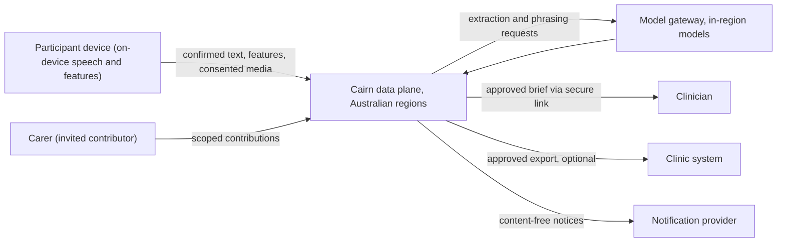

# Data Protection Impact Assessment (DPIA)

> **Template Origin**: Official | **ArcKit Version**: 6.16.4 | **Command**: `/arckit:dpia`

## Document Control

| Field | Value |
|-------|-------|
| **Document ID** | ARC-001-DPIA-v1.0 |
| **Document Type** | Data Protection Impact Assessment (Australian privacy impact assessment) |
| **Project** | Cairn — Longitudinal Guidance and Evidence Platform (Project 001) |
| **Classification** | OFFICIAL |
| **Status** | DRAFT |
| **Version** | 1.0 |
| **Created Date** | 2026-09-29 |
| **Last Modified** | 2026-09-29 |
| **Review Cycle** | Annual, and on the triggers in section 10 |
| **Next Review Date** | 2027-09-29 |
| **Owner** | Chris McKelt (Privacy Officer, S-8) |
| **Reviewed By** | [PENDING] |
| **Approved By** | [PENDING] |
| **Distribution** | Executive Sponsor, Privacy Officer, Clinical Safety Lead, Architecture Review Board, pilot health service privacy contact |

## Revision History

| Version | Date | Author | Changes | Approved By | Approval Date |
|---------|------|--------|---------|-------------|---------------|
| 1.0 | 2026-09-29 | ArcKit AI | Initial creation from `/arckit:dpia` command | PENDING | PENDING |

**Assessment scope and framework** (chosen for this version):

- **Scope**: the Parkinson's pilot only: the Cairn core plus the Parkinson's symptom capture pack, as needed before pilot enrolment. The mentorship pack and organisation aggregate reporting are out of scope and need their own assessment before Phase 2.
- **Framework**: Australian Privacy Act 1988 (Cth), the Australian Privacy Principles (APPs), the Notifiable Data Breaches (NDB) scheme and OAIC guidance on privacy impact assessments. The template's UK GDPR and ICO references are mapped to their Australian equivalents. State health records law applies depending on the pilot health service. Legal conclusions are to be confirmed by counsel.
- **Data subject consultation**: recorded as not applicable at the request of the assessment owner. This assessment recommends revisiting that decision (section 3.2).

> **Publication**: Cairn is a proof of concept built in the open. On 2026-09-29 the architecture owner decided that all artefacts, including this assessment, may be published in the public repository (risk register R-020, accepted). This assessment uses synthetic scenarios only and contains no participant data. Before real participants enrol, re-check that later versions contain nothing that should not be public.

---

## Executive Summary

**Processing Activity**: A patient-held visit-preparation diary for people living with Parkinson's. Participants record experiences by voice or text and complete guided captures (for example finger tapping or a sustained vowel). Carers can contribute observations. Cairn structures the information into cited evidence and prepares a one-page brief that the participant approves before sharing with their clinician.

**DPIA Outcome**: MEDIUM residual risk to data subjects overall, with one HIGH residual risk (DPIA-004, an inadequate response to a disclosure of self-harm or immediate danger) that is a clinical safety risk as much as a privacy one.

**Approval Status**: PENDING

**Key Findings**:

- **The pilot processes sensitive health information**, and possibly biometric information derived from voice and movement, about a population that includes older people and people whose capacity to consent may change over a long journey. Five of the nine screening criteria are met.
- **The design is strongly privacy-protective**: consent as data, participant approval before every disclosure, on-device processing of raw media, Australian residency, crypto-shredding deletion and no secondary use. But almost all of these controls are designed, not yet built.
- **The largest gaps are organisational, not technical**:
  - No mechanism exists yet for participants who lose capacity; authorised representatives are out of scope in v1.
  - Safety escalation and statutory retention rules await legal advice.
  - One person holds the privacy officer, clinical safety, product and architecture roles.
  - Data subjects have not been consulted.
- **Excluding long-term memory from the pilot** (null provider, risk register R-011) removes an entire category of inference and deletion risk.

**Recommendation**: Proceed with conditions (section 8.2). The pilot should not enrol participants until conditions 1 to 8 are met.

**ICO Consultation Required**: NO. The ICO does not regulate Australian processing, and the Privacy Act has no mandatory prior consultation for private-sector entities. Voluntary engagement with the pilot health service's privacy and clinical governance functions is recommended.

---

## 1. DPIA Screening Assessment

### 1.1 Screening Criteria (ICO's 9 Criteria)

The ICO criteria are used as a structured screen. The OAIC's guidance similarly treats sensitive information, new technology and vulnerable groups as signs of high privacy risk.

| # | Criterion | YES/NO | Evidence |
|---|-----------|--------|----------|
| 1 | **Evaluation or scoring** including profiling and predicting | YES | Pattern rules evaluate each participant's timeline against their own baseline, and derived voice and movement features are tracked over time (FR-020, FR-021, E-012, E-013). No score is shown to anyone, but profiling occurs internally. |
| 2 | **Automated decision-making with legal or similarly significant effect** | NO | The planner decides which question to ask next (FR-022). No decision has a legal or similarly significant effect, and clinicians make all care decisions. Automated-decision transparency under the 2024 Privacy Act amendments is addressed in section 15. |
| 3 | **Systematic monitoring** of data subjects | YES | A longitudinal health diary with repeated captures over months (DR-010, E-008). It is participant-initiated, but it builds an ongoing record of health status. |
| 4 | **Sensitive data or data of highly personal nature** | YES | Health information throughout (E-005 to E-017, E-021), safety events (E-021), and features that may be biometric information (E-012). |
| 5 | **Processing on a large scale** | NO (pilot) | Up to 200 participants in the pilot (A-6). This becomes YES at production scale (Year 3 projection of 50,000 journeys, NFR-S-001). |
| 6 | **Matching or combining datasets** unexpectedly | NO | Participant, carer and device data are combined within one journey, as participants would expect. No external datasets are matched, and cross-journey linkage is prohibited (FR-004). |
| 7 | **Data concerning vulnerable data subjects** | YES | People living with Parkinson's, many older, some with fluctuating or declining cognition; carers; people who may disclose self-harm. |
| 8 | **Innovative use of new technology** | YES | Language-model extraction and phrasing (FR-016, FR-025); on-device speech and movement feature extraction (FR-014). |
| 9 | **Processing that prevents data subjects from exercising a right** | NO | Access, correction, deletion, export and withdrawal are designed (FR-018, FR-035, FR-044, DR-006). |

**Screening Score**: 5/9 criteria met

### 1.2 DPIA Necessity Decision

**Decision**: DPIA REQUIRED

**Rationale**:

- Five criteria are met, including sensitive information about a vulnerable population.
- The OAIC recommends a privacy impact assessment for projects that involve sensitive information or new technology with significant privacy impact.
- The requirements (NFR-C-001) and data model already identify the assessment as a pilot dependency.

**Decision Authority**: Chris McKelt, Privacy Officer (S-8), countersigned by Haim Ozchakir, Executive Sponsor (S-11), per the role-concentration mitigation in the stakeholder analysis

**Decision Date**: 2026-09-29

---

## 2. Description of Processing

### 2.1 Nature of Processing

**How data is collected**:

- The participant types or speaks entries in the mobile or web app. Speech is transcribed on the device; server transcription happens only under a separate consent purpose, and audio is deleted after the participant confirms the transcript (FR-011).
- Guided captures (finger tapping, walk and turn, sustained vowel, reading) compute features on the device; raw video and audio stay on the device unless the participant consents to upload a specific item (FR-014).
- Invited carers add observations within a scope the participant sets (FR-003).
- The participant answers pack questions chosen by deterministic rules within a burden budget (FR-022, FR-023).

**How data is used**:

- A language model, through the in-region model gateway, proposes structured observations from confirmed text. Each proposal must cite the exact source text, and the participant confirms it directly or through brief approval (FR-016).
- Deterministic rules detect patterns, coverage gaps and changes from the participant's own baseline. These drive which question is asked next, and are never shown as scores (FR-020, FR-021).
- A deterministic core safety floor screens every input for self-harm and immediate danger (FR-026).
- Briefs are assembled from cited records; the participant approves each item for each recipient (FR-030, FR-032).

**How data is stored**: in the tenant's data plane in approved Australian regions; content encrypted with a per-journey key; append-only evidence with a hash chain (DR-002, NFR-C-004).

**How data is disclosed**: only to recipients the participant approves: a time-limited secure link or, optionally, a structured export into the clinic's system (FR-033, FR-034). Notifications are content-free (INT-009).

**How data is deleted**: participant deletion within 30 days in primary stores; crypto-shredding makes backups unreadable immediately; legal hold only where statutory retention applies and the participant was told at enrolment (DR-006).

**Processing not in the pilot**: long-term memory (the Parkinson's pack uses the null provider, risk register R-011), organisation aggregate reporting, the mentorship pack, and research or model-training use.

**Data flow**:

### 2.2 Scope of Processing

#### What data are we processing?

| Category | Data | Entities (ARC-001-DATA-v1.0) | Sensitivity |
|----------|------|------------------------------|-------------|
| Identity and contact | Identity provider reference, chosen display name, email, phone, locale, time zone, adult confirmation (no date of birth) | E-002 | Personal |
| Preferences | Input mode, language level, cadence, quiet periods, ask limit | E-003 | Personal (may imply disability) |
| Relationships | Carer and clinician links, invitee contact details | E-004 | Sensitive in context (reveals condition) |
| Journey and goals | Journey existence, goals | E-005, E-006 | Health information |
| Participant content | Utterances, transcripts, documents, contributions, structured observations, citations, briefs | E-008 to E-011, E-017 | Health information |
| Derived features and baselines | Voice and movement features, participant baselines | E-012, E-013 | Health information; possibly biometric |
| Rule and planning records | Pattern evaluations, coverage states, questions asked | E-007, E-014 to E-016 | Health information in context |
| Safety events | Floor and red-flag hits, responses, any disclosure basis | E-021 | Sensitive health information |
| Consent, approvals, shares | Consent grants, approvals, share records | E-018 to E-020 | Personal |
| Audit | Pseudonymous actor, action, time | E-027 | Personal (pseudonymous) |

#### Whose data are we processing?

| Data subject group | Description | Vulnerability |
|--------------------|-------------|---------------|
| Participants | Adults living with Parkinson's in the pilot (up to 200) | High: older age, fatigue, possible cognitive change, health information |
| Carers and contributors | Family members or friends invited by participants | Medium: their observations and contact details |
| Clinicians | Reviewers who receive briefs | Low: professional contact and access logs |
| Third parties mentioned in entries | People participants talk about | Medium: not aware their information is recorded |

#### How much data?

- **Pilot**: up to 200 participants, about 50,000 evidence items in the pilot year (DATA E-008)
- **Duration**: 6-month pilot, with journeys that may continue for years afterwards
- **Geography**: Australia

#### How long are we keeping it?

| Data | Retention (ARC-001-DATA-v1.0) |
|------|-------------------------------|
| Journey content (E-004 to E-017) | Journey lifetime, then the pack retention period (proposed default 12 months) unless statutory retention applies |
| Safety events (E-021) | Per the pack's regulatory profile; proposed minimum 7 years if the pack is regulated |
| Consent, approval and share records | Journey lifetime + 7 years (proposed) |
| Audit events | 7 years (proposed) |
| Backups | 35 days; shredded journeys unreadable immediately |

### 2.3 Context of Processing

#### Why are we processing this data?

To help people living with Parkinson's remember and communicate what changed between infrequent specialist visits, in their own words, with a brief they control (BR-002, stakeholder goal G-1). The pack does not diagnose Parkinson's, score disease severity or recommend treatment [CSD-C1].

#### What is the relationship with data subjects?

Participants are invited through a health service running the pilot. The health service is likely the tenant and may be a health service provider with its own obligations. Whether Cairn is the service provider acting for the health service or an entity holding records in its own right determines who is the record holder for state health records law. That is unresolved (risk register R-007) and must be settled in the pilot agreement.

#### How much control do data subjects have?

High by design:

- Participants choose what to record, confirm transcripts, approve each brief item for each recipient, and can revoke sharing.
- They can see who accessed shared content, export everything, delete items or the whole journey, and withdraw at any time (P4, FR-018, FR-032, FR-035, FR-044).

Carers control only their own contributions. Third parties mentioned in entries have no direct control.

#### Would data subjects expect this processing?

Mostly yes for a diary shared with a clinician. Participants may not expect:

- that a language model processes their words, even in-region and without training
- that movement and voice features are computed and compared over time
- that safety disclosures trigger a fixed response and may be escalated if they agreed to that at enrolment

These must be explained in plain language at enrolment (NFR-C-006).

### 2.4 Purpose and Benefits

#### What do we want to achieve?

- Better-prepared specialist visits: 70% of visits preceded by an approved brief (G-1)
- Participants feel heard with little effort (G-2)
- No disclosure without participant approval (G-3)

#### Who benefits?

- **Participants**: concerns raised and recorded in their own words
- **Clinicians**: structured, cited information before short consultations
- **Health service**: better use of specialist time

---

## 3. Consultation

### 3.1 Data Protection Officer (DPO) Consultation

Australian law does not require a data protection officer. The privacy officer role (S-8) performs this function.

| Field | Value |
|-------|-------|
| Privacy officer | Chris McKelt (S-8) |
| Consulted on | 2026-09-29 (assessment owner) |
| Independence | Limited: the same person holds the product owner, clinical safety lead and architecture owner roles (risk register R-001) |
| Advice | Proceed with conditions; obtain external privacy review before enrolment |

### 3.2 Data Subject Consultation

**Approach selected**: Not applicable (assessment owner's decision for this version).

**Assessment comment**: Consultation is feasible here. Participants, carers and advocacy organisations can be reached, and the stakeholder analysis already plans co-design workshops with people living with Parkinson's and an advocacy organisation (ARC-001-STKE-v1.2, Appendix A). OAIC guidance encourages consulting affected people in a privacy impact assessment. Recording consultation as not applicable leaves expectations untested, particularly about language-model processing, derived features and safety escalation (section 2.3). **Recommendation**: fold privacy questions into the planned co-design workshops before enrolment, or record the justification for not consulting (condition 7).

### 3.3 Stakeholder Consultation

| Stakeholder | Role in processing | Consultation status |
|-------------|--------------------|---------------------|
| Haim Ozchakir (S-11) | Executive sponsor; accountable for the consent model | Countersigns this assessment |
| Chris McKelt (S-7, S-8, S-10, S-18) | Clinical safety lead, privacy officer, architecture owner, product owner | Assessment owner |
| Pilot health service (S-4) | Tenant; possibly record holder; clinical governance | Not yet consulted; required before enrolment |
| Clinical advisory group (S-6) | Pack content, safety floor wording | Not yet consulted |
| Platform operator (S-9) | Data plane operation, backups, break-glass | Consulted through the data model |
| Model and notification providers (S-15) | Processors in the data path | Contract terms to be confirmed (section 6.2) |
| Legal counsel | Disclosure duties, record holder, retention | Advice pending (risk register R-006, R-007) |

---

## 4. Necessity and Proportionality Assessment

### 4.1 Lawful Basis Assessment

Australian privacy law has no single "lawful basis" list like GDPR Article 6. The equivalent tests are: collection must be reasonably necessary for the entity's functions (APP 3); sensitive information needs consent unless an exception applies (APP 3.3); and use and disclosure are limited to the primary purpose or a permitted secondary purpose (APP 6).

| Processing | Australian basis | GDPR equivalent (for EU tenants only) |
|------------|------------------|---------------------------------------|
| Collecting health information for the diary and brief | Consent, specific to the pack's purposes (APP 3.3) | Article 6(1)(a) with Article 9(2)(a) |
| Using information to choose questions and prepare briefs | Primary purpose (APP 6) | Consent |
| Disclosing briefs to clinicians | Participant's express approval per item and recipient (APP 6.1) | Consent |
| Contact details for notifications | Consent and notification (APP 5) | Consent |
| Audit and security logging | Required to protect information (APP 11) | Legal obligation or legitimate interests |
| Safety escalation beyond the participant | Consent agreed at enrolment, or a documented legal obligation (APP 6.2 permitted situations) | Consent or vital interests |

### 4.2 Special Category Data Basis (Article 9)

Health information and biometric information are sensitive information under the Privacy Act. The pilot relies on **express consent** (APP 3.3(a)). Consent must be informed, voluntary, current and specific, and given by a person with capacity. Because Parkinson's can affect cognition, capacity may change during a long journey. v1 has no authorised representative mechanism (FR-032 assumption), so capacity is a key risk (DPIA-005).

### 4.3 Necessity Assessment

| Data | Necessary? | Justification |
|------|-----------|---------------|
| Participant utterances and observations | Yes | Core purpose: the participant's own account |
| Derived voice and movement features | Partly | Useful for rule-driven follow-up questions, but not shown to anyone in the pilot. Consider deferring until the regulatory determination (R-002) confirms how they may be used |
| Raw media | No, by default | Stays on the device; uploaded only when the participant chooses to share a clip |
| Contact details | Yes | Content-free reminders and share notifications |
| Carer contributions | Yes, optional | Observations the participant may not notice; scoped by the participant |
| Date of birth, address, government identifiers | No | Not collected (adult confirmation only) |
| Clinical patient identifier | Only if exports are used | Needed only to file into clinic systems; the secure link avoids it (DATA gap) |
| Long-term memory | No | Excluded from the pilot |

### 4.4 Proportionality Assessment

- **Minimisation**: no date of birth, address or government identifiers; features instead of raw media; claim-check events without content; content-free telemetry and notifications
- **Participant control**: approval before every disclosure; revocation; export; deletion
- **Less intrusive alternatives**: a paper diary gives less structure and no clinician preparation; server-side media processing would be more accurate but more intrusive. The chosen design takes the less intrusive route where accuracy allows (requirements Conflict C-3)
- **Balance**: the benefit to participants is direct, and they keep control of disclosure. Processing is proportionate, provided the conditions in section 8.2 are met

---

## 5. Risk Assessment to Data Subjects

**CRITICAL**: Assess risks to **individuals' rights and freedoms**, NOT organisational risks. Organisational risks are in `ARC-001-RISK-v1.0`; each DPIA risk below links to the related register entry where one exists.

### 5.1 Risk Identification

**Risk Categories to Consider**:

- Physical harm: a missed or mishandled safety disclosure; care decisions based on inaccurate information
- Material damage: discrimination in employment or insurance if health information leaks
- Non-material damage: distress, loss of control over health information, embarrassment in family relationships, loss of trust in clinicians

### 5.2 Inherent Risks (Before Mitigation)

| Risk ID | Risk Description | Impact on Data Subjects | Likelihood | Severity | Risk Level | Risk Source |
|---------|------------------|-------------------------|------------|----------|------------|-------------|
| DPIA-001 | Unauthorised access to, or breach of, participant health information | Discrimination, distress, loss of control over a diagnosis they may not have disclosed | Medium | High | HIGH | Security vulnerability; insider access |
| DPIA-002 | Disclosure beyond what the participant intended (wrong recipient, forwarded link, carer sees too much) | Distress; family or workplace consequences | Medium | High | HIGH | Sharing and relationship design |
| DPIA-003 | Inaccurate transcription or extraction misrepresents the participant's experience to their clinician | Wrong impression in consultation; potential effect on care | Medium | High | HIGH | Speech recognition; language-model extraction |
| DPIA-004 | Inadequate response to a disclosure of self-harm or immediate danger, or escalation without agreement | Physical harm; or breach of trust through unexpected escalation | Medium | Very High | VERY HIGH | Safety floor coverage; unresolved escalation rules |
| DPIA-005 | Consent becomes invalid as a participant's capacity changes over a long journey | Processing and disclosure without valid consent; loss of autonomy | Medium | High | HIGH | Parkinson's-related cognitive change; no authorised-representative mechanism in v1 |
| DPIA-006 | Function creep: use for research, model training, insurers or employers | Loss of control; discrimination | Low | High | MEDIUM | Commercial pressure; unclear contracts |
| DPIA-007 | Participant expectations of deletion not met (statutory retention; copies already delivered) | Distress; loss of control | Medium | Medium | MEDIUM | Health records law; exports to clinic systems |
| DPIA-008 | Unexpected inferences from derived voice and movement features | Feeling monitored; inferred decline recorded without awareness | Medium | Medium | MEDIUM | On-device features; baselines |
| DPIA-009 | Carer contributions and third parties mentioned in entries | Carers' own information exposed; third parties recorded without knowledge | Medium | Medium | MEDIUM | Contributor model; free-text entries |
| DPIA-010 | Processors (model, speech, notification providers) mishandle or move data offshore | Loss of control; offshore exposure | Low | High | MEDIUM | Third-party processing |
| DPIA-011 | Approved exports into clinic systems are retained or reused beyond Cairn's control | Loss of control over copies | Medium | Medium | MEDIUM | Onward disclosure |
| DPIA-012 | Condition revealed indirectly (notifications, relationship labels, app presence) | Unwanted disclosure of diagnosis to household or colleagues | Medium | Medium | MEDIUM | Notification and UI design |
| DPIA-013 | Participants unaware of AI use and rule-driven questions | Reduced autonomy and trust | Medium | Low | LOW | Transparency |

**Likelihood Scale**:

- **Low**: Unlikely to occur (0-33% chance)
- **Medium**: May occur (34-66% chance)
- **High**: Likely to occur (67-100% chance)

**Severity Scale** (Impact on Individuals):

- **Low**: Minimal or no impact; temporary inconvenience
- **Medium**: Significant inconvenience or distress; some financial loss; minor reputational impact
- **High**: Serious consequences; significant financial loss; significant reputational damage; psychological harm
- **Very High**: Irreversible harm; severe financial loss; severe psychological trauma; physical safety risk

**Risk Level Matrix**:

|            | Low Severity | Medium Severity | High Severity | Very High Severity |
|------------|-------------|-----------------|---------------|-------------------|
| **Low Likelihood**    | LOW  | LOW  | MEDIUM | HIGH |
| **Medium Likelihood** | LOW  | MEDIUM | HIGH | VERY HIGH |
| **High Likelihood**   | MEDIUM | HIGH | VERY HIGH | VERY HIGH |

### 5.3 Detailed Risk Analysis

**DPIA-001: Breach of participant health information**

**Description**: An attacker, a defect (for example a cross-journey leak) or an insider exposes participant content.

**Data Subjects Affected**: All participants and carers in the tenant data plane (up to 200 participants in the pilot).

**Harm to Individuals**:

- Physical: None directly
- Material: Possible discrimination in employment or insurance
- Non-material: Distress; loss of control over a diagnosis some have not disclosed

**Likelihood Analysis**: Medium before controls; health data is a common target.

**Severity Analysis**: High; health information is sensitive and permanent.

**Existing Controls**: Designed only: per-journey encryption, isolation tests, row-level security, content-free telemetry, break-glass access (NFR-SEC-003, NFR-SEC-007, FR-039). Related register risks: R-004, R-022.

---

**DPIA-002: Disclosure beyond the participant's intent**

**Description**: A brief is approved for the wrong clinician, a secure link is forwarded, or a carer's scope is broader than intended.

**Data Subjects Affected**: Participants who share briefs; carers.

**Harm to Individuals**:

- Physical: None
- Material: Possible, if information reaches an employer
- Non-material: Distress and damaged relationships

**Likelihood Analysis**: Medium; sharing is frequent and user error is common.

**Severity Analysis**: High for health information.

**Existing Controls**: Designed only: per-item, per-recipient approval; expiring links with recipient verification; access log visible to the participant; revocation (FR-032, FR-033, FR-018). Related register risk: R-004.

---

**DPIA-003: Inaccurate representation to the clinician**

**Description**: Speech recognition struggles with soft or slurred speech, or extraction mislabels an experience, and the brief misstates what the participant said.

**Data Subjects Affected**: Participants, especially those with speech changes.

**Harm to Individuals**:

- Physical: Possible, if care decisions rely on a wrong impression
- Material: None
- Non-material: Feeling misrepresented

**Likelihood Analysis**: Medium; speech models are weaker on atypical speech (register R-008).

**Severity Analysis**: High; it can affect care.

**Existing Controls**: Designed only: transcript confirmation, extraction only from confirmed text, citations to the participant's own words, participant approval of every brief item, and a brief that separates "not reported" from "not asked" (FR-012, FR-016, FR-030).

---

**DPIA-004: Inadequate response to self-harm or immediate danger**

**Description**: A participant discloses self-harm or danger and the floor fails to respond appropriately. Alternatively, information is escalated to someone the participant did not agree to.

**Data Subjects Affected**: Participants at risk; carers.

**Harm to Individuals**:

- Physical: Serious harm if a disclosure is missed
- Material: None
- Non-material: Loss of trust if escalation is unexpected

**Likelihood Analysis**: Medium before controls; open conversation defeats simple detection.

**Severity Analysis**: Very High (physical safety).

**Existing Controls**: Designed only: deterministic floor on every input before any reply, including offline; release blocked on any critical miss; escalation only by enrolment consent or documented legal obligation (FR-026, FR-015, FR-028). Related register risks: R-003, R-006.

---

**DPIA-005: Consent invalidated by changing capacity**

**Description**: Parkinson's can bring cognitive change. A participant who consented with capacity may later be unable to understand or change their consent, while recording, briefs and sharing continue.

**Data Subjects Affected**: Participants whose cognition changes during the journey.

**Harm to Individuals**:

- Physical: None directly
- Material: None
- Non-material: Loss of autonomy; disclosures they would not now choose

**Likelihood Analysis**: Medium over journeys lasting months to years.

**Severity Analysis**: High (sensitive information, autonomy).

**Existing Controls**: None specific. Authorised representatives are out of scope in v1 (FR-032 assumption). **Not yet in the risk register**; to be added.

---

**DPIA-006 to DPIA-013** are Medium or Low risks before mitigation. Section 5.2 describes them and section 6.3 maps their mitigations.

---

## 6. Mitigation Measures

### 6.1 Technical Measures

**Data Security**:

- [ ] **Encryption at rest**: AES-256 or equivalent for all stores; per-journey data keys; crypto-shredding for deletion (NFR-SEC-003, DATA)
- [ ] **Encryption in transit**: TLS 1.2 or higher, mutual TLS between services
- [ ] **Access control**: purpose- and consent-aware authorisation on every request; row-level security; no routine operator access; break-glass with approval and audit (NFR-SEC-002, FR-039)
- [ ] **Isolation testing**: store-as-A, read-as-B tests across tenants and journeys block release (NFR-SEC-007)
- [ ] **Audit logging**: tamper-evident, content-free, 7 years; participants see who accessed shared content (NFR-C-002, FR-018)

**Data Minimisation**:

- [ ] No date of birth, address or government identifiers (E-002)
- [ ] Raw media stays on the device unless the participant uploads a chosen item (FR-014)
- [ ] Content-free notifications that never name the condition or pack (INT-009)
- [ ] Claim-check event stream without content (FR-050)
- [ ] Long-term memory excluded from the pilot (null provider)

**Accuracy**:

- [ ] Transcript confirmation; extraction only from confirmed text; citations; participant approval of briefs (FR-012, FR-016, FR-030)
- [ ] Speech engine evaluated on representative voices with a word error rate target (NFR-U-002)

**Residency**:

- [ ] Australian regions only, enforced by cloud policy and the model gateway (NFR-C-004)

### 6.2 Organisational Measures

**Policies and Procedures**:

- [ ] Plain-language collection notice (APP 5) explaining language-model use, derived features, safety responses and escalation, retention, and how to exercise rights
- [ ] Privacy policy (APP 1), including automated-decision transparency ahead of the December 2026 obligations
- [ ] Capacity procedure: capacity confirmed at enrolment by the treating clinician; consent re-confirmed every 6 months (proposed) or on concern; journeys paused when capacity is in doubt; process agreed with the health service for nominated persons
- [ ] Safety escalation protocol agreed with the health service and legal counsel
- [ ] Breach response runbook for the NDB scheme: triage within 24 hours, assessment within 30 days

**Contracts**:

- [ ] Pilot agreement with the health service settles who holds the records, retention, clinician responsibilities and escalation
- [ ] Model provider terms: in-region processing, no training on Cairn data, no content logging
- [ ] Notification provider: in-region, or an APP 8 assessment with contract terms

**People**:

- [ ] Independent clinical safety adviser and external privacy review before enrolment (register R-001)
- [ ] Privacy and safety training for anyone with break-glass access

### 6.3 Mitigation Mapping

| Risk ID | Key Mitigations | Requirement / Register Link |
|---------|-----------------|-----------------------------|
| DPIA-001 | Encryption, isolation tests, row-level security, content-free telemetry, break-glass, penetration test | NFR-SEC-003, NFR-SEC-007, FR-039; R-004, R-022 |
| DPIA-002 | Per-item approval, expiring verified links, access log, revocation, confirmation screen naming the recipient | FR-032, FR-033, FR-018; R-004 |
| DPIA-003 | Transcript confirmation, citations, brief approval, speech evaluation | FR-012, FR-016, FR-030, NFR-U-002; R-008 |
| DPIA-004 | Deterministic floor, regression suite, independent clinical review, legal advice on escalation, consent-based escalation | FR-026, FR-028; R-003, R-006 |
| DPIA-005 | Capacity procedure, periodic consent re-confirmation, pause on concern, nominated-person process | New requirement needed; add to register |
| DPIA-006 | Purpose-bound consent, no secondary use without separate consent, provider no-training terms | DR-012, FR-036; R-021 |
| DPIA-007 | Retention declared at enrolment, legal hold transparency, warning before exports | DR-006, FR-032; R-007 |
| DPIA-008 | On-device features, internal only, displayed only if the regulatory profile allows, explained at enrolment | FR-014, FR-021; R-002 |
| DPIA-009 | Scoped contributor access, contributor rights, guidance on mentioning others | FR-003; DATA E-004 |
| DPIA-010 | In-region gateway, provider contracts, server transcription only by consent | FR-046, FR-011; R-009, R-023 |
| DPIA-011 | Secure link as default channel; export warning; exports only on explicit approval | FR-033, FR-034 |
| DPIA-012 | Content-free notifications, discreet app naming option, small-cohort suppression | INT-009, DR-008 |
| DPIA-013 | Plain-language AI transparency, "asked because…" explanations | NFR-C-006, FR-018 |

### 6.4 Residual Risk Assessment

**Risks After Mitigation**:

| Risk ID | Risk Title | Mitigations | Residual Likelihood | Residual Severity | Residual Risk Level | Acceptable? | Justification |
|---------|------------|-------------|---------------------|-------------------|---------------------|-------------|---------------|
| DPIA-001 | Breach of health information | Encryption, isolation, access control | Low | High | **MEDIUM** | YES | Cannot be eliminated; controls are strong once built |
| DPIA-002 | Disclosure beyond intent | Approval, verified links, revocation | Low | High | **MEDIUM** | YES | Participant control and visibility |
| DPIA-003 | Inaccurate representation | Confirmation, citations, approval | Low | High | **MEDIUM** | YES | Participant reviews every brief item |
| DPIA-004 | Inadequate safety response | Floor, regression suite, independent review, escalation protocol | Low | Very High | **HIGH** | YES, with conditions | Severity cannot be reduced; conditions 3 and 8 apply |
| DPIA-005 | Consent and capacity | Capacity procedure, re-confirmation, pause | Medium | Medium | **MEDIUM** | YES, with conditions | Condition 2 applies |
| DPIA-006 | Function creep | Purpose-bound consent, contracts | Low | Medium | **LOW** | YES | |
| DPIA-007 | Deletion expectations | Transparency, legal hold, export warning | Low | Medium | **LOW** | YES | |
| DPIA-008 | Unexpected inference | Internal only, explained | Low | Medium | **LOW** | YES | |
| DPIA-009 | Carer and third parties | Scoped access, rights | Low | Medium | **LOW** | YES | |
| DPIA-010 | Processors | Contracts, gateway | Low | Medium | **LOW** | YES | |
| DPIA-011 | Onward copies | Secure link default, warning | Medium | Low | **LOW** | YES | |
| DPIA-012 | Indirect revelation | Content-free notices | Low | Medium | **LOW** | YES | |
| DPIA-013 | Transparency | Plain-language notice | Low | Low | **LOW** | YES | |

**Overall Residual Risk Level**: MEDIUM (one HIGH)

**Acceptability Assessment**:

- [ ] All residual risks are LOW or MEDIUM → ACCEPTABLE
- [x] Some residual risks are HIGH → ACCEPTABLE WITH CONDITIONS (section 8.2)
- [ ] Any residual risks are VERY HIGH → NOT ACCEPTABLE (ICO consultation required)

**Conditions for Acceptance**: see section 8.2.

---

## 7. ICO Prior Consultation

**ICO Consultation Required**: NO

The ICO regulates UK processing only. Under the Australian Privacy Act, private-sector entities have no mandatory prior consultation with the OAIC. The one HIGH residual risk (DPIA-004) is a clinical safety risk, best reviewed by the pilot health service's clinical governance committee and the independent clinical safety adviser. The OAIC can be approached voluntarily for guidance.

| Field | Value |
|-------|-------|
| ICO Reference Number | Not applicable |
| Consultation Date | Not applicable |
| ICO Case Officer | Not applicable |
| ICO Advice Received | Not applicable |
| ICO Recommendations | Not applicable |
| ICO Approval | Not applicable |
| Conditions | Not applicable |
| How Conditions Addressed | Clinical governance review in place of regulator consultation (condition 3) |

---

## 8. Sign-Off and Approval

### 8.1 DPIA Approval

| Role | Name | Decision | Signature | Date |
|------|------|----------|-----------|------|
| Privacy Officer (assessment owner) | Chris McKelt | | | |
| Clinical Safety and Regulatory Lead | Chris McKelt | | | |
| Executive Sponsor (countersignature, register R-001) | Haim Ozchakir | | | |
| External privacy reviewer | To be appointed | | | |

### 8.2 Conditions of Approval

The pilot must not enrol participants until conditions 1 to 8 are met:

1. **Controls built and verified**: consent, approval, isolation, deletion and residency controls are implemented, with evidence in the certification pack (FR-032, FR-036, NFR-SEC-007, DR-006, NFR-C-004).
2. **Capacity procedure**: capacity confirmed at enrolment, consent re-confirmed periodically, journeys paused on concern, and a nominated-person process agreed with the health service. Add a requirement and a register risk for it.
3. **Safety escalation**: legal advice obtained; escalation protocol agreed with the health service; floor rules and messages approved with independent clinical review (register R-001, R-003, R-006).
4. **Record holder and retention**: settled in the pilot agreement (register R-007).
5. **Processor terms**: model, speech and notification provider terms confirmed (in-region, no training, no content logging, or an APP 8 assessment).
6. **Transparency**: collection notice and privacy policy published in plain language, including AI use and automated-decision transparency.
7. **Consultation**: privacy questions included in the planned co-design workshops, or the justification for not consulting recorded.
8. **Independent review**: external privacy review of this assessment, and the executive sponsor's countersignature.

Publication: all artefacts, including this assessment, may be public for the proof of concept (decided 2026-09-29; register R-020).

### 8.3 Final Decision

**Decision**: PENDING. The recommendation is to proceed with the conditions above.

**Rationale**: The processing is necessary and proportionate for the participant-controlled diary. The design is strongly privacy-protective, and residual risks are acceptable once the conditions are met.

---

## 9. Integration with Information Security Management

### 9.1 Link to Security Controls

No Secure by Design assessment exists yet. The security controls relied on here are specified in `ARC-001-REQ-v1.1` (NFR-SEC-001 to NFR-SEC-009) and `ARC-001-DATA-v1.0`. Run `/arckit:secure` to assess them. A threat model and penetration test are planned before the pilot (register R-004).

### 9.2 Link to Risk Register

| DPIA Risk | Register Risk | Action |
|-----------|---------------|--------|
| DPIA-001, DPIA-002 | R-004, R-022 | Existing |
| DPIA-003 | R-008 | Existing |
| DPIA-004 | R-003, R-006 | Existing |
| DPIA-005 | None | **Add** (capacity and consent) |
| DPIA-006, DPIA-013 | R-021 | Existing |
| DPIA-007 | R-007 | Existing |
| DPIA-008 | R-002 | Existing |
| DPIA-009 | None | **Add** (carer and third-party information) |
| DPIA-010 | R-009, R-023 | Existing |
| DPIA-011, DPIA-012 | None | Low residual; track in this assessment |

---

## 10. Review and Monitoring

### 10.1 Review Triggers

- 12 months after approval
- Before Phase 2 (mentorship pack) or organisation aggregate reporting, which need their own assessment
- Before any use of long-term memory in the Parkinson's pack
- The regulatory determination changes the pack's status (register R-002)
- Any eligible data breach or serious safety event
- New processors, new regions or new export destinations
- Material changes to Australian privacy law or OAIC guidance, including the automated-decision obligations from December 2026

### 10.2 Review Schedule

| Review | Date | Reviewer |
|--------|------|----------|
| Pre-enrolment condition check | Before pilot enrolment | Privacy officer; external reviewer |
| Pilot mid-point | 3 months after enrolment | Privacy officer; health service privacy contact |
| Annual review | 2027-09-29 | Privacy officer; executive sponsor |

### 10.3 Monitoring Activities

- Monthly: deletion completion, access-log anomalies, isolation test results, share-link expiry
- Monthly: safety events reviewed by the clinical safety lead and independent adviser
- Quarterly: consent re-confirmation rates and capacity pauses
- Per release: residency attestation and processor configuration

### 10.4 Change Management

Changes affecting personal data (new data fields, purposes, processors, regions, disclosures or model bindings) require a privacy review before release. Changes to pack consent purposes are pack changes and go through pack certification (FR-009).

---

## 11. Traceability to ArcKit Artifacts

### 11.1 Source Artifacts

| Artifact | Used For |
|----------|----------|
| `ARC-001-DATA-v1.0` | Entities, personal information inventory, retention, subject rights, data flows |
| `ARC-001-REQ-v1.1` | Processing purposes, controls (FR, NFR-SEC, NFR-C, DR) |
| `ARC-001-STKE-v1.2` | Data subjects, vulnerable groups, governance roles, consultation plans |
| `ARC-001-RISK-v1.0` | Related organisational risks |
| `ARC-000-PRIN-v1.0` | Participant ownership (P4), on-device first (P8), residency (P11), consent-bound data (P13) |

### 11.2 Traceability Matrix: Data → Requirements → DPIA

| Data (Entity) | Requirement | DPIA Risk |
|---------------|-------------|-----------|
| E-008 Evidence, E-010 Observation | FR-012, FR-016, FR-017 | DPIA-001, DPIA-003 |
| E-017 Report, E-018 Approval, E-019 Share | FR-030, FR-032, FR-033 | DPIA-002, DPIA-011 |
| E-021 SafetyEvent | FR-026, FR-028 | DPIA-004 |
| E-020 ConsentGrant | FR-036, DR-005 | DPIA-005, DPIA-006 |
| E-012 DerivedFeature, E-013 Baseline | FR-014, FR-021 | DPIA-008 |
| E-004 Relationship | FR-003 | DPIA-009 |
| E-002 Participant | INT-009 | DPIA-012 |

### 11.3 Traceability Matrix: Stakeholder → Data Subject → Rights

| Stakeholder (STKE) | Data Subject Group | Key Rights |
|--------------------|--------------------|------------|
| S-1 Participants | Participants | Access, correction, deletion, export, withdrawal, approval of every disclosure |
| S-2 Contributors | Carers and contributors | Access, export and withdrawal of their own contributions |
| S-3 Reviewers | Clinicians | Transparency about access logging |

### 11.4 Downstream Artifacts Informed by DPIA

- `ARC-001-RISK-v1.1`: add DPIA-005 and DPIA-009 as risks
- `ARC-001-REQ-v1.2`: add a capacity and consent re-confirmation requirement
- Secure by Design assessment (`/arckit:secure`)
- Pilot agreement and collection notice

---

## 12. Data Subject Rights Implementation

### 12.1 Rights Checklist

| Right (APP / GDPR equivalent) | Implemented? | Mechanism | Gap |
|-------------------------------|--------------|-----------|-----|
| Access (APP 12) | ✅ Designed | In-app timeline and full export within 24 hours (FR-018, FR-035) | Not built |
| Correction (APP 13) | ✅ Designed | Superseding versions; history kept (FR-018) | Not built |
| Deletion | ✅ Designed | Governed deletion with crypto-shredding; 30 days; legal hold disclosed (DR-006) | Statutory retention rules pending legal advice |
| Portability | ✅ Designed | JSON and readable export (NFR-I-003) | Not built |
| Withdrawal of consent | ✅ Designed | Revocation effective within 60 seconds (FR-036) | Not built |
| Objection and restriction | ✅ Designed | Pause journey; skip any question; revoke purposes (FR-023, FR-036) | Not built |
| Transparency about automated decisions | ✅ Designed | "Asked because…" explanations (FR-018) | Privacy policy wording needed |
| Rights of people who lose capacity | ❌ Not implemented | None in v1 | Condition 2 |
| Contributors' rights | ✅ Designed | Own contributions only (E-004, E-008) | Procedure to be written |

### 12.2 Rights Fulfillment Procedures

- Requests are made in the app, or to the privacy officer, with identity confirmed through the identity provider
- Access and export within 24 hours (automated); correction immediately; deletion within 30 days
- Where the health service is the record holder, requests are coordinated with the health service under the pilot agreement
- Every request and outcome is logged in E-027

---

## 13. International Data Transfers

**Transfers**: None by default. All stores and model inference stay in approved Australian regions (NFR-C-004).

### 13.1 Transfer Details

| Destination | Data | Status |
|-------------|------|--------|
| Model and speech providers | Confirmed text; consented audio | In-region only, enforced by the gateway |
| Notification providers | Contact details and content-free messages | In-region provider preferred; otherwise an APP 8 assessment |
| Participant-directed exports | Approved content | Disclosure to a recipient the participant chooses |

### 13.2 Transfer Safeguards

- Cloud policy denies resources outside approved regions; the gateway rejects out-of-region model bindings
- Contracts prohibit offshore processing, training and content logging
- Any unavoidable cross-border disclosure requires an APP 8 assessment and contract terms

### 13.3 Transfer Risk Assessment

LOW, provided notification providers are in-region or assessed (DPIA-010).

---

## 14. Children's Data (if applicable)

**Applicable**: NO. v1 enrols adults only (assumption A-1), confirmed at onboarding (`age_confirmed_adult`, E-002).

### 14.1 Age Verification

Self-declaration at onboarding, with enrolment through the health service providing further assurance.

### 14.2 Additional Safeguards for Children

Not applicable in v1. Enrolling young-onset participants under 18 would require a new assessment.

### 14.3 Best Interests Assessment

Not applicable.

---

## 15. Algorithmic/AI Processing (if applicable)

**Applicable**: YES: language-model extraction and phrasing, and deterministic rules over participant data.

### 15.1 Algorithm Description

| Component | What it does | What it does not do |
|-----------|--------------|---------------------|
| Language model (extraction) | Proposes structured observations from confirmed text, citing the source span | Does not decide what is detected, asked, safe or shown (P2) |
| Language model (phrasing) | Words the question the rules chose | Cannot change the question; factual references must cite evidence |
| Pattern rules and planner | Deterministically choose the next question within a burden budget | No scores, diagnoses or predictions about the person (P5) |
| On-device feature algorithms | Compute voice and movement features for rule inputs | Not displayed unless the regulatory profile allows |
| Safety floor | Deterministic detection with fixed approved messages | No model involvement |

### 15.2 Algorithmic Bias Assessment

- **Speech recognition**: likely to be less accurate for soft, slurred or accented speech, so some participants may have worse transcripts (DPIA-003). Mitigation: evaluation on representative voices, a per-pack error target and one-tap correction.
- **Extraction**: may perform differently across language styles. Mitigation: evaluation by cohort (FR-047), with confirmation and citations.
- **Features**: movement and voice features may vary with tremor severity, device and environment. They are not displayed or used for decisions about the person.

### 15.3 Explainability and Transparency

- Every question shows why it was asked (FR-018); every brief statement links to the participant's words (FR-030)
- The collection notice explains where AI is used and that rules, not AI, make decisions (NFR-C-006)
- Automated-decision transparency under the 2024 Privacy Act amendments: planner decisions probably do not significantly affect rights or interests, but the privacy policy should describe them (condition 6)

---

## 16. Summary and Conclusion

### 16.1 Key Findings

| Measure | Result |
|---------|--------|
| Screening | 5/9 criteria met; assessment required |
| Risks identified | 13 |
| Inherent levels | 1 Very High, 4 High, 7 Medium, 1 Low |
| Residual levels | 1 High, 4 Medium, 8 Low |
| Regulator consultation | Not required; clinical governance review recommended |
| Rights | Designed for all rights except those of participants who lose capacity |

### 16.2 Recommendations

| # | Recommendation | Owner | Due |
|---|----------------|-------|-----|
| 1 | Re-check published artefacts for anything that should not be public before real participants enrol | Chris McKelt (Privacy Officer) | Before pilot enrolment |
| 2 | Obtain legal advice on escalation, record holder and retention | Haim Ozchakir | 2026-11-30 |
| 3 | Define the capacity procedure and add a requirement for it | Chris McKelt (Privacy Officer) | 2026-12-15 |
| 4 | Engage an independent clinical safety adviser and external privacy reviewer | Haim Ozchakir | 2026-12-15 |
| 5 | Confirm processor terms (model, speech, notifications) | Chris McKelt (Architecture Owner) | 2027-02-28 |
| 6 | Publish the collection notice and privacy policy | Chris McKelt (Privacy Officer) | 2027-03-31 |
| 7 | Include privacy questions in co-design workshops, or record why not | Chris McKelt (Product Owner) | 2026-12-15 |
| 8 | Add DPIA-005 and DPIA-009 to the risk register | Chris McKelt (Product Owner) | 2026-10-15 |

### 16.3 Final Conclusion

Once built, Cairn's design meets or exceeds the Australian Privacy Principles for this pilot: participants control every disclosure, raw media stays on devices, data stays in Australia, and deletion reaches backups. The residual risks come from organisational gaps: capacity, safety escalation, record-holder status, independence of review and consultation. Closing these is a precondition for enrolment. Recommendation: **proceed with conditions**.

---

## External References

> This section provides traceability from generated content back to source documents.
> Follow citation instructions in the project's citation reference guide.

### Document Register

| Doc ID | Filename | Type | Source Location | Description |
|--------|----------|------|-----------------|-------------|
| CSD | 001_cairn_solution_design.md | Solution Design | `000-global/external/` | Cairn Solution Design v0.2 |

### Citations

| Citation ID | Doc ID | Page/Section | Category | Quoted Passage |
|-------------|--------|--------------|----------|----------------|
| [CSD-C1] | CSD | §12 Reference Domain Pack A | Compliance Constraint | "It does not diagnose Parkinson’s, score disease severity or recommend treatment in its initial intended purpose." |

### Unreferenced Documents

| Filename | Source Location | Reason |
|----------|-----------------|--------|
| 002_technotes.md | `000-global/external/` | Long-term memory is excluded from the pilot scope |
| .gitkeep | `000-global/policies/` | No existing privacy policy or prior assessments provided |

---

## Generation Metadata

**Generated by**: ArcKit `/arckit:dpia` command
**Generated on**: 2026-09-29
**ArcKit Version**: 6.16.4
**Project**: Cairn — Longitudinal Guidance and Evidence Platform (Project 001)
**Model**: Claude Opus 5.5 (claude-opus-5-5)

---

## Appendix A: ICO DPIA Screening Checklist

See section 1.1: 5 of 9 criteria met (evaluation/profiling, systematic monitoring, sensitive data, vulnerable subjects, innovative technology).

## Appendix B: GDPR Article 35 Requirements Checklist

Mapped to the elements the OAIC recommends for a privacy impact assessment:

- [x] Systematic description of processing and purposes (section 2)
- [x] Necessity and proportionality (section 4)
- [x] Risks to individuals (section 5)
- [x] Measures to address risks (section 6)
- [ ] Consultation with affected individuals (section 3.2, condition 7)
- [ ] Independent review and sign-off (section 8, condition 8)

## Appendix C: Data Protection Principles Compliance

| APP | Summary | Status |
|-----|---------|--------|
| APP 1 | Open and transparent management | Privacy policy needed (condition 6) |
| APP 3 | Collection of sensitive information with consent | Designed; capacity gap (condition 2) |
| APP 5 | Notification of collection | Collection notice needed (condition 6) |
| APP 6 | Use and disclosure | Designed: approval before every disclosure |
| APP 8 | Cross-border disclosure | No transfers by default; notification providers to confirm |
| APP 10 | Quality | Confirmation, citations, correction |
| APP 11 | Security, destruction and de-identification | Designed: encryption, isolation, crypto-shredding |
| APP 12 | Access | Designed: in-app and export |
| APP 13 | Correction | Designed: superseding versions |

## Appendix D: Glossary

| Term | Meaning |
|------|---------|
| APP | Australian Privacy Principle |
| Crypto-shredding | Deleting data by destroying its encryption key |
| NDB | Notifiable Data Breaches scheme |
| OAIC | Office of the Australian Information Commissioner |
| Sensitive information | Privacy Act category including health and biometric information |
