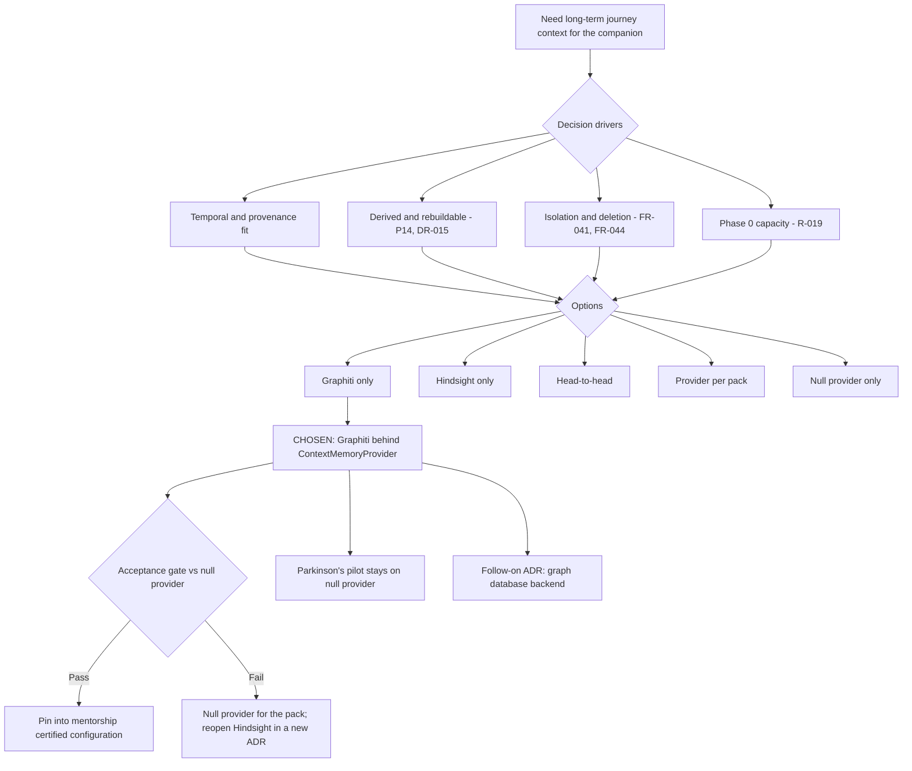

# Architecture Decision Record: Adopt Graphiti as the Long-Term Context Memory Provider

> **Template Origin**: Official | **ArcKit Version**: 6.1.7 | **Command**: `/arckit:adr`

## Document Control

| Field | Value |
|-------|-------|
| **Document ID** | ARC-001-ADR-001-v1.0 |
| **Document Type** | Architecture Decision Record |
| **Project** | Cairn — Longitudinal Guidance and Evidence Platform (Project 001) |
| **Classification** | OFFICIAL |
| **Status** | DRAFT |
| **Version** | 1.0 |
| **Created Date** | 2026-10-03 |
| **Last Modified** | 2026-10-03 |
| **Review Cycle** | On-Demand |
| **Next Review Date** | 2026-11-02 |
| **Owner** | Chris McKelt (Architecture Owner) |
| **Reviewed By** | [PENDING] |
| **Approved By** | [PENDING] |
| **Distribution** | Project Team, Architecture Team, Engineering and delivery team |

## Revision History

| Version | Date | Author | Changes | Approved By | Approval Date |
|---------|------|--------|---------|-------------|---------------|
| 1.0 | 2026-10-03 | ArcKit AI | Initial creation from `/arckit:adr` command | [PENDING] | [PENDING] |

---

## 1. Decision Title

**Adopt Graphiti as the long-term context memory provider, behind the provider-neutral interface**

**ADR status**: Proposed

**In one paragraph**: Cairn will build one memory adapter, for Graphiti, behind the `ContextMemoryProvider` interface (FR-040). It will not build a Hindsight adapter. Graphiti stays a derived, rebuildable projection of canonical Cairn events and never becomes a source of truth. The Phase 0 head-to-head between Hindsight and Graphiti (FR-051) becomes a narrower acceptance gate: Graphiti against the null provider. If Graphiti fails the gate, the affected pack runs with the null provider and the Hindsight option is reopened. The Parkinson's pilot keeps the null provider, as the DPIA and risk R-011 already require.

---

## 2. Stakeholders

### 2.1 Deciders (RACI: Accountable)

- **Chris McKelt, Architecture Owner (S-10)**: owns architecture decisions and holds the risk for R-010 (memory provider immaturity)
- **Engineering and delivery team (S-12)**: responsible for memory provider adoption in the stakeholder RACI, and builds and runs the adapter

### 2.2 Consulted (RACI: Consulted)

- **Chris McKelt, Privacy Officer (S-8)**: deletion propagation, consent-bound retention, residency of the graph store
- **Chris McKelt, Clinical Safety and Regulatory Lead (S-7)**: stops model-derived temporal facts drifting into clinical use (R-011, Conflict C-13)
- **Platform operator and SRE (S-9)**: running a graph database in every data plane that uses memory
- **Pack authors (S-6)**: the mentorship ontology and memory policy (FR-052)

### 2.3 Informed (RACI: Informed)

- **Haim Ozchakir, Executive Sponsor (S-11)**
- **Chris McKelt, Product Owner (S-18)**
- **Technology suppliers (S-15)**: Graphiti maintainers

### 2.4 Escalation Context

**Decision Level**: Team

**Escalation Rationale**:

- [x] **Team**: Local implementation choice (frameworks, libraries, testing)
- [ ] **Cross-team**: Integration patterns, shared services, API standards
- [ ] **Department**: Technology standards, cloud providers, security frameworks
- [ ] **Cross-government**: National infrastructure, cross-department interoperability

The architecture owner chose Team level. The memory provider sits behind an interface and is non-authoritative. It can be swapped for the null provider without any change to core or pack code (BR-010).

> **Governance note**: The stakeholder RACI (`ARC-001-STKE-v1.2`) names the Architecture Review Board as **accountable** for memory provider adoption. This decision also changes requirements FR-040, FR-051, INT-003, TC-4 and TC-7 (Section 7.3). The Team-level decision lets the adapter work start. The requirement changes should be ratified at the next monthly ARB. Because the architecture owner also chairs the ARB (risk R-001, role concentration), an independent technical reviewer should be named for that ratification.

**Governance Forum**: Engineering design review (platform team), with ratification of the requirement changes at the Cairn Architecture Review Board

**Approval Date**: [PENDING]

**UK Government context**: Cairn is a private-sector product deployed in Australia by default, so the GDS Service Standard and Technology Code of Practice do not apply. Sections 4.3 and 8.3 use the Australian equivalents already adopted in the requirements and DPIA.

---

## 3. Context and Problem Statement

### 3.1 Problem Description

Cairn's companion needs context that lasts for months. For example: "last month you said the new role felt like a stretch", or "you prefer short questions in the evening". The canonical record holds the facts. A long-term memory layer makes conversation feel continuous. Requirements v1.1 made memory provider-neutral and planned a Phase 0 head-to-head between Hindsight and Graphiti, with a null-provider control arm (FR-051). The technology notes rank Graphiti first (9/10) and Hindsight second (8.5/10) [TN-C1] [TN-C7]. They recommend evaluating both before committing [TN-C6].

The team is small (R-019) and Phase 0 has to fit regulatory, safety and build work into the same window. Building and evaluating two adapters, two backing stores and two licence reviews is effort that does not reach participants.

**Problem statement as a question**: Which long-term context memory provider should Cairn build against now, and what evidence must it still produce before it enters a certified production configuration?

### 3.2 Why This Decision Is Needed

- **Business context**: BR-010 (replaceable AI and memory components), BR-002 (evidence-backed preparation for conversations), BR-013 (first paying tenants). The mentorship pack is the first pack that will use memory (Goal G-7).
- **Technical context**: FR-040 to FR-045 (memory interface, isolation, retain and recall, never govern, deletion and rebuild, restricted synthesis), FR-050 to FR-052 (event stream, provider evaluation, pack memory policy), INT-003, NFR-P-003, NFR-P-006, NFR-SEC-007.
- **Regulatory context**: The Australian Privacy Act 1988 and the APPs (purpose limitation and deletion of derived data), plus state health privacy law for the Parkinson's pack. The Parkinson's pack may be regulated as software as a medical device (TGA, R-002), so any third-party component in its path is SOUP (P9).

### 3.3 Supporting Links

- **User story/Epic**: Group K (Long-term context memory) and Group O (Projections and memory provider selection) in `ARC-001-REQ-v1.1`
- **Requirements**: BR-010, FR-040, FR-041, FR-042, FR-043, FR-044, FR-045, FR-050, FR-051, FR-052, INT-003, NFR-P-003, NFR-P-006, NFR-SEC-003, NFR-SEC-006, NFR-SEC-007, NFR-SEC-008, NFR-C-004, DR-014, DR-015, TC-4, TC-7, TC-9, TC-10
- **Research findings**: No ArcKit research artifact exists. The evidence base is the agent memory technology notes (`000-global/external/002_technotes.md`) and the sources checked on 2026-10-03 (External References).
- **Related ADRs**: None yet. This is the first ADR for project 001. A follow-on ADR is required for the graph database backend (Section 12.2).

---

## 4. Decision Drivers (Forces)

### 4.1 Technical Drivers

- **Temporal and provenance fit**: Cairn's central concern is how a person's goals, observations and evidence change over time. A Graphiti fact records "when it became true, when it stopped being true, and which source episode produced it" [TN-C2].
  - Requirements: FR-042 (every memory item links to canonical IDs), FR-044 (forget by source)
  - Principles: P14 Evidence Integrity and Lineage
- **Memory must stay derived and disposable**: The provider can never be the only place a fact exists [TN-C8]. It must be rebuildable from the canonical event stream.
  - Requirements: FR-050, DR-015, NFR-P-006
  - Principles: P2, P14
- **Isolation**: Each tenant and journey needs its own memory scope. Cross-journey or cross-tenant leakage disqualifies a provider.
  - Requirements: FR-041, NFR-SEC-007
  - Principles: P4, P9, P16
- **Deletion that reaches every derived copy**: This includes learned summaries, not just raw items.
  - Requirements: FR-044 (deletion window, proposed at 24 hours)
  - Principles: P13
- **Residency-safe inference**: The provider's internal model and embedding calls must go through the model gateway or in-cluster models.
  - Requirements: INT-003, FR-046, NFR-C-004
  - Principles: P11
- **Domain-free core**: The ontology belongs to the pack, not to the core or the provider.
  - Requirements: FR-052, NFR-M-004
  - Principles: P1

### 4.2 Business Drivers

- **Delivery capacity**: One adapter, one backing store and one licence review instead of two. This frees Phase 0 effort for the regulatory and safety gates.
  - Risks: R-019 (team capacity), R-018 (pace pressure over gates)
  - Stakeholder goals: SD-15 deliverable scope (S-12)
- **Platform simplicity**: Fewer certified configurations and a smaller SOUP register.
  - Requirements: NFR-S-003, NFR-SEC-008; Conflict C-12
- **Proving the thesis on the mentorship pack**: Memory continuity matters most for mentors and mentees (SD-7).
  - Stakeholder goals: G-7 (mentorship pack on the same core)

### 4.3 Regulatory & Compliance Drivers

- **GDS Service Standard / Technology Code of Practice**: Not applicable. Cairn is private-sector and Australia-hosted.
- **Privacy (Australian Privacy Act 1988, APPs 3, 6, 11)**: Collection only for declared purposes, use limited to purpose, and secure destruction that reaches derived data. This drives FR-044 deletion verification inside the graph.
- **Health records**: State health privacy law applies to the Parkinson's pack. The pack stays on the null provider for the pilot (DPIA).
- **Medical device regulation (TGA)**: If the Parkinson's pack is a medical device (R-002), Graphiti and its graph database would be SOUP and would need a SOUP register entry (P9, NFR-SEC-008).
- **Responsible AI**: Australia's AI Ethics Principles (NFR-C-006). Participants are told plainly that memory is AI-derived and does not make decisions.
- **Licensing**: TC-9 requires permissive licences by default. Network-copyleft or source-available licences need legal review, and the requirement covers a candidate's datastores too.

### 4.4 Alignment to Architecture Principles

Reference: `projects/000-global/ARC-000-PRIN-v1.0.md`

| Principle | Alignment | Impact |
|-----------|-----------|--------|
| P1 The Core Is Domain-Free | ✅ Supports | Graphiti's developer-defined ontologies [TN-C11] let each pack declare its own entity and edge types (FR-052). The core holds none. |
| P2 LLMs Converse; Deterministic Rules Decide (NON-NEGOTIABLE) | ✅ Supports | Recall runs after the planner has chosen the action and feeds phrasing only (FR-042, FR-043). |
| P3 Every Claim Cites Evidence (NON-NEGOTIABLE) | ⚠️ Partial | Graph facts look authoritative but are model-extracted. A fact is displayed only if it cites canonical evidence (FR-043, Conflict C-13). |
| P4 The Participant Owns the Journey (NON-NEGOTIABLE) | ✅ Supports | One `group_id` per tenant and journey, derived server-side. Participants can view and delete standing context (FR-044). |
| P9 Regulated Packs Are Isolated | ⚠️ Partial | Graphiti is not used in the regulated pilot. Any later use needs a physically separate graph store and SOUP entries for Graphiti and the database. |
| P10 Portable Core, Native Adapters | ⚠️ Partial | The Graphiti SDK is confined to the adapter. Portability now depends on the graph database chosen in the follow-on ADR. Amazon Neptune would be AWS-only. |
| P11 Residency by Policy (NON-NEGOTIABLE) | ✅ Supports (conditional) | Graphiti accepts any OpenAI-compatible endpoint [WEB-1-C3], so its calls can be bound to the model gateway. Gate condition: no other egress. |
| P12 Version Everything | ✅ Supports | The Graphiti version, graph database version and pack memory policy version are stamped in the version manifest (FR-040). |
| P13 Consent-Bound, Minimised Data | ⚠️ Partial | Per-episode deletion exists, but a known defect can leave deleted facts in entity summaries [WEB-6-C1]. Verification must probe summaries. |
| P14 Evidence Integrity and Lineage | ✅ Supports | Each canonical event becomes one Graphiti episode carrying its canonical source ID, which gives lineage from fact to source [TN-C4]. |
| P16 Security by Design (NON-NEGOTIABLE) | ⚠️ Partial | Adds a datastore to encrypt, segment, patch and back up in each data plane (NFR-SEC-003). |
| P21 Evaluation-Gated Change | ✅ Supports | Adoption into a certified configuration still passes an evaluation gate, now against the null provider. |
| P23 Decisions Are Recorded | ✅ Supports | This ADR. |

---

## 5. Considered Options

Five options were analysed, plus the Do Nothing baseline. **Not shortlisted**: Mem0 (8/10), Cognee (7.5/10), MemMachine (7/10), and the AGPL candidates OpenViking and Honcho. The technology notes rank them below the top two for Cairn's temporal and evidence needs, and the AGPL candidates conflict with TC-9 [TN-C1]. Letta is excluded by TC-10.

Cost note: no cost model exists for memory yet (R-017). Costs below are relative estimates in engineering effort and infrastructure categories, not priced figures. They should be replaced by measured values from the acceptance gate (NFR-P-006 requires per-turn ingestion cost to be measured and capped).

### Option 1: Adopt Graphiti now as the single provider (behind the interface)

**Description**: Build one adapter, for Graphiti, behind `ContextMemoryProvider`. Graphiti is a derived temporal projection fed only from the canonical event stream. Phase 0 runs a Graphiti-versus-null acceptance gate. Hindsight is not built.

**Implementation approach**:

- One canonical event becomes one Graphiti episode, carrying canonical source IDs, occurred-at time, pack version and purpose (FR-042, FR-050).
- One `group_id` per tenant and journey, derived server-side from authenticated state (FR-041). Graphiti isolation is logical inside one database, and its documentation warns that the application "must authorize each `group_id`" [WEB-5-C1] [WEB-5-C2]. The adapter rejects any query without a scope filter.
- `forget(source)` maps to episode removal and is followed by recall probes. These probes check entity summaries as well as facts (FR-044).
- `rebuild(journey)` drops the journey's group and replays the event stream (DR-015).
- The pack's ontology (entity and edge types) comes from the pack memory policy (FR-052).
- LLM and embedding calls go to the model gateway through Graphiti's OpenAI-compatible client [WEB-1-C3].
- The graph database backend is chosen in a follow-on ADR (Section 12.2).

**Wardley Evolution Stage**: Custom-Built moving towards Product. Graphiti is an open-source library that needs integration work; its graph databases are Product.

#### Good (Pros)

- ✅ **Best model fit**: Time, relationships and provenance are first-class, and those are Cairn's core concerns [TN-C2]. It is the technology notes' top score (9/10) and current first preference [TN-C1] [TN-C10].
- ✅ **Lineage by construction**: Episode-to-fact links support FR-042 projection records and per-source forget (FR-044, P14).
- ✅ **Pack-owned ontology**: Developer-defined entity and edge types fit FR-052 and P1 [TN-C11].
- ✅ **Permissive licence**: Graphiti is Apache-2.0 [WEB-1-C1], which complies with TC-9 for the library itself.
- ✅ **Residency-compatible inference**: Any OpenAI-compatible `/v1` endpoint can be used [WEB-1-C3], so calls can be bound to the model gateway (P11, INT-003).
- ✅ **Half the Phase 0 build**: One adapter, one store, one licence review and one SOUP candidate. This directly relieves R-019.

#### Bad (Cons)

- ❌ **Adds a graph database to every data plane that uses memory**: That means operations, backup, encryption, patching and licence review (INT-003, TN notes "requires graph infrastructure" [TN-C1]). The licence options are awkward (Option analysis in Appendix A): Neo4j Community is GPL v3 [WEB-4-C1], FalkorDB is SSPLv1 [WEB-3-C1], and Kuzu support is deprecated upstream [WEB-1-C2].
- ❌ **Logical isolation only**: All journeys share one database separated by `group_id` [WEB-5-C1]. A partitioning defect would be a cross-journey leak (R-022). Related defects have occurred: Graphiti's MCP server handlers once queried the wrong group's graph on FalkorDB [WEB-7-C1]. Cairn does not use the MCP server, but this shows the class of risk.
- ❌ **Deletion verification is not yet clean**: An open defect leaves a removed fact in a surviving entity's summary [WEB-6-C1]. Until that is fixed, FR-044 needs either summary regeneration in the adapter or delete-and-rebuild of the journey.
- ❌ **Departs from the technology notes' recommendation**: The notes say "both deserve evaluation before committing" [TN-C6] and suggest Hindsight "may be stronger" for mentorship [TN-C5], which is the first pack that will use memory.
- ❌ **Facts that look authoritative**: Model-extracted validity dates invite misuse as a timeline (Conflict C-13, R-011). FR-043 architecture tests are required.
- ❌ **Model-heavy ingestion**: Entity and edge extraction and deduplication need structured output on every episode [WEB-1-C4], which affects R-017 cost and NFR-P-006 throughput.

#### Cost Analysis

- **CAPEX**: About 4–6 engineer-weeks for the adapter, contract tests, isolation tests, forget and rebuild, and the acceptance gate. Plus about 1 week for the graph database selection and licence review.
- **OPEX**: One graph database per memory-enabled data plane (compute, storage, backups, patching). If a commercial graph database edition is chosen, add its licence. Model gateway spend for ingestion and embeddings, to be measured per confirmed turn (NFR-P-006).
- **TCO (3-year)**: Not priced. Lowest of the provider options in engineering effort. Infrastructure is higher than Hindsight because a second datastore type is needed.

#### Compliance Impact (Australian equivalents)

| Area | Impact | Notes |
|------|--------|-------|
| Privacy Act APP 11 (security and destruction) | Negative until verified | Deletion within summaries must be proven (FR-044) |
| Residency (P11, NFR-C-004) | Neutral | Self-hosted in the tenant's data plane; gateway-bound inference |
| Medical device / SOUP (P9) | Neutral | Not in the regulated pilot path |

---

### Option 2: Adopt Hindsight now as the single provider

**Description**: Build only a Hindsight adapter behind the interface. Hindsight runs on PostgreSQL with pgvector [WEB-2-C2] and uses one memory bank per tenant and journey.

**Implementation approach**: One bank per journey. Retain from the canonical event stream, recall after planning, and keep reflect disabled by default (FR-045).

**Wardley Evolution Stage**: Custom-Built. It is pre-1.0, with v0.10.1 evaluated (TC-7).

#### Good (Pros)

- ✅ **No new datastore type**: It uses PostgreSQL, which every data plane already runs (TC-4).
- ✅ **Strong conversational memory**: Observations, mental models, and an evolving picture of a participant. This is a good fit for mentorship [TN-C5] [TN-C7].
- ✅ **MIT licence** [WEB-2-C1], with strict bank isolation claimed: "no cross-bank leakage" [WEB-2-C3].
- ✅ **Custom OpenAI-compatible endpoints** are supported, so calls can be gateway-bound [WEB-2-C4].

#### Bad (Cons)

- ❌ **Weaker temporal and provenance model**: Observations are probabilistic synthesised memory [TN-C7]. Tracing them back to canonical sources is less direct than episode-to-fact links.
- ❌ **Pre-1.0**: API churn risk is higher (R-010).
- ❌ **Weaker fit for evidence-oriented packs**: The notes favour Graphiti for the Parkinson's pack [TN-C5].
- ❌ **The notes explicitly advise against hard-coding Hindsight** [TN-C12]. The interface prevents hard-coding either way.

#### Cost Analysis

- **CAPEX**: About 4–5 engineer-weeks.
- **OPEX**: PostgreSQL capacity in the existing data plane, plus model gateway spend for retain and consolidation.
- **TCO (3-year)**: Not priced. Likely the lowest infrastructure cost of the provider options.

---

### Option 3: Keep the Phase 0 head-to-head (current plan, FR-051)

**Description**: Build both adapters and evaluate Hindsight, Graphiti and the null provider on the same synthetic mentorship and Parkinson's journeys. Choose per pack [TN-C9].

#### Good (Pros)

- ✅ **The choice rests on evidence**: Measured results, not reputation. This follows the technology notes [TN-C6] and the current requirements.
- ✅ **Tests the per-pack hypothesis** [TN-C5].

#### Bad (Cons)

- ❌ **About double the Phase 0 memory effort**: Two adapters, two stores and two licence reviews, when capacity is the constraint (R-019).
- ❌ **The Parkinson's arm has limited value**: The regulated pilot uses the null provider anyway (DPIA, R-011 Terminate), so the fair comparison there is against the null provider (Conflict C-12).
- ❌ **Defers the graph database question while still requiring it**: The Graphiti arm needs a graph database.

#### Cost Analysis

- **CAPEX**: About 8–11 engineer-weeks.
- **OPEX**: The winner's costs. Both stores must be run during evaluation.
- **TCO (3-year)**: Not priced. Highest up-front cost.

---

### Option 4: A different provider per pack (Hindsight for mentorship, Graphiti for Parkinson's)

**Description**: Commit to the technology notes' "likely result" without an evaluation [TN-C5].

#### Good (Pros)

- ✅ **Best hypothesised fit for each domain**.

#### Bad (Cons)

- ❌ **Two providers to run, patch, certify and evaluate on every upgrade** (Conflict C-12 Option 1).
- ❌ **Puts a graph database in the regulated data plane**, against the DPIA scope and R-011 Terminate.
- ❌ **No evidence for either half of the hypothesis**.

#### Cost Analysis

- **CAPEX**: About 8–11 engineer-weeks.
- **OPEX**: The highest, with two stores and SOUP entries in the regulated plane.
- **TCO (3-year)**: Not priced. Highest of all options.

---

### Option 5: Do Nothing (Baseline) — null provider only

**Description**: Defer any memory provider. All packs run with the null provider. Conversation uses canonical state only.

#### Good

- ✅ **No immediate cost or new dependency**: Nothing to license, run or certify.
- ✅ **Lowest privacy risk**: No model-derived memory, so no deletion-verification problem.
- ✅ **Governed workflows are unaffected**: BR-010 requires them to pass with the null provider.

#### Bad

- ❌ **No conversational continuity**: Mentors and mentees lose "you mentioned last month…" context (SD-7), which weakens the mentorship pack (G-7).
- ❌ **Opportunity cost**: The interface (FR-040) and event stream (FR-050) are built without a real provider to prove them.
- ❌ **Decision debt**: The provider question returns later, under more pressure.

---

## 6. Decision Outcome

### 6.1 Chosen Option

**"Option 1: Adopt Graphiti now as the single provider (behind the interface)"**

It is chosen with these binding conditions:

1. **Projection, not record**: Graphiti is a derived semantic projection [TN-C4]. It is not a clinical or operational system of record [TN-C3]. FR-043 applies in full.
2. **Scope**: Graphiti is for unregulated packs, starting with mentorship. The Parkinson's pilot stays on the null provider. Graphiti enters a regulated data plane only after a new ADR, a physically separate graph store and SOUP registration (P9).
3. **Acceptance gate before certification**: Graphiti must beat the null provider on the synthetic six-month mentorship journey. It is disqualified by any cross-journey or cross-tenant leak, any deleted source still recoverable (**including in entity summaries**), or any model call that cannot be bound to the model gateway (Section 8.1).
4. **Fallback**: If the gate fails, the mentorship pack runs with the null provider and the Hindsight option is reopened in a superseding ADR.
5. **Graph database**: The backend is chosen in a follow-on ADR (Section 12.2) with a TC-9 licence review before any non-synthetic data is ingested.

### 6.2 Y-Statement (Structured Justification)

> **In the context of** giving Cairn's conversational companion long-term, journey-scoped context across months-long journeys,
> **facing** a small team, a crowded Phase 0, and two credible open-source candidates that would each need an adapter, a store and a licence review,
> **we decided for** Graphiti as the single memory provider, behind the provider-neutral interface and gated against the null provider,
> **to achieve** a memory model that natively captures time, relationships and provenance and maps cleanly onto Cairn's canonical events and pack ontologies, at half the evaluation cost,
> **accepting** a graph database in every memory-enabled data plane, logical-only partition isolation, deletion verification that must cover entity summaries, and the risk that Hindsight would have served mentorship conversation better.

### 6.3 Justification (Why This Option?)

**Key reasons**:

1. **Model fit with Cairn's core concept**: The notes conclude Graphiti "may ultimately be the stronger match" for understanding how goals, observations and evidence evolve [TN-C10]. Its facts carry validity periods and source episodes [TN-C2], which line up with FR-042 projection records and per-source forget.
2. **One provider is the simplest compliant shape**: Conflict C-12 already leans towards one provider for unregulated packs and the null provider for the regulated pilot. Choosing one provider now completes that resolution and halves the Phase 0 memory effort (R-019).
3. **The evidence step is kept, not dropped**: Adoption into a certified configuration still needs a measured result (P21). The gate compares against the null provider, which is the comparison Conflict C-12 calls fair, and keeps every FR-051 disqualifier.
4. **Low cost of being wrong**: The interface (FR-040), the null provider and rebuild-from-events (DR-015) mean a wrong choice costs one adapter, not a migration. No canonical data lives in Graphiti.
5. **Licence and residency are viable**: Graphiti is Apache-2.0 [WEB-1-C1] and can route all model calls through the gateway [WEB-1-C3]. Hindsight is equally viable on both counts, so this is not a differentiator. The graph database licence is the open item.

**Why not Hindsight (Option 2)**: Its single biggest advantage, no new datastore, is real. Its temporal and provenance model is weaker for evidence-oriented journeys, and it is pre-1.0. If the Graphiti gate fails, Hindsight is the first alternative.

**Why not the head-to-head (Option 3)**: It is the more evidence-rich path and is what the technology notes recommend [TN-C6]. It was declined for capacity reasons. This is a deliberate departure from the notes, recorded here.

**Stakeholder consensus**: The decision was made by the architecture owner. No stakeholder interviews have been held (STKE v1.2). Privacy, clinical safety and platform operations are consulted roles that have not yet reviewed it. Because these roles are concentrated in one person (R-001), independent review at ARB ratification is recommended.

**Risk appetite**: TECHNOLOGY risk appetite is Medium (score ≤ 12). R-010 is expected to stay within appetite because the acceptance gate still controls adoption. See Section 7.4.

---

## 7. Consequences

### 7.1 Positive Consequences

- ✅ **Lineage from memory to source**: Each memory fact traces to the episode, and the episode to the canonical event ID (P14).
- ✅ **Pack-defined memory ontologies**: The mentorship pack declares entity and edge types (Mentee, Goal, Competency, Reflection, Feedback). The core stays domain-free (P1).
- ✅ **Richer phrasing context**: For example "your goal changed in August from gaining leadership experience to leading a team", always cited to canonical evidence.
- ✅ **Lower Phase 0 load**: One adapter and one licence review instead of two.

**Measurable outcomes** (from the acceptance gate):

- Conversational usefulness versus the null provider: no baseline yet → a statistically meaningful improvement on the pack's phrasing rubric
- Cross-journey and cross-tenant leakage: 0 in every store-as-A, read-as-B test
- Deleted sources recoverable after forget (facts, nodes, entity summaries): 0 within the proposed 24-hour window
- Recall latency: ≤ 500 ms at the 95th percentile, with a 1-second hard timeout (NFR-P-003)
- Confirmed turn reflected in memory: ≤ 5 minutes at the 95th percentile (NFR-P-006)
- Rebuild of a 12-month journey: ≤ 4 hours (NFR-P-006)

### 7.2 Negative Consequences (Accepted Trade-offs)

- ❌ **A graph database in every memory-enabled data plane**: More to operate, secure, back up and license.
- ❌ **Logical-only isolation**: Isolation relies on adapter discipline and tests, not physical separation.
- ❌ **A known deletion defect upstream**: Removed facts can persist in entity summaries [WEB-6-C1].
- ❌ **Hindsight's conversational strengths are not available**: Mental models and consolidated observations [TN-C7].
- ❌ **Model cost on every ingested episode**: Structured-output extraction runs per episode [WEB-1-C4].

**Mitigation strategies**:

- **Graph database**: Choose it in the follow-on ADR with criteria for licence (TC-9), portability (P10), encryption (NFR-SEC-003) and backup. Because memory needs no RPO (NFR-A-002), backups can be minimal and recovery can use rebuild.
- **Isolation**: The adapter injects the server-derived `group_id` on every call and rejects unscoped queries. Run NFR-SEC-007 tests across two journeys of the same participant. Regulated planes, if ever used, get a separate store.
- **Deletion defect**: Pin a Graphiti version that includes the fix (PR #1912) once released, or regenerate affected entity summaries in the adapter. Fall back to delete-and-rebuild of the journey (FR-044 Alt 4a). Recall probes must query summaries.
- **Conversational strength**: Measure usefulness against the null provider. If Graphiti adds little for mentorship, reopen Hindsight.
- **Cost**: Measure and cap per-turn ingestion cost per certified configuration (NFR-P-006, R-017). Batch background ingestion.

### 7.3 Neutral Consequences (Changes Needed)

- 🔄 **Requirements (create `ARC-001-REQ-v1.2`)**:
  - FR-040: "Only two candidate adapters are built" becomes "one adapter (Graphiti) is built; the null provider is always available"
  - FR-051: Change from a Hindsight-versus-Graphiti head-to-head to a Graphiti-versus-null acceptance gate, keeping all disqualifiers and adding entity-summary deletion probes
  - INT-003: Retitle to Graphiti. Keep the Hindsight text as a recorded alternative.
  - TC-4 and TC-7: Name Graphiti as the selected candidate, pinned per certified configuration after the gate
  - Conflict C-12: Record the resolution (Graphiti for unregulated packs; null provider for the regulated pilot)
- 🔄 **Stakeholder RACI**: Rename "Memory provider adoption (Hindsight)" to "Memory provider adoption" in `ARC-001-STKE`. S-15 then refers to Graphiti maintainers.
- 🔄 **Risk register**: Update R-010 wording (Graphiti selected; graph database licence and deletion defect). Link R-022 and R-023 to this ADR.
- 🔄 **Team training**: Graph data modelling and the operation of the chosen graph database.
- 🔄 **Infrastructure changes**: Helm chart and Terraform/OpenTofu modules for the graph database; network policy so that only the memory adapter reaches it (FR-041).
- 🔄 **Process updates**: A runbook for deletion verification failure and rebuild (NFR-M-003); a Graphiti upgrade checklist under NFR-M-006.
- 🔄 **Vendor relationships**: None for Graphiti (open source). A commercial graph database edition would need a contract.

### 7.4 Risks and Mitigations

| Risk | Likelihood | Impact | Mitigation | Owner |
|------|------------|--------|------------|-------|
| Graph database licence conflicts with TC-9 (GPL v3 Neo4j Community, SSPL FalkorDB) | M | M | Follow-on ADR with legal review; consider Neptune (AWS adapter) or a commercial edition | Chris McKelt (S-10) |
| Cross-journey leak through `group_id` misuse | L | H | Server-derived scope, rejection of unscoped queries, NFR-SEC-007 tests; a leak blocks release | Engineering (S-12) |
| Deleted facts survive in entity summaries | M | H | Summary probes in forget verification; pinned fixed version; delete-and-rebuild fallback | Engineering (S-12) |
| Graphiti adds no measurable value for mentorship | M | L | Null provider fallback; reopen Hindsight | Chris McKelt (S-10) |
| Ingestion model cost exceeds plan | M | M | Measure and cap per turn (NFR-P-006); batch ingestion | Engineering (S-12) |
| Graph facts drift into governed use or briefs | L | H | FR-043 architecture tests; fail-closed citation check (P3) | Chris McKelt (S-7) |
| Breaking Graphiti or graph database upgrade | M | L | Pin per certified configuration; contract test suite; rebuild path | Engineering (S-12) |

**Link to risk register**: `projects/001-cairn/ARC-001-RISK-v1.1.md` — R-010 (memory provider immature or deletion unverifiable), R-011 (model-derived memory treated as clinical truth), R-017 (inference and memory costs), R-019 (team capacity), R-022 (cross-tenant or cross-journey leakage), R-023 (third-party licence constraints)

---

## 8. Validation & Compliance

### 8.1 How Will Implementation Be Verified?

**Acceptance gate (replaces the FR-051 head-to-head)**: Graphiti and the null provider are run on the same synthetic six-month mentorship journey, using the technology notes' timeline: goal set, repeated concern, goal change, contradiction, mentor observation, evidence upload, summary request [TN-C9]. The same model bindings are used in both arms. A synthetic Parkinson's journey is run for information only; it does not change the pilot scope.

| Test | Pass condition |
|------|----------------|
| Conversational usefulness | Better than the null provider on the pack phrasing rubric |
| Current-state and historical accuracy | Measured as phrasing quality only (Conflict C-13) |
| Contradiction handling | Change preserved (old fact invalidated, not overwritten) |
| Traceability | Every fact and node links to canonical source IDs |
| Tenant and journey isolation | Zero leakage, including across two journeys of one participant |
| Forget and delete | Zero recoverable deleted sources in facts, nodes **and entity summaries** |
| Rebuild | A 12-month journey rebuilt within 4 hours with no revoked source |
| Residency | All LLM and embedding calls observed at the model gateway; all other egress blocked |
| Latency and cost | NFR-P-003 met; per-turn ingestion cost measured |
| Degradation | Graphiti outage leaves the journey working with the null provider |

**Design review**:

- [ ] High-Level Design shows Graphiti as a projection consumer of the canonical event stream
- [ ] Data model `MemoryProjection` records Graphiti episode and fact identifiers
- [ ] Architecture diagrams show the graph database inside the tenant data plane, reachable only by the adapter

**Code review**:

- [ ] CI blocks `graphiti_core` imports outside the memory adapter (FR-040, NFR-M-004)
- [ ] The adapter never accepts a client-supplied `group_id`
- [ ] The planner, pattern engine, safety and report modules have no dependency on the memory interface

**Testing strategy**:

- [ ] One interface contract suite, run against both the Graphiti and null providers
- [ ] Store-as-A, read-as-B isolation tests in CI (NFR-SEC-007)
- [ ] Replay with memory disabled gives identical governed decisions (FR-043)
- [ ] Adversarial memory-poisoning cases (NFR-SEC-006)

### 8.2 Monitoring & Observability

**Success metrics**:

- **Recall p95 latency**: ≤ 500 ms, from adapter tracing
- **Recall timeout rate**: under 1% of turns
- **Ingestion lag p95**: ≤ 5 minutes, from the last event applied per projection (FR-050)
- **Deletion verification**: 100% within the window
- **Ingestion model cost per confirmed turn**: at or under the cap per certified configuration

**Alerts and dashboards**:

- Alerts on deletion verification failure, isolation test failure, recall p95 over 500 ms for 15 minutes, and ingestion lag over 15 minutes
- Telemetry carries no participant content (P17)

### 8.3 Compliance Verification

**GDS Service Assessment / Technology Code of Practice**: Not applicable (private sector, Australia).

**Privacy (Australian Privacy Act 1988)**:

- [ ] DPIA updated before any Graphiti use with real participant data, with the graph store added to the data inventory
- [ ] Deletion propagation to Graphiti demonstrated (APP 11.2)
- [ ] Participant-facing explanation that memory is AI-derived and does not make decisions (NFR-C-006)

**Security assurance**:

- [ ] Graph database encrypted at rest with tenant-scoped keys (NFR-SEC-003)
- [ ] Network segmentation: only the memory adapter can reach the database (FR-041)
- [ ] Graphiti and the graph database added to the SBOM, and to the SOUP register if they ever enter a regulated plane (NFR-SEC-008)
- [ ] Vulnerability scanning covers the graph database image

**Licensing**:

- [ ] TC-9 licence review completed for the chosen graph database before non-synthetic data is ingested

---

## 9. Links to Supporting Documents

### 9.1 Requirements Traceability

**Business Requirements**:

- BR-010: Replaceable AI and memory components — Graphiti sits behind the interface, with null provider fallback
- BR-002: Evidence-backed preparation — memory improves conversational continuity without becoming evidence

**Functional Requirements**:

- FR-040: Memory interface and null provider — modified (one adapter)
- FR-041: Memory isolation — `group_id` per tenant and journey
- FR-042: Retain from canonical events — one event becomes one episode
- FR-043: Memory never governs — unchanged and binding
- FR-044: Deletion, rebuild, export — summary probes added
- FR-045: Restricted synthesis — graph-wide summarisation off by default
- FR-050: Canonical event stream — the feed for Graphiti
- FR-051: Provider evaluation — modified (acceptance gate)
- FR-052: Pack memory policy and ontology — supplies Graphiti entity and edge types

**Non-Functional Requirements**:

- NFR-P-003: Memory recall budget
- NFR-P-006: Ingestion and rebuild budget
- NFR-SEC-003: Encryption (including the graph database)
- NFR-SEC-006: Prompt injection and memory poisoning
- NFR-SEC-007: Isolation testing (graph partitions)
- NFR-SEC-008: Supply chain integrity and SOUP
- NFR-C-004: Residency enforcement
- NFR-A-003: Graceful degradation

**Integration, data and constraints**: INT-003, DR-014, DR-015, TC-4, TC-7, TC-9, TC-10

### 9.2 Architecture Artifacts

**Architecture principles**: `projects/000-global/ARC-000-PRIN-v1.0.md` — P1, P2, P3, P4, P9, P10, P11, P12, P13, P14, P16, P21, P23 (13 principles)

**Stakeholder drivers**: `projects/001-cairn/ARC-001-STKE-v1.2.md` — SD-7 continuity between sessions (mentors), SD-12 principled portable platform, SD-13 safety and no regulatory drift, SD-15 deliverable scope; goals G-3, G-7, G-8

**Risk register**: `projects/001-cairn/ARC-001-RISK-v1.1.md` — R-010, R-011, R-017, R-019, R-022, R-023

**Requirements conflicts**: `projects/001-cairn/ARC-001-REQ-v1.1.md` — Conflict C-12 (resolved by this ADR for the pilot), Conflict C-13 (unchanged)

**DPIA**: `projects/001-cairn/ARC-001-DPIA-v1.0.md` — long-term memory excluded from the Parkinson's pilot; unchanged by this ADR

**Research findings**: None as an ArcKit artifact. Run `/arckit:research` if a formal record is needed.

**Wardley Maps, architecture diagrams, roadmap**: None yet

### 9.3 Design Documents

**High-Level Design / Detailed Design**: Not yet produced. The HLD must show the memory projection and the graph database placement.

**Data model**: `projects/001-cairn/ARC-001-DATA-v1.0.md` — the memory provider store ("a graph database for Graphiti") and the `MemoryProjection` entity

### 9.4 External References

**Vendor documentation**:

- Graphiti repository and README: https://github.com/getzep/graphiti
- Graphiti graph namespacing: https://help.getzep.com/graphiti/core-concepts/graph-namespacing
- Hindsight repository: https://github.com/vectorize-io/hindsight
- FalkorDB repository: https://github.com/FalkorDB/FalkorDB
- Neo4j licensing: https://neo4j.com/licensing/

**Evidence of defects**:

- Graphiti issue #1837 (deleted fact persists in entity summary): https://github.com/getzep/graphiti/issues/1837
- Graphiti issue #1651 (MCP handlers bypass per-group routing on FalkorDB): https://github.com/getzep/graphiti/issues/1651

**Regulatory guidance**: Australian Privacy Principles (OAIC); Australia's AI Ethics Principles; TGA guidance on software as a medical device

---

## 10. Implementation Plan

### 10.1 Dependencies

**Prerequisite decisions**:

- Follow-on ADR: graph database backend for Graphiti (licence, portability, encryption, operations)

**Infrastructure dependencies**:

- Canonical event stream with transactional outbox (FR-050)
- Model gateway with an OpenAI-compatible endpoint and structured-output-capable models in the approved Australian regions (A-10, R-009)
- Synthetic mentorship journey dataset (DR-013)

**Team dependencies**:

- Graph modelling skills; capacity within Phase 0 (R-019)

### 10.2 Implementation Timeline

| Phase | Activities | Duration | Owner |
|-------|-----------|----------|-------|
| **Phase 1: Preparation** | Update REQ (v1.2), STKE RACI and R-010; ARB ratification; graph database ADR and licence review | 2 weeks | Chris McKelt (S-10) |
| **Phase 2: Implementation** | Graphiti adapter, null provider, contract suite, `group_id` scoping, forget with summary probes, rebuild from the event stream | 4–5 weeks | Engineering (S-12) |
| **Phase 3: Validation** | Acceptance gate against the null provider; isolation, deletion, residency, latency and cost tests | 2 weeks, completing by 2026-12-15 (R-010 action date) | Engineering (S-12) |
| **Phase 4: Deployment** | Pin into the mentorship certified configuration; runbooks; DPIA update before real data | Phase 1 delivery | Engineering (S-12), Chris McKelt (S-8) |

### 10.3 Rollback Plan

**Rollback trigger**: The acceptance gate fails; or any isolation leak; or deletion cannot be verified within the window; or the graph database licence is rejected with no compliant alternative; or ingestion cost exceeds the cap with no remedy.

**Rollback procedure**:

1. Switch the affected pack's memory policy to the null provider (a configuration release gated by evaluation, P21). Governed workflows are unaffected (BR-010).
2. Delete the Graphiti memory scopes and the graph database for the affected data planes. No canonical data is lost, because memory is derived (DR-015).
3. Raise a superseding ADR that reopens Hindsight (Option 2) or the head-to-head (Option 3).
4. Tell the executive sponsor and pack authors about any loss of personalisation.

**Rollback owner**: Chris McKelt, Architecture Owner (S-10)

---

## 11. Review and Updates

### 11.1 Review Schedule

**Initial review**: At the end of the acceptance gate (target 2026-12-15), and before the mentorship pack enters Phase 2

**Periodic review**: Annually, or on a trigger event

**Review criteria**:

- Did Graphiti pass the gate against the null provider?
- Is deletion verification clean, including entity summaries?
- Has the graph database licence been settled within TC-9?
- Are per-turn costs within the cap?
- Should this ADR be superseded by Hindsight or a per-pack choice?

### 11.2 Trigger Events for Review

- [ ] Acceptance gate failure on any disqualifier
- [ ] A Graphiti major release or breaking API change; a fix or regression in episode removal
- [ ] A graph database licence change
- [ ] Hindsight reaching 1.0, or new evidence that it handles provenance well
- [ ] A proposal to use memory in the Parkinson's pack or any regulated pack
- [ ] Ingestion cost variance above 20% of the cap
- [ ] Any security incident involving a memory store

---

## 12. Related Decisions

### 12.1 Decisions This ADR Depends On

- None recorded as ADRs. It depends on principle-level decisions P10 (portability boundary) and P11 (Australian default region). Principle 23 says both should be backed by ADRs.

### 12.2 Decisions That Depend On This ADR

- **Follow-on ADR (to be created)**: Graph database backend for Graphiti. Candidates are Neo4j (Community GPL v3, or a commercial edition), FalkorDB (SSPLv1, excluded unless approved under TC-9), Amazon Neptune (AWS adapter only), and Kuzu (deprecated upstream, not recommended).

### 12.3 Conflicting Decisions

- None recorded as ADRs. This ADR departs from the technology notes' recommendation to evaluate both candidates before committing [TN-C6] and from FR-051 as written. Both are resolved by the requirement changes in Section 7.3, subject to ARB ratification.

---

## 13. Appendices

### Appendix A: Options Analysis Details

**Summary comparison**

| Criterion | Option 1 Graphiti | Option 2 Hindsight | Option 3 Head-to-head | Option 4 Per pack | Option 5 Null only |
|-----------|-------------------|--------------------|-----------------------|-------------------|--------------------|
| Technology notes fit score | 9/10 | 8.5/10 | Both | Both | Not applicable |
| Temporal and provenance model | Strong | Moderate | Measured | Mixed | None |
| New datastore type | Graph database | None (PostgreSQL) | Graph database (evaluation) | Graph database incl. regulated plane | None |
| Library licence | Apache-2.0 | MIT | Both | Both | Not applicable |
| Isolation | Logical (`group_id`) | Bank ("no cross-bank leakage") | Measured | Mixed | Not applicable |
| Deletion evidence | Known open defect (summaries) | Untested by Cairn | Measured | Mixed | Trivial |
| Phase 0 effort (estimate) | 4–6 weeks | 4–5 weeks | 8–11 weeks | 8–11 weeks | 0 |
| Fits the regulated pilot scope (DPIA) | Yes (not used there) | Yes (not used there) | Yes | No | Yes |

**Graph database backends supported by Graphiti** [WEB-1-C2]

| Backend | Minimum version | Licence | Notes for Cairn |
|---------|-----------------|---------|-----------------|
| Neo4j | 5.26 | Community: GPL v3 [WEB-4-C1]; Enterprise: commercial | GPL is not network copyleft, but it is not the permissive default in TC-9. Needs legal review. |
| FalkorDB | 1.1.2 | SSPLv1 [WEB-3-C1] | Source-available. TC-9 excludes it unless approved. |
| Amazon Neptune | Database cluster or Neptune Analytics | Managed service | Allowed only inside an AWS adapter (P10). AWS is the first certified configuration (TC-6), but other clouds would need another backend. |
| Kuzu | 0.11.2 | MIT | Deprecated: "upstream Kuzu project is no longer maintained" [WEB-1-C2]. Not recommended. |

### Appendix B: Stakeholder Consultation Log

| Date | Stakeholder | Feedback | Action Taken |
|------|-------------|----------|--------------|
| 2026-10-03 | Chris McKelt (S-10, Architecture Owner) | Chose Graphiti now rather than waiting for the Phase 0 head-to-head; Team-level escalation; asked for a full options analysis | ADR drafted with Graphiti as the chosen option and an acceptance gate retained |
| [PENDING] | Privacy Officer (S-8) | [PENDING] | Review of deletion verification and graph store residency |
| [PENDING] | Clinical Safety Lead (S-7) | [PENDING] | Confirm the Parkinson's pilot stays on the null provider |
| [PENDING] | Platform operator (S-9) | [PENDING] | Operability review of the graph database |

### Appendix C: Decision Flow

---

## Document Approval

| Role | Name | Signature | Date |
|------|------|-----------|------|
| **Architecture Owner** | Chris McKelt | | [PENDING] |
| **Executive Sponsor** | Haim Ozchakir | | [PENDING] |
| **Independent Technical Reviewer** | [PENDING] | | [PENDING] |
| **Governance Board** | Cairn Architecture Review Board | | [PENDING] |

---

*This ADR follows the MADR v4.0 format enhanced with ArcKit governance standards. UK Government sections are adapted to Cairn's private-sector, Australian context.*

*For more information:*

- *MADR: https://adr.github.io/madr/*
- *UK Gov ADR Framework: https://www.gov.uk/government/publications/architectural-decision-record-framework*

## External References

> This section provides traceability from generated content back to source documents.

### Document Register

| Doc ID | Filename | Type | Source Location | Description |
|--------|----------|------|-----------------|-------------|
| TN | 002_technotes.md | Technology Assessment | `000-global/external/` | Cairn Technology Notes — Agent Memory Options Assessment |
| WEB-1 | https://github.com/getzep/graphiti | Web URL | github.com | Graphiti repository README (licence, backends, LLM providers) |
| WEB-2 | https://github.com/vectorize-io/hindsight | Web URL | github.com | Hindsight repository README |
| WEB-3 | https://github.com/FalkorDB/FalkorDB | Web URL | github.com | FalkorDB repository (licence) |
| WEB-4 | https://neo4j.com/licensing/ | Web URL | neo4j.com | Neo4j licensing terms index |
| WEB-5 | https://help.getzep.com/graphiti/core-concepts/graph-namespacing | Web URL | help.getzep.com | Graphiti graph namespacing (`group_id`) |
| WEB-6 | https://github.com/getzep/graphiti/issues/1837 | Web URL | github.com | Issue: remove_episode leaves a deleted fact in a surviving entity summary |
| WEB-7 | https://github.com/getzep/graphiti/issues/1651 | Web URL | github.com | Issue: MCP get_episodes and delete_episode query the wrong graph on FalkorDB |

### Citations

| Citation ID | Doc ID | Page/Section | Category | Quoted Passage |
|-------------|--------|--------------|----------|----------------|
| TN-C1 | TN | Summary Assessment | Market Evidence | Graphiti row: "9/10 — Temporal facts, provenance, evolving relationships, custom ontology — Requires graph infrastructure; surrounding user/session management remains Cairn's responsibility" (table, described) |
| TN-C2 | TN | Graphiti, Why Graphiti is a serious contender | Design Decision | "A Graphiti fact can represent not just what is true, but when it became true, when it stopped being true, and which source episode produced it." |
| TN-C3 | TN | Graphiti, Recommended Cairn boundary | Design Decision | "Graphiti should still not become the clinical or operational system of record." |
| TN-C4 | TN | Graphiti, Recommended Cairn boundary | Design Decision | "The canonical Cairn event store remains authoritative. Graphiti is a derived semantic projection." |
| TN-C5 | TN | Hindsight vs Graphiti, Likely result | Design Decision | "For the Mentorship Domain Pack, Hindsight may be stronger." … "For the Parkinson's Domain Pack, Graphiti may be stronger." |
| TN-C6 | TN | Hindsight vs Graphiti, Likely result | Design Decision | "Because Cairn must support both, both deserve evaluation before committing." |
| TN-C7 | TN | Summary Assessment; Hindsight, Main caveat | Market Evidence | Hindsight row scored 8.5/10; "A Hindsight observation is still probabilistic, synthesized memory." |
| TN-C8 | TN | Design Principle: Memory Is Disposable | Design Decision | "The memory provider should never become the only place an important fact exists." |
| TN-C9 | TN | Proposed Evaluation Spike | Functional Requirement | Six-month synthetic timeline and an evaluation table covering current-state and historical accuracy, contradiction handling, traceability, isolation, forget/delete, portability, cost/latency and rebuildability (described) |
| TN-C10 | TN | Current Preference | Design Decision | "Graphiti may ultimately be the stronger match for Cairn's central concept: not simply remembering a participant, but understanding how their goals, observations, relationships and evidence evolve through time." |
| TN-C11 | TN | Graphiti, Why Graphiti is a serious contender | Design Decision | Graphiti focus list includes "developer-defined ontologies" (described) |
| TN-C12 | TN | Current Preference | Design Decision | "Do not hard-code Hindsight into Cairn yet." |
| WEB-1-C1 | WEB-1 | README, License | Market Evidence | Licence: Apache-2.0 |
| WEB-1-C2 | WEB-1 | README, graph database backends | Market Evidence | Supported backends: Neo4j 5.26+, FalkorDB 1.1.2+, Amazon Neptune, Kuzu 0.11.2+ (deprecated; "upstream Kuzu project is no longer maintained") |
| WEB-1-C3 | WEB-1 | README, LLM providers | Integration Requirement | "any OpenAI-compatible `/v1` endpoint for LLM inference via `OpenAIGenericClient`" |
| WEB-1-C4 | WEB-1 | README, structured output | Non-Functional Requirement | "Graphiti depends on structured (JSON) output for entity/edge extraction and deduplication" |
| WEB-2-C1 | WEB-2 | README, License | Market Evidence | MIT License |
| WEB-2-C2 | WEB-2 | README, storage | Market Evidence | "PostgreSQL + pgvector, or Oracle AI Database 23ai with full feature parity" |
| WEB-2-C3 | WEB-2 | README, memory banks | Security Requirement | "isolation is strict: no cross-bank leakage" |
| WEB-2-C4 | WEB-2 | README, LLM providers | Integration Requirement | Supports "25+ LLM providers" including custom OpenAI-compatible endpoints (described) |
| WEB-3-C1 | WEB-3 | README, License | Procurement Constraint | "This project is licensed under the Server Side Public License v1 (SSPLv1)." |
| WEB-4-C1 | WEB-4 | Licensing index | Procurement Constraint | Neo4j Community Edition is licensed under GPL v3 (described) |
| WEB-5-C1 | WEB-5 | Graph namespacing | Security Requirement | "Namespacing creates isolated graph environments within one Graphiti instance, enabling multiple distinct knowledge graphs to coexist without interference." |
| WEB-5-C2 | WEB-5 | Graph namespacing | Security Requirement | "Your application must authorize each `group_id` and `group_ids` value before it passes the value to Graphiti" … "Do not accept a namespace identifier from an untrusted request." |
| WEB-6-C1 | WEB-6 | Issue #1837 (open, 2026-09-05) | Risk Factor | "removing the first episode deletes that episode and its fact edge, but the shared entity's summary still contains the removed fact." |
| WEB-7-C1 | WEB-7 | Issue #1651 (closed; opened 2026-07-15) | Risk Factor | MCP handlers "bypass the decorator entirely" and operate against "the driver's current database" rather than the requested group's graph |

### Unreferenced Documents

| Filename | Source Location | Reason |
|----------|-----------------|--------|
| 001_cairn_solution_design.md | `000-global/external/` | Not re-read for this ADR. Its memory content is already traced into `ARC-001-REQ-v1.1` (CSD citations), which this ADR references by requirement ID |
| .gitkeep | `000-global/external/`, `000-global/policies/` | Placeholder files, no content |

---

**Generated by**: ArcKit `/arckit:adr` command
**Generated on**: 2026-10-03 GMT
**ArcKit Version**: 6.1.7
**Project**: Cairn — Longitudinal Guidance and Evidence Platform (Project 001)
**Model**: Claude Opus 5.5 (claude-opus-5-5[1m])
**Generation Context**: Built from ARC-000-PRIN-v1.0, ARC-001-REQ-v1.1, ARC-001-RISK-v1.1, ARC-001-STKE-v1.2, ARC-001-DPIA-v1.0, ARC-001-DATA-v1.0 and the agent memory technology notes (002_technotes.md), plus Graphiti, Hindsight, FalkorDB and Neo4j sources fetched on 2026-10-03. The architecture owner chose Graphiti, Team escalation and a 4+ option analysis.
